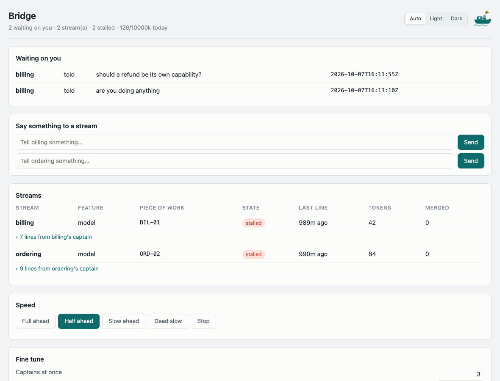

# A second person joins

One person driving one slice at a time needs none of this page. Two do, and so does one person running two
agents — the problem is the same either way: **two workers in one repository, and nobody waiting on
anybody's branch.**

---

## The lane, not the branch

A **fairway** is a lane of work. It owns a set of paths, one worker at a time, and it is the unit everything
on this page is about — the board has a row per fairway, the logs have a file per fairway, and the scope
gate is enforced per fairway.

The chart said what each one owns:

```yaml
fairways:
  booking:
    owns: ["apps/bookings/src/booking/**"]
  availability:
    owns: ["apps/bookings/src/availability/**"]
```

```console
$ make check-slice-scope
check-slice-scope: slice/BOK-01 touches only what one slice may
```

A branch that writes outside its fairway is refused by the gate, by name, with the fairway that owns the
path it touched. Not as etiquette — as a gate, because the first attempt relied on etiquette and two agents
rewrote each other's adapter inside an hour.

## Why neither of you is waiting

This is the part worth slowing down for, because it is the thing version 2 changed.

`BOK-01` is in the `booking` fairway and sets `BookingHeld`. `AVA-01` is in `availability` and steers by it.
The old answer was: `AVA-01` waits for `BOK-01` to merge. The new answer is that **`AVA-01` is cleared the
moment the mark is set**, which happens at `BOK-01`'s first stage, in its own worktree, before anything has
merged anywhere:

```console
$ slipwai fleet booking
booking: the last 6 line(s) its captain wrote
  2026-10-08T09:14:48Z  claimed BOK-01
  2026-10-08T09:14:48Z  set BookingHeld — BOK-01
  2026-10-08T09:14:49Z  still going, 42k spent
  2026-10-08T09:14:49Z  demo of BOK-01: accepted
  2026-10-08T09:14:50Z  asked to merge: merge slice/BOK-01 into trunk after the full gate
  2026-10-08T09:14:58Z  merged BOK-01 as a1b2c3d4

$ python3 scripts/agents/clearance.py
clearance: 3 of 3 slices cleared in booking
```

**Read the second line, and then the last one.** The mark was set one second after the slice was claimed.
Nothing reached trunk until ten seconds later, and `AVA-01` was cleared by line two — eight seconds and four
rungs before the thing it steers by existed anywhere but in one worktree.

It is safe because of the rule the chart enforces: **one setter per mark**. `BookingHeld` has exactly one
owner and one typed definition, so a second fairway building against it cannot be building against a
different one. If two slices both claimed to set it, `make check-chart` would have refused the chart before
either started.

## Berths: how a worker is given a place to work

A **berth** is a worktree with a branch and a name. The second person does not clone anything or negotiate
anything:

```console
$ slipwai fleet
berths: 2
  fairway       feature  slice   state    last line  tokens  merged  marks
  ------------  -------  ------  -------  ---------  ------  ------  -----
  availability  booking  AVA-01  working  31s ago    42      0       0
  booking       booking  BOK-02  working  12s ago    84      1       1
```

Each berth is a separate working directory on the same repository, so two gates can run at once without
one `node_modules` or one database file being fought over.

## The board

```sh
slipwai fleet          # once
slipwai fleet watch    # redrawn every few seconds
```

```
waiting on you: 2
  billing    told    should a refund be its own capability?
  billing    told    are you doing anything

berths: 2, 2 stalled
  fairway   feature  slice   state    last line  tokens  merged  marks
  --------  -------  ------  -------  ---------  ------  ------  -----
  billing   model    BIL-01  stalled  989m ago   42      0       1
  ordering  model    ORD-02  stalled  990m ago   84      0       1

telegraph: half-ahead  boilers 3  fanout 2  bunker 126/10000k today

last lines
  2026-10-07T16:11:51Z  billing    mark-set
  2026-10-07T16:11:53Z  ordering   claimed
  2026-10-07T16:11:53Z  ordering   demo
  2026-10-07T16:11:55Z  harbour    granted
  2026-10-07T16:11:55Z  harbour    mark-set
```

**Read the first block first.** "Waiting on you" is the only part of the board that is about you; everything
under it is the run reporting on itself.

**The board keeps no state.** Every column is computed from the logs each time it is drawn. Nothing writes
a status field anywhere, which is deliberate and is the correction of two specific failures: a runner that
was the single source of status and died at iteration two while twenty slices went on merging, and a model
file that said `planned` for eight slices that had shipped, because the field was written at plan time and
never reconciled. **A stage that wrote no line made no progress** — that sentence is the whole design, and
it is only true if nothing but the logs is ever consulted.

`stalled` above is that rule being honest: those two captains had written nothing for sixteen hours, so the
board says so rather than guessing.

## One stream's log

The board always provokes the same question — *what is `billing` actually doing?* — and cannot answer it,
because the answer is forty lines of one file. So:

```console
$ slipwai fleet ordering
ordering: the last 9 line(s) its captain wrote
  2026-10-07T16:11:48Z  claimed ORD-01
  2026-10-07T16:11:48Z  set OrderPlaced — ORD-01
  2026-10-07T16:11:49Z  still going, 42k spent
  2026-10-07T16:11:49Z  demo of ORD-01: accepted
  2026-10-07T16:11:50Z  asked to merge: merge slice/ORD-01 into trunk after the full gate
  2026-10-07T16:11:53Z  claimed ORD-02
  2026-10-07T16:11:53Z  still going, 42k spent
  2026-10-07T16:11:53Z  demo of ORD-02: accepted
  2026-10-07T16:11:55Z  asked to merge: merge slice/ORD-02 into trunk after the full gate
```

Its own log, said a line at a time, in English. Each fairway writes only its own file and nothing else
writes it, which is why two workers never conflict on a log and why the board can be folded from all of
them without a lock.

## Answering from one seat

When a run is going, you do not want two terminals and a board you have to re-run:

```console
$ slipwai bridge
bridge: http://127.0.0.1:8099  — ctrl-c to stop
```



What is waiting on a person is at the top, and an answer typed there becomes a line in that stream's own
log — the same line the agent would have got in a terminal. It binds the loopback address only, because the
page changes what a run does and a default that put that on a shared network would be wrong once and then
permanently.

## Next

→ **[Let it sail](let-it-sail.md)** — captains, the telegraph, and what a person still decides.

Other pages: [start here](start-here.md) · [your first feature](first-feature.md) ·
[bring an existing codebase](adopt.md) · [the vocabulary](../../GLOSSARY.md)
