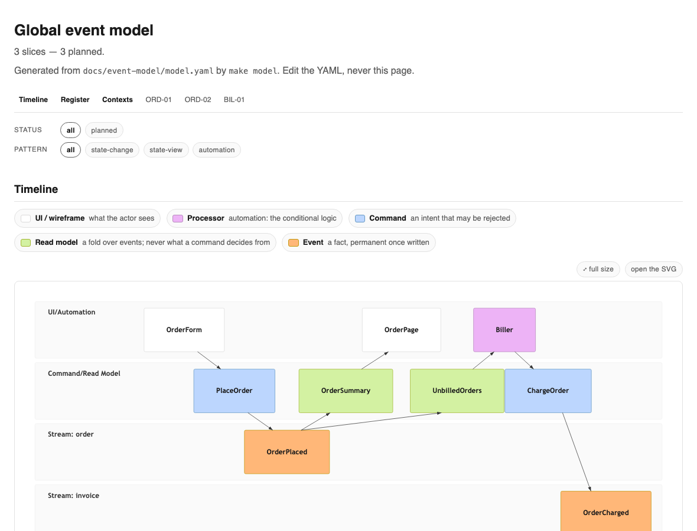

# Your first feature

**Five minutes from a green gate to one slice demoed.** You have a repository and `make verify` passes;
this page is one feature, from a sentence you type to a working thing you watch a person accept.

The commands with a slash — `/sail`, `/speckit-specify`, `/mockups` — are run inside your coding agent, not
in the shell. `./init` installed them.

---

## Sail it

```
/sail
```

That is the whole of it. `/sail` works out which stage you are at from what is on disk rather than from
anything you tell it, runs that stage and every stage after it, and then **takes the next ready slice
without being asked again**. It stops when the split is exhausted or everything left is blocked.

Being invoked before any of this exists is a valid start, not an error: with an empty repository the first
stage is the first one whose artefact is missing, which is the principles, and it begins there.

Three narrower forms exist for when you want one lane or one slice:

```
/sail fairway=booking     one lane, and the other lanes' ready slices are named and left
/sail booking             one feature, across whichever fairways its slices are in
/sail BOK-01              this slice, and nothing else
```

**Bare is the normal form.** The narrower ones are for when a second person is working beside you, which
is the next page.

---

## What it is doing underneath

You do not type the commands below — `/sail` runs them, in this order, and enters at the first one whose
artefact is missing. They are here because the first time through you want to see each artefact appear,
and because **three of these stages stop for a person**: the principles are ratified by you, the mock-ups
are approved one state at a time, and the demo is accepted by somebody watching it run.

The stages are the ladder, and `commands/sail.md` in your own project carries its full text.

### 1. Principles

`/speckit-constitution`, which fills `.specify/memory/constitution.md` and asks you to ratify it. These
are the rules every later stage is held to — what a slice must be, what a test must prove, what may not
enter domain code. A constitution that is absent, unfilled or unratified is where `/sail` starts, because
everything after it is judged against something.

### 2. Say what you are building

```
/speckit-specify  Guests book a table. A guest picks a time, we hold it, and the
                  restaurant sees it on tonight's list.
```

This writes `specs/booking/spec.md` — the product, in the language of the people who want it, with no
technology in it. Then:

```
/gaps
```

which reads the specification back and asks what it did not say. Who cancels a booking? What happens when
two guests take the last table? Answer them now, in the specification, because every one of them becomes a
slice later and a question answered here costs a sentence.

### 3. Mock-ups, approved one at a time

```
/mockups
```

Every screen state the feature needs, written under `specs/booking/mockups/` and approved by you one state
at a time — the empty one, the loaded one, the one that failed. This stage stops for a person on purpose:
a screen nobody looked at before it was built is the most expensive thing on this ladder to discover late,
and a slice's `ui` frame later points at the state it is built to.

### 4. Model it

Modelling is a skill rather than a command, because it is a conversation: you and the agent name the
commands, events and read models together. On the event-modelling profile it writes
`docs/event-model/model.yaml`: the commands somebody issues, the events that are the record of what happened, the read models the screens are built from, and which slice
each belongs to. One file, and everything downstream is rendered from it.

```console
$ make model
  wrote docs/event-model/model.svg
  wrote docs/event-model/slices/BOK-01.mmd
  wrote docs/event-model/model.html
  wrote README.md (event-model block)

model: 3 slices rendered. Open docs/event-model/model.html to browse it.
```

Open it. You get the timeline with a swimlane per context, each slice as a vertical stripe through it, and
every command, event and read model in its place:



### 5. The fairways, charted from the model

A **fairway** is a lane of work that one worker owns at a time; a **mark** is a typed contract — an event,
a read model, a route — that one fairway sets and others steer by. The **chart** names them, and it is
written before the work is cut up, because how you cut the work up depends on it.

On the event profile you do not write the chart. The model already says each slice's context, the events
it produces and what it reads, so the chart is rendered:

```console
$ make chart
chart: specs/booking/chart.yaml written from the model — 2 fairways, 2 marks, 3 slices
$ make check-chart
check-chart: 1 chart(s), 2 marks, one setter each, every slice in a capability
```

On the standard profile there is no such artefact, so `/chart` writes it with a person present. Either way
`make check-chart` holds it afterwards, and it refuses the two mistakes that cost the most: a mark nobody
typed, and a mark two slices both set.

**One setter per mark.** That rule is the whole reason the rest of this works. If exactly one fairway sets
`BookingHeld`, then everyone else can be told the moment it exists and can start — without waiting for a
branch to merge, and without a second definition of it appearing anywhere.

### 6. Split it

```
/story-splitting
```

One feature becomes slices, each a thin vertical cut that is demoable on its own, and each one writes its
own row into the chart: the fairway it belongs to, the capability it is part of, the marks it sets, the
marks it steers by.

```console
$ python3 scripts/agents/clearance.py
clearance: 1 of 3 slices cleared in booking
  BOK-01
```

**Cleared** means every mark this slice steers by has been set. Nothing has been set yet, so only the slice
that waits for nothing may start. A slice that is not cleared names what it is waiting for and who is
setting it, so "blocked" is never a mood — it is a mark with an owner.

### 7. Then, per slice, until the demo

The example map, the slice's own gaps, plan and tasks, implementation one RED-GREEN-REFACTOR increment at
a time, and convergence. Each writes its artefact under `specs/booking/slices/BOK-01/`, which is how
`/sail` knows where it got to if you close the terminal.

## The demo stops for you

An actor-visible run of the thing, in front of a person:

```
demo of BOK-01 — a guest holds 19:30 for four

  POST /bookings  { "at": "19:30", "covers": 4 }  →  201  held until 19:45
  the restaurant's list now shows it

accept this? [y/n/notes]
```

Say yes and the line goes in the log. Say no with notes and they go back into the slice. After the demo
come the review and reshape stage, the adversary pass, the mutation gate, and the merge to trunk.

```console
$ slipwai fleet booking
booking: the last 6 line(s) its captain wrote
  2026-10-08T09:14:48Z  claimed BOK-01
  2026-10-08T09:14:48Z  set BookingHeld — BOK-01
  2026-10-08T09:14:49Z  still going, 42k spent
  2026-10-08T09:14:49Z  demo of BOK-01: accepted
  2026-10-08T09:14:50Z  asked to merge: merge slice/BOK-01 into trunk after the full gate
  2026-10-08T09:14:58Z  merged BOK-01 as a1b2c3d4
```

The timestamps are that run's; yours will be your own. The last line is the harbourmaster's work, not the
captain's: a captain holds no credential, so it asks, and the thing that holds them rebases the branch onto
trunk, runs the whole gate there, and answers with the commit.

**That is the fifteen minutes.** One slice, specified, modelled, charted, built, and accepted by a person
who watched it work — and `/sail` has already taken the next ready slice.

---

## The one thing worth understanding before you go further

Look at the second line of that log. `set BookingHeld` was written when the slice **started**, in its own
worktree, before anything merged. Run clearance again and the slice in the other fairway that steers by
`BookingHeld` is now cleared:

```console
$ python3 scripts/agents/clearance.py
clearance: 3 of 3 slices cleared in booking
  AVA-01
  BOK-01
  BOK-02
```

One line in a log, and two more slices may start. **Nothing merged.** A second fairway can start on the
strength of a contract that exists and has one owner, which is why two people — or two agents — are not
queueing behind each other's branches. That is the claim
version 2 is built on, and the next page is what it looks like with more than one of you.

## Next

→ **[A second person joins](a-second-person.md)** — fairways, berths, and the board that shows both.

Other pages: [start here](start-here.md) · [let it cruise](let-it-cruise.md) ·
[bring an existing codebase](adopt.md) · [the vocabulary](../../GLOSSARY.md)
