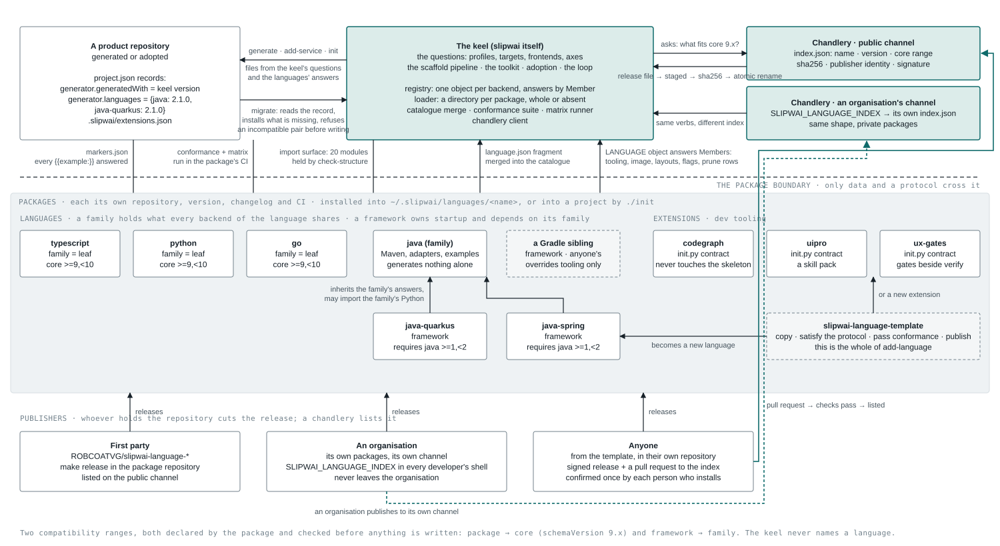
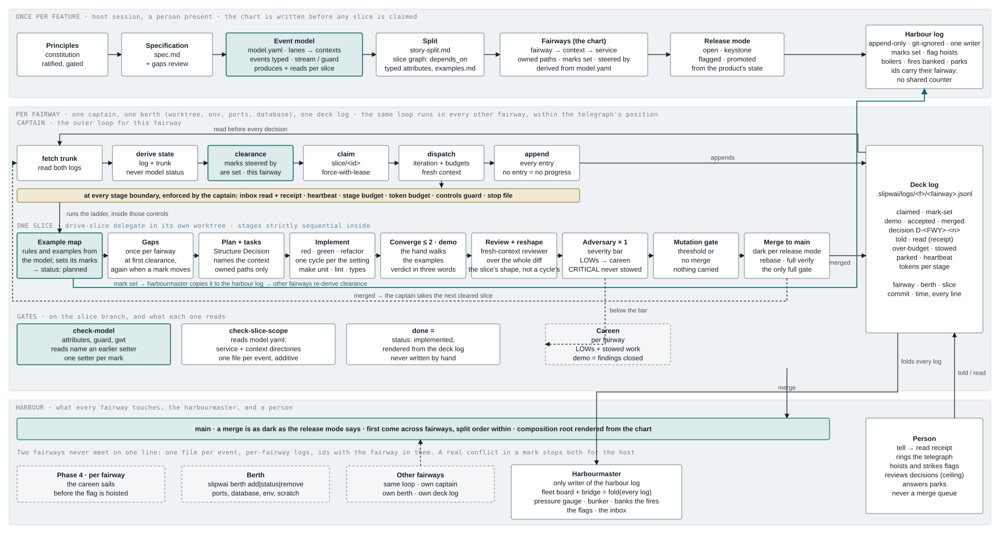
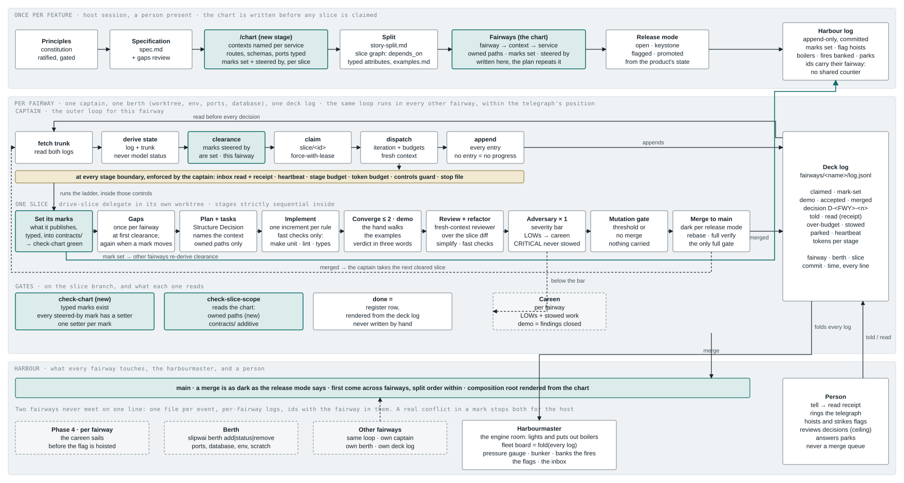
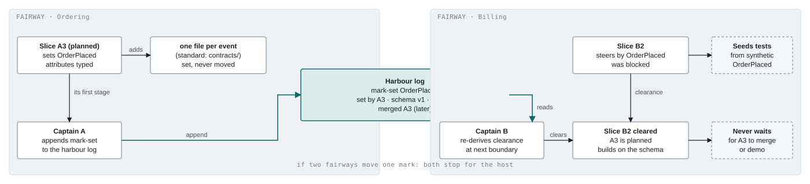

# Slipwai 2: the plan

This document is the plan for version 2 of slipwai. Slipwai is a tool that generates a product repository
and then runs a delivery loop in it with coding agents. Say the name as "slipway".

The plan was written on 2026-10-06 and revised the same day. Its sources are this fork, the experiment in the
`slipwai-cruise-2` checkout, GitHub issues #26, #30, #32, #27 and #29 on `ROBCOATVG/slipwai`, and an
unposted write-up of a five-berth run on a product called MANDA.

The document has eleven sections:

1. The words this plan uses.
2. Where things stand today.
3. What the first attempt taught.
4. The five themes of version 2.
5. The delivery loop, drawn for both profiles.
6. How a project built on version 1 moves to version 2.
7. The order of work.
8. The rules for doing the work.
9. Decisions taken, and decisions still open.
10. The gaps review log.
11. The implementation plan.

## 1. The words this plan uses

Every name in slipwai comes from the slipway and the harbour. This section is the glossary for the rest of the
document. Read it first. Later sections use these words without explaining them again.

Nothing in version 2 is called a workstation, a workstream, a lane or a runner. Where this document describes
version 1, it uses version 1's own names and says so.

| Word | Meaning | Version 1 name, where one existed |
|---|---|---|
| **Keel** | The core of slipwai: the questions it asks, the code that writes a project, the toolkit, the adoption path, and the delivery loop. Every package attaches to the keel | "core", "core driver" |
| **Language** | A package that holds every answer for one language family, with a thin framework package for each framework of that family. Example: `java` is a family, `java-quarkus` is a framework of it | Same word |
| **Extension** | A package of developer tooling that a project chooses to add. Example: `codegraph` | Same word |
| **Chandlery** | The index of packages that slipwai can install: languages and extensions, each with a version, a compatibility range, a checksum, a publisher and a one-line description. `slipwai search <term>` finds packages across every channel; `slipwai show <name>` describes one; `slipwai install <name>` installs it | "marketplace", "index" |
| **Slice** | One unit of product work that an actor can use when it is done. Unchanged from version 1 | Same word |
| **Fairway** | One bounded context's slices, in split order, with one release flag and one holder. The fairway is the unit of scope, of ownership and of release. Several fairways run side by side into the same harbour. A vessel keeps to its own fairway | "value stream", "workstream" |
| **Berth** | The provisioned place where one captain works: a sandbox or container, a git worktree, environment variables, an allocated block of ports, a database, and scratch directories. A berth holds no cloud or forge credential. `slipwai berth add`, `slipwai berth status` and `slipwai berth remove` manage berths | "workstation", "lane" |
| **Captain** | The outer loop for one fairway, in both modes. The captain reads the logs, works out the state of the fairway from the logs and trunk, gives clearance, claims a slice, dispatches an iteration, enforces every stage boundary, and appends to the deck log. There is one captain per fairway. Under `/drive` the captain brings every question and demo to the person. Under `/cruise` the skipper answers and the hand demos | "runner", `cruise.py run` |
| **Harbourmaster** | The part the captains share, one process per harbour. It allocates berths, is the only writer of the harbour log, draws the fleet board and the bridge, holds the flags, and answers the telegraph. Under `/drive` it runs inside the person's session; under `/cruise` it runs on its own. It is not a merge queue | "integrator" |
| **Deck log** | A fairway's own append-only log at `.slipwai/logs/<feature>/<fairway>.jsonl`, ignored by git and written only by that fairway's captain. The harbourmaster syncs it between machines through the ref `refs/slipwai/logs`, never through trunk. Its lines are: claimed, mark set, demo, accepted, merged, decision, told, read, heartbeat, stowed, parked | "stream log" |
| **Harbour log** | The one append-only log at `.slipwai/logs/harbour.jsonl`, ignored by git, that every fairway reads and only the harbourmaster writes. Its lines are: mark set, flag hoisted, berth allocated, fires banked, park for a person, telegraph rung. A captain never appends to it; the harbourmaster copies what other fairways need from each deck log | "cross-stream log" |
| **Chart** | The contracts, written before the split, as one committed file per feature: `specs/<feature>/chart.yaml`. The chart names the fairways, the marks each slice sets, the marks each slice steers by, and the paths each fairway owns. On the event-modelling profile `make chart` renders it from the event model and `check-chart` fails when the two disagree. On the standard profile a `/chart` stage writes it | "contract map", "streams manifest" |
| **Mark** | One published contract that another slice steers by: an event, a route, a schema or a port, typed. An event or a schema is typed with JSON Schema; a route is an OpenAPI operation; a port is a name with typed inputs and outputs. A mark is set once and never moved. The files that hold marks only grow | "contract entry" |
| **Clearance** | The rule that lets a slice start. A slice has clearance when every mark it steers by has been set by a slice that is planned or implemented. A slice sets its own marks itself, as its first stage, in its own worktree | "consumption gate" (issue #32) |
| **Careen** | One hardening slice per fairway. It holds the findings below the severity bar and the work that stages stowed. It runs before the fairway's flag is hoisted. Its demo is: the findings are closed | "hardening slice" |
| **Stow** | What a stage does with its open work when it runs out of budget: it moves the work into the careen. Work is never dropped. A CRITICAL finding is never stowed | "backload" |
| **Telegraph** | The dial between speed and cost: the engine order telegraph on the bridge. A person rings it; the engine room answers by raising or lowering steam. Its positions are `full-ahead`, `half-ahead`, `slow-ahead`, `dead-slow` and `stop`. Each position sets, as a group, how many boilers are lit, how many delegates a captain may run at once, which model role each stage uses, and the bunker per slice and per day. `slipwai telegraph half-ahead` rings it. Each number underneath can also be set alone | "concurrency setting", "cost cap", "trim" |
| **Boiler** | One berth under steam. A lit boiler is a captain working. The telegraph says how many may be lit at once | "max concurrency" |
| **Bunker** | The coal store: the token budget, per slice and per day. Tokens are the coal. The pressure gauge on the fleet board shows the rate they burn at | "token budget", "cost cap" |
| **Bank the fires** | What the harbourmaster does when the bunker runs down faster than the telegraph position allows: optional stages stowed into the careen, fewer delegates, cheaper model roles, then one boiler put out. Each step is a line in the harbour log. A person stokes the fires back up | "throttle", "reef" |
| **Hoist, strike** | To hoist a flag is to turn a release flag on for real actors. To strike a flag is to remove it after it has been on everywhere for long enough. Only a person hoists | "turn on", "remove the flag" |
| **Slipway, sea trials, in service** | The three states of a product, recorded once in `project.json`. Slipway: no production yet. Sea trials: a production with a known set of pilot actors. In service: real actors. The release mode defaults from this state | "pre-launch", "beta", "GA" |
| **Release mode** | How dark a merge is. One of: open, keystone, flagged, promoted. Section 4, theme E, defines each | `release: flagged` |
| **Skiff, liner** | The two shapes of a cloud target. A skiff is one environment on the smallest managed compute and database, for a staff tool. A liner is today's full stack, for a product. Theme E defines both | one stack for every project |
| **Skipper, hand, bosun** | The three delegates inside one iteration. The skipper decides product questions. The hand runs the demo. The bosun works round a block. Unchanged from version 1 | Same words |
| **Fleet board** | Every view of the harbour, meaning the agents at work: the berth table, the slice graph by fairway, the swimlanes with cost, the event feed, the pressure gauge and the bunker, and the inbox. Every view is computed from the logs and from `git rev-list`. The fleet board keeps no state of its own. `slipwai fleet` prints it. `slipwai fleet watch` keeps it live. The harbourmaster also renders it as a page | "fleet view", "multi-lane status", "dashboard" |
| **Bridge** | One product's own dashboard, as distinct from the fleet board, which is the harbour's view of the agents. The bridge shows where the product is (slipway, sea trials, in service), the release mode, how far along each fairway is, which flags are hoisted and where, what is deployed to each environment, what is waiting on a person, and what the product has cost so far. `slipwai bridge` prints it. The harbourmaster renders it to the project's Pages site next to the event model | `/where-are-we`, the demo stop's progress board, the event-model page |
| **Drive, cruise** | `/drive` is the main mode: a person is present, the whole fleet fans out across fairways, and every product question, park and demo comes back to that person through the inbox. `/cruise` is the same fleet with nobody at the keyboard: the skipper answers the questions and the hand runs the demos. Nothing else differs | Same words, but in version 1 only `/cruise` fanned out across a product |
| **The ladder** | The ordered stages of `/drive`. Section 5 draws it | Same word |

**Facing a person, every one of these words is paired with the ordinary one.** The vocabulary is the
method's, not the reader's. A stop, a command, a refusal or a page that asks a person something names the
thing both ways the first time it appears in that exchange — "the fairway (this context's slices)", "hoist
the flag (turn it on for real users)", "the careen (the hardening slice)" — and may use the slipwai word
alone afterwards. A person answering a question should never have to learn a vocabulary to answer it, and a
stakeholder reading the bridge never agreed to learn one at all. Slice 7.5 already holds the bridge to plain
labels; this is the same rule everywhere a person is asked or told. Decided 2026-10-07.

**A stop brings a proposal, not a questionnaire.** Every stage that stops for a person does the work first
and puts an answer to them to confirm or amend. The release-constraint stage already says it — *recommend
the answer with its reason rather than asking an open question* — and it is the rule everywhere a person is
stopped: the chart's contexts and services, the mock-up review's surfaces and states, the fairways, the
release mode. A person's attention is the scarcest thing in this loop and a blank question spends it on
work a careful reading of the repository would have done.

Three things keep that from becoming a rubber stamp, and they are what make it safe rather than merely
fast. **Every proposal carries what it was read off**, by file and by line, so it is something a person can
disagree with rather than a conclusion handed down. **Confidence is said out loud and per item, before the
list is read**, because a proposal offered as confidently as every other gets confirmed as quickly as every
other, and the wrong one goes through with the rest. And **where the evidence runs out the question stays a
question** — a product decision taken by inference is exactly what these stops exist to prevent, and a
confident wrong proposal is worse than a blank, because a blank gets thought about. Decided 2026-10-07.

Two version 1 terms appear in this document when it describes version 1:

- **The runner** is version 1's `scripts/agents/cruise.py`. It starts one iteration after another in a fresh
  session. The captain replaces it.
- **The integrator** is the one person who, in version 1's generated `workstations.md`, merges every accepted
  slice to `main`. Version 2 has no integrator.

## 2. Where things stand today

### The problem in one line

Version 1 delivers one product well with one runner, and gets no faster when people or machines join; its
gate grows with every language. The cost of doing nothing is the experiment's own numbers: 104 hours and 180
million input tokens per accepted slice at the median, and a gate that nobody runs locally.

### The checkouts

| Checkout | What it is | State on 2026-10-06 |
|---|---|---|
| `slipwai_v2_Fork` | This repository, `github.com/ROBCOATVG/slipwai_v2_Fork`. It was a clone of upstream `main` | Cleared (see section 7, phase 0). Before the clearing it was 1.5.2.dev0 and identical to upstream |
| `slipwai-cruise-2` | The experiment. Slipwai 1.3.0 was adopted onto its own repository, and `/cruise` was run against issue #26 | 641 commits past 1.3.0. `VERSION` reads 2.0.0.dev0. Working tree clean. Last commit by the loop 2026-10-03. One commit by hand 2026-10-05 |
| `slipwai-workstreams` | One local commit on top of 1.5.2.dev0: the MINOR change for issue #30 | 18 files changed, 322 lines added, with tests. Not merged anywhere |
| Six package repositories | `luke-gee/slipwai-language-go`, `-python`, `-typescript`, `-java`, `-java-quarkus`, and `luke-gee/slipwai-language-template`. All private | Pinned as git submodules under `languages/` and `templates/language` in `slipwai-cruise-2` |

### What the experiment delivered

The experiment's own checkpoint file is stale, so this list comes from git, not from the checkpoint.

- 20 of 24 slices merged. Slices S01 to S19 have a row in the register. Slices S20 and S23 are merged through
  the branch `integ/iter19` with accepted demos, but they have no register row. Slice S21 has a gaps file only.
  Slices S22 and S24 were never started.
- The keel now loads languages as packages from the directory in `$SLIPWAI_LANGUAGES`. It merges each
  package's `language.json` into the catalogue. The catalogue's `schemaVersion` is now `"9.0"` and a package
  declares a compatibility range against it. The verbs `slipwai list`, `slipwai language list`, `slipwai language
  install`, `slipwai language upgrade` and `slipwai language remove` exist. `project.json` records
  `generator.languages`. `slipwai migrate` moves a 1.x project to 2.0. A conformance suite and a per-package test
  matrix exist. A list of 20 keel modules that a package may import is held by `check-structure`.
- 24 changelog fragments exist: 8 MAJOR, 3 MINOR, 13 PATCH. Together they describe a 2.0.0 release.
- The runner stopped at iteration 2. The stop file `cruise.stop` is empty, so no reason is recorded.
  Iterations 3 to 19 ran from interactive sessions. They wrote no run log, no stream and no line in
  `cruise-log.jsonl`. The checkpoint still says "iteration 2". This is why nobody could know the status without
  reading git.

### What the experiment lists as blocking 2.0.0

The file `specs/001-slipwai-2-language-addons/cruise-report.md` in `slipwai-cruise-2` lists these:

- The image probes for `java-quarkus` and `java-spring` never passed. Ten decisions (D25, D32, D36, D48, D54,
  D69, D78, D86, D94, D105) ruled them environmental again and again. They need one green run with real network
  access.
- The submodule `languages/java-spring` points at `slipwai-cruise-2` itself, pinned to the branch
  `slice/S10-java-spring`. The run could not create the real repository (decision D62).
- CI cannot load the `go` submodule. The edits are written in `ci-proposal.md`. They need a token and a person.
- The root CI matrix still generates every language's variants. The edit that retires it is in `ci-proposal.md`
  (slice S14, decision D100).
- `check-slice-scope` refused every path under `src/` and `tests/` for the whole run, because the factory's own
  `project.json` declares no deployable (decision D30). Every slice merged with that check red.
- 8 architecture decision records (ADRs) are at the status Proposed. About 105 of 125 decisions were never
  reviewed by a person.
- Slice S20 has five open tasks and a mutation run that stopped at 135 of 207 mutants. Slice S23 has eight open
  tasks, one of them handed back.

### The gate on the experiment

On 2026-10-06, `make verify` on `slipwai-cruise-2`'s `main` passed on this machine: every gate green, with
7 tests skipped. The run took longer than ten minutes because it builds the Java variants locally. The two image
probes listed above still need a run where they are not skipped.

### The salvage measurement

On 2026-10-06 a trial merge was run in a scratch clone. Nothing in any real checkout was touched. The merge
brought upstream's changes from 1.3.0 to 1.5.2 into `slipwai-cruise-2`'s `main`. Upstream changed 130 files.
35 of them conflict: `cli.py`, `scaffold.py`, `catalog.py`, `migrate.py`, `toolkit.py`, the three language
modules that became packages, `prune.py`, and some docs. That is about one day of work. The reverse, rebasing
641 commits onto upstream, is not worth attempting. Section 9 records that neither route was chosen.

## 3. What the first attempt taught

### Design decisions that held

Version 2 keeps these decisions from the experiment.

- **The keel owns the questions. A language owns its answers.** The `Registry` holds one object per backend,
  keyed by `Member` constants rather than strings. A framework inherits from its family. `None` is a valid
  answer; what matters is whether an answer is present. Before this change a new backend touched seventeen files
  in the keel. After it, a new backend is one package.
- **A family is a dependency. A framework is what gets installed.** This two-layer split matched what was
  already on disk.
- **Packages load from a directory, not from Python entry points.** A frozen executable cannot run `pip
  install` into itself. One directory loader serves the wheel, the executable and a checkout alike.
- **Compatibility is a range that the package declares.** It is not an equality test on `schemaVersion`.
- **The import surface is part of the schema.** A package may import exactly twenty keel modules. In the
  experiment the list lived in a prose contract that the gate parsed; in version 2 it is `import-surface.txt`
  at the repository root, which `check-structure` holds in both directions — a package that imports off the
  list fails, and a line naming a module the keel does not have fails too. This is what makes a change to
  the keel safe.
- **A package is either whole in its directory or not there.** Installation stages the files, checks the
  sha256, and renames the directory atomically.
- **Every refusal ends with the command that fixes it.** The idea is right. The cost is described below.
- **Conformance and the test matrix are exports of the keel that each package runs.** A package proves itself
  without the keel's CI.

### Design debts that version 2 pays down

- **The wording of refusals became the main source of complexity.** Decisions D116, D117, D122 and D124 are
  pages about what single error lines say. Slice S20 changed no behaviour and still took three quality rounds.
  Version 2 has one refusal shape. The shape is generated from the fault, and the fixing command is data.
- **The contract files also served as the specification.** They grew a Status column that slices changed.
  Version 2 writes the contracts first, freezes them, and keeps the specification separate.
- **Packages had no release tool** (decision D112). Releases were cut by hand. Version 2 makes the whole path
  four verbs: `slipwai package new`, `check`, `release` and `register`.
- **Tables keyed by HTTP option stayed in the keel** (decision D39). A language that brings a new HTTP framework
  still edits the keel. Version 2 moves those tables behind the protocol.
- **Loading a package runs its Python code**, both at install and in the conformance probe. There is no sandbox.
  Version 2 states this up front as the trust model of the chandlery: an entry is signed, or it is not listed.

### Process findings

These findings matter more than the design ones. The evidence is in `benchmark.md`, `adversary-log.md`,
`decisions.md` and the cruise log in `slipwai-cruise-2`, and in the MANDA run.

| Finding | Evidence | What version 2 does |
|---|---|---|
| Mutation and conformance gaps were carried forward, not closed | 18 gaps moved from S08 to S09, 31 from S09 to S13, 46 from S12 to S13. Two whole slices (S13, S17) existed only to collect that debt | A slice does not merge with open gaps. If that makes the slice too big, the slice was too big |
| The adversary loop never converged | 129 findings over 21 rounds. 64 were LOW, most about wording. S20 still ended with 5 open LOWs | One adversary round per slice. Findings below a stated bar go to the careen. A demo verdict of `behaviour` is a defect in the specification, and is fixed there |
| Environment problems were decided ten times | The two Java image probes, decisions D25 to D105 | Prove the gate green in the target environment on day zero, or exclude the test once, in writing |
| Decisions outran review | 125 decisions, 105 unreviewed, 8 ADRs still Proposed | The captain holds a ceiling on unreviewed decisions and parks when the count passes it |
| Large architectural slices blew their budgets | S08 took 20 hours. S01 took 14 hours. S09 used 291 million input tokens. S02 took 2 hours 22 minutes and S18 took 31 minutes, and both were fine | Make every slice the size of S02. Never the size of S08 |
| Every merge was dark on a product that nobody used | `release: flagged` is absolute. MANDA ran five berths behind flags with no actor. A slice with nothing holding it back parked | A release mode per product state: open, keystone, flagged, promoted |
| Every increment paid for the full gate | One `make verify` runs lint, typecheck, structure and the whole test suite. The owner's own note in the experiment was "use full verify sparingly, it's heavy" | Fast checks per increment. The full gate once, before `main` |
| Integration was re-cut again and again | 18 `integ/*` branches for 19 iterations, with `a`, `b`, `c` retries | Merge to trunk per slice, dark according to the release mode. No integration branches. The two files that every slice touched become generated or split |
| The repository split happened mid-flight | S08 to S10 extracted six repositories while slices were running. `java-spring` is still a stub | The split is its own completed step. Push credentials are proven first |
| The factory tripped over itself when run on itself | `check-slice-scope` was red all run. `AGENTS.md` pointed at a script that did not exist. The code index was dead from iteration 2 | Declare the factory as a deployable in its own `project.json`. Verify its own tooling on itself before any run |
| Instructions written in command prose did not hold under load | Rebase at start, close browser sessions, bound every wait, read the inbox between stages. All were documented. All failed in MANDA | Anything the ladder relies on every time belongs to the captain, not to the agent's memory |
| The runner was the only source of status, and it died | 17 of 19 iterations have no log. In MANDA, `model.yaml` said `planned` for eight slices that were built and merged | The log is the control plane. No log line means no progress |
| Shared ids collided across berths | 54 renumbering commits in 20 hours. One renumber touched 91 citations | Every id carries its fairway. Every append-only file is per fairway. Feature-level views are rendered, never edited |

## 4. The five themes of version 2

### Theme A. The keel and the chandlery

**Goal.** The keel is small and fast to verify. Languages, and then extensions, are packages found in the
chandlery, installed into slipwai, versioned and released on their own. Adding one touches nothing in the keel.

**What already exists.** From the experiment: the registry, the loader, the index contract, the verbs, the
conformance suite, the test matrix, the template, and six packages. The design is in
`specs/001-slipwai-2-language-addons/contracts/*.md` in `slipwai-cruise-2`.

**How the pieces link.** The figure shows the four parts and what crosses each boundary: a product repository,
the keel, the chandlery, and the packages, with the publishers below them. Nothing crosses the package boundary
except data and a protocol. The keel never names a language.



**How a package is linked at usage time.** A user never touches a package repository. The link is the chandlery
index and the installed directory:

1. `slipwai install java-quarkus` asks the chandlery for the index (`index.json`, served from the public channel,
   or from the organisation's own channel when `SLIPWAI_LANGUAGE_INDEX` names one). The index lists each
   package's releases: name, version, the keel range it fits, the framework's family range, a URL for the
   release file, its sha256, and the publisher's signature.
2. The keel picks the newest release that fits this keel, resolves the family first (`java`), downloads each
   release file, checks its sha256, stages it, and renames it into `~/.slipwai/packages/<name>/`. A package is
   whole in that directory or not there.
3. From then on the loader reads the directory. It merges each `language.json` into the catalogue, imports each
   package's `LANGUAGE` object, and answers every question about that backend from it. The keel never names a
   language in its own code.
4. A generated project records what it was made with in `project.json`: `generator.generatedWith` for the keel
   and `generator.languages` for family and framework, with versions. On another machine, `./init` reads that
   record and says what to install; `slipwai migrate` installs it. The repository the package came from is not
   recorded anywhere a user reads.

**The two kinds of package.** A package is a language or an extension. Both are found, signed, installed,
loaded and released the same way. They differ in what they declare, and in when the keel asks them anything.

| | Language | Extension |
|---|---|---|
| Manifest | `language.json`: the backends it provides, the axis options each answers, its targets, and the family it belongs to | `extension.json`: version 1's catalogue entry (`name`, `description`, and `ignore`, the gitignore lines its local state needs) plus the keel range, the publisher and tags |
| Executable half | a `LANGUAGE` object keyed by `Member` constants, family resolved before framework | scripts attached to the keel's **hook points** — `init`, `project`, `check`, `before-stage`, `after-stage`, `boundary`, `before-merge` — declared in the manifest's `hooks` block; `init.py`, `project_guidance()` and `check-<key>.py` are the first three, named (section 12, 6.1) |
| When the keel asks it | at `slipwai generate`, to write the skeleton | at `./init`, after the skeleton exists. An extension never changes generated code |
| What conformance proves | every `Member` the manifest claims is answered, and the matrix is green | the six obligations of `docs/extensions.md`: replaceably idempotent; installs what it needs and is non-fatal when it cannot; projects a marker-fenced block into `AGENTS.md`; gates whatever state can go stale; names the recovery command on every failure path; and merges rather than overwrites a file a person hand-edits |

The loader does one merge into two destinations: `language.json` into the backends catalogue, `extension.json`
into the catalogue's `extensions` map, which is what `./init`'s extension menu already reads. Because the two
kinds sit beside each other on disk, the installed directory is `~/.slipwai/packages/<name>/`. It is not
called `languages/`, as the experiment's was: a directory of that name holding `codegraph` is the sort of
small lie that costs an hour later. `slipwai migrate` moves an install made before the rename. Decided
2026-10-06.

**How a package is linked at development time: it is not.** There is one link between a keel and a
package and it is made when a project is generated or migrated — the chandlery index, a download, a
checksum, a directory under `~/.slipwai/packages/`. There is no second link at build time. The keel's
repository pins no package, holds no submodule, and its gate never reads one.

This is the whole of theme A's goal, and it is easy to lose. The first instinct is to pin the first-party
packages so the keel's gate can prove them, and the experiment did exactly that: its CI could not load the
`go` submodule without a token and a person, and its root matrix regenerated every language's variants on
every commit, which is the ten minutes theme A is trying to buy back. Making the repositories public fixes
the token. It does not fix the shape. A keel whose gate checks seven packages is a keel that cannot be
changed without them, which is the coupling the packages were split out to remove.

So the work is divided by who owns the failure:

| Who | Proves | When |
|---|---|---|
| The keel's gate | That the conformance suite and the matrix work, against one toy package held in-tree as a fixture | Every commit. It is one package, and it is the keel's own |
| Each package's CI | That *that* package passes the suite against a pinned keel, and imports nothing off the surface | Every commit to that package, on its own schedule |
| The keel's release | That the published packages still pass against the keel about to ship | Once, at release (phase 8), never per commit |

A keel change that breaks a package is found by that package's CI, which is the Maven arrangement this
design keeps invoking: Central does not test every artefact that depends on it. The release job is the
backstop, and it runs once. Decided 2026-10-06, on the objection that a build-time link is a link theme A
exists to remove.

Publishing is `slipwai package release` in the package repository, which tags, builds the release file,
signs it and uploads it as a release asset, followed by `slipwai package register`, which adds the release
to a channel's index.

**Trust: an open channel, signed releases, and a publisher confirmed once.** Anyone may publish a language or
an extension; the ecosystem is open or it is not one. Loading a package runs its Python, so the keel will not
install anything it cannot attribute. Three rules make both true at once.

1. **Every release is signed by the identity that publishes it.** Sigstore keyless signing from the package's
   CI binds the release file to the repository and workflow that built it; a publisher without CI uses a
   minisign key. The index entry names the publisher identity, and the keel refuses a release whose signature
   does not match it. Nobody can publish as someone else.
2. **The public channel takes contributions by pull request.** A contributor makes the package with `slipwai
   package new`, cuts a signed release with `slipwai package release`, and opens the pull request that adds the
   entry to the public `index.json` with `slipwai package register`. The
   channel's CI checks that the signature matches the publisher, that the package passes the conformance suite
   against the keel range it claims, and that its name does not collide. Merged means listed. No approval by a
   person at `ROBCOATVG` is needed beyond the merge, and the checks are the same for a first-party package.
3. **A person confirms a new publisher once.** `slipwai install` shows a publisher it has not seen before, the
   repository behind the identity, and what the package will answer for, and asks once. The answer goes to
   `~/.slipwai/trust.json`, and every later release from that publisher installs without a question, the way
   an SSH host key or a Homebrew tap works. `ROBCOATVG` is in the file from the start, and nothing else is.
   `slipwai chandlery` marks each entry `first-party`, `confirmed` or `new to you`. An organisation can pre-seed
   the file for its machines, and can pin its channel to publishers it has reviewed.

This costs the keel nothing at build time. Like Maven shipping Central's address and a trust store and resolving
artefacts at run time, the keel reads the index when a person installs, verifies the signature then, and from
then on loads whatever is whole in `~/.slipwai/packages/`. A package placed there by hand, as a developer does
with `SLIPWAI_LANGUAGES`, loads without a signature and is shown as `unsigned` by `slipwai list`, so a machine
never mistakes a development copy for a release. Decided 2026-10-06.

**Which languages 2.0.0 ships with.** All six from the experiment: `typescript`, `python`, `go`, `java`,
`java-quarkus` and `java-spring`, each passing the conformance suite and its own matrix against the 2.0.0 keel.
Parity with 1.5, with `java-spring` needing its real repository first (phase 2). Decided 2026-10-06.

**Where the first-party packages live.** Under `ROBCOATVG`, beside the keel, public from the start, moved
before phase 2. Public so that a contributor can read one without being given access, and so each
package's own CI is free on Actions. Not so that the keel's CI can read them: it does not read them at
all, and the submodule the experiment could not load without a token is gone rather than unlocked
(theme A). Decided 2026-10-06 (section 10).

**What version 2 builds.**

1. The keel is brought back one module at a time, in the order of the import surface (section 7). Each module
   asks the registry from its first commit. Nothing is inverted afterwards.
2. The chart points at the six packages. The real `java-spring` repository is created. The six are rebuilt
   onto the template that `slipwai package new` writes, so a first-party package and a contributor's are the
   same shape.
3. Extensions become packages on the same loader, in the shape above. `codegraph`, `uipro` and `ux-gates`
   move out of the keel and out of `assets/toolkit/scripts/extensions/`. What stays in the keel is the
   `./init --extension` flag, the menu, the election record in `.slipwai/extensions.json` and the projection
   pass: the keel names no extension in its own code, exactly as it names no language.
4. The chandlery: one `index.json` per channel. It lists languages and extensions alike, each with a version, a
   compatibility range, a checksum, a publisher, a one-line description and tags. An organisation can run a
   private chandlery.
5. **Search from the command line.** `slipwai search <term>` reads every configured channel and matches the
   term against name, description, tags, family, framework and the axis options a package answers, and prints
   one line per match: name, kind (language or extension), latest version that fits this keel, publisher
   status (`first-party`, `confirmed`, `new to you`), installed or not, and the description. `slipwai search
   --kind extension`, `--family java` and `--answers http=fastapi` narrow it. `slipwai search` with no term
   lists everything. `slipwai show <name>` prints one package in full: what it answers, which targets, which
   frameworks, the keel range, the publisher and its repository, the release history, and the install command.
   The same search runs inside `generate` when an answer names something not installed, so the interview can
   say "three packages answer that; install one?" instead of refusing.
6. When nothing is installed, `slipwai generate` names what to install and offers to do it. The standalone
   executable bundles no language: it is the keel alone, the same as the wheel, so there is one artefact to
   build and sign and no bundled copy to drift from the chandlery's. Decided 2026-10-06.
7. **Making a package is a verb, not a fork of the template.** `slipwai package` is `generate` for packages,
   with the same shape as the product path:
   - `slipwai package new <name>` asks what the product interview asks, for a package. The first question is
     the kind, and it decides the rest. For a **language**: family, or framework of which family; which
     backends it provides and which axis options each answers; which targets. It writes `language.json`
     filled in, the `LANGUAGE` object as a skeleton with one `Member` per answer and a failing test per
     Member, and the matrix. For an **extension**: what the tool is and what it installs; where its state
     goes and what to add to `.gitignore`; which capability it waits for, if any; and whether it leaves state
     that can go stale. It writes `extension.json` filled in, `init.py` as a skeleton with `main()` and
     `project_guidance()`, `ready()` and `installed()` where it waits, a `check-<key>.py` where it leaves
     stale state, and a failing test per obligation. Either kind also gets the conformance suite wired into
     `make verify`, a CI workflow that runs it against the pinned keel and signs a release with Sigstore,
     `make release`, and a `README` that says what is left to write. Like `generate`, it makes one commit on
     `main`, and like `./init` it offers to create the repository on the forge and push.
   - `slipwai package check` runs the conformance suite locally against the installed keel, with the matrix
     where the package is a language, and prints the same lines the channel's CI will.
   - `slipwai package release` tags, builds the release file, signs it, and uploads it as a release asset. It
     refuses when `check` is red or the version is not new.
   - `slipwai package register [--channel <url>]` opens the pull request that adds the entry to the channel's
     index, with the entry generated from the release. For a private channel it pushes the entry directly.
   The `add-language`, `add-framework` and `add-extension` skills become the prose around these four commands, which is slice 9.5. In version 1 they are 1,368 lines in `.claude/skills/` describing a manual procedure — fork the template, fill in `language.json` by hand, wire the matrix, remember the release — and almost every line of that is a verb's job now.

**The keel declares the question; a package declares its own answers.** An axis is the keel's: there are
four, and a package adds none. An *answer* depends on what it is. `event-store: postgres` is
infrastructure — Postgres is Postgres whichever language talks to it, and the keel ships the Compose
service, the SQL and the Keycloak realm for the ones like it. `http: fastapi` is not infrastructure; it
is a Python library, and a keel that declared it would be a keel a new language has to be edited into.

So the five framework options left `catalog.json` on 2026-10-06. A package declares the options it
brings in a new `axes` block in `language.json`, and everything about an option travels with it: its
label, its capabilities, the feature that owns its files, which targets it is offered under, whether it
puts the app into Compose, and what it owns at the repository root and in a browser app. Two rules,
both the registry's rules restated: an option belongs to one package, and no package may redeclare one
the keel has.

Three consequences worth naming. The `http` axis ships with one option, `none`, and that is a keel with
a short menu rather than a broken catalogue — the same reading as an option no loaded backend answers.
The keel's copy of the pruner carries the infrastructure tables and nothing else; a generated project's
copy gets the options that project was offered, written in the way each family's rows are. And the
mirror between the catalogue and the pruner now holds only the keel's own options, because a package's
is declared in one place and has no second copy to drift from — its own conformance suite is what
checks it.

**An axis the reader should not be asked.** `http` was a question with one real answer. A backend
answers exactly one transport — its framework's — so it was never "which?"; and a generated project's
first application is a service, so it was never "whether?" either. Version 2 marks the axis `inferred`:
it is not asked, and the answer is the backend's own default. `none` stays an option, because a backend
may offer no transport and an adopted repository may report having none — it stops being a choice and
becomes a state. Decided 2026-10-06. Only `http` is inferred; an axis earns it by having one answer
once something already decided is known, and the event store does not: Postgres and SQLite are
different products, not two spellings of one backend's framework.

**A cloud is a package too.** Decided 2026-10-06, and it is the same rule the languages and the axis
options are already held to: the keel asks where a project goes to production; *AWS* and *Azure* are
answers, and an answer naming a product is the product's to carry. A keel that ships Terraform for two
clouds is a keel that cannot add a third without a release, and cannot be changed without testing both.

What stays is the question and the two answers that provision nothing: `none`, and `existing` for a
project deploying somewhere the keel does not own. What moves is each cloud's whole stack — its
`assets/targets/<name>/`, its bootstrap and deploy scripts, its docs page, its preflight tool list, its
image builder, its skiff and liner shapes, and the provisioning each axis option declares under it.

**It is bigger than the language move, and the measurement says how much.** On 2026-10-06: 47 asset
files and 612K under `assets/targets/`, and 29 keel modules naming a cloud in 112 places. Six of those
are deep — `aws_docs` and `azure_docs` are nothing else, `target_docs` and `deploy_workflow` are mostly
cloud, `targets.py` and `preflight.py` carry a table each — and the remaining twenty-three mention one
in passing, which is usually a default or an example in prose.

So it is a phase rather than a slice, and it needs a contract first: a `TARGET` object answering a
protocol the way `LANGUAGE` does, a `target.json` manifest, `kind: target` through the chandlery, a
third conformance profile, and the import surface widened to whatever a target package reads. **This is
phase 10, after 2.0.0.** Not because it is optional — it is the last place the keel still names a
product — but because doing it before the release would hold the release behind a second ecosystem
contract, and the first one is not proven until real packages are rebuilt on it (phase 2's build list).
A keel that ships the clouds is a keel version 2 can release; a keel that ships them *and* claims to
name no product is one that cannot.

**What stays in the keel.** Profiles, targets, frontends, axes, adoption, and the toolkit. This is the line that
issue #26 drew.

**Done when.** The keel's `make verify` runs in under ten minutes with no language present. A new language or
extension is one repository made by `slipwai package new`, with no change to the keel.

### Theme B. A leaner loop

**Goal.** The ladder spends its budget where the budget changes the outcome. Hardening is bounded, can be stowed,
and is scoped to a fairway.

1. **Stage budgets and a kill switch per stage** (issue #29). When a stage runs over its budget, the captain
   alerts, stows the open work, or parks. A CRITICAL finding is never stowed.
2. **Gap analysis runs once per fairway**, at the fairway's first clearance, and again when a mark changes. The
   completion audit runs per fairway, then across fairways.
3. **Adversary review runs once per slice**, with a severity bar. It runs once more per fairway, in the careen,
   before the flag is hoisted. Findings below the bar go to the careen.
4. **Mutation testing is a gate, not a backlog.** A slice merges at its threshold or does not merge.
5. **A ceiling on unreviewed decisions.** The captain holds it.
6. **The captain owns every wait.** A background gate gets a timeout from the captain. A delegate writes no
   polling loop of its own.
7. **Domain knowledge for the skipper** (issue #27), so it parks less and guesses less.
8. **Review and refactor before the merge.** After the hand's verdict on the slice's examples, and before
   adversary review, a reviewer
   with a fresh context reads the slice's diff against the chart, the constitution and the slice's own examples.
   The reviewer looks for correctness, for reuse of what the keel or the service already has, for
   simplification, and for the hexagon being kept. The reviewer never edits. The slice's delegate fixes the
   findings. Then a refactor pass runs, with the fast checks green after each step. This is one round, with a
   budget, on the model table's review role. In the experiment, adversary review found 64 LOW findings that a
   review would have found for a fraction of the tokens.
9. **Two gates, not one.** In version 1, one `make verify` does everything, and every increment pays for lint,
   typecheck, structure and the whole suite. In version 2, only the fast checks run per increment inside a
   slice: `make unit`, lint, typecheck, and the slice's own tests, each bounded. The full `make verify` runs
   once, on the rebased branch, before the merge to `main`, and again in CI. The ladder, the captain and the
   generated `Makefile` all say which gate a stage runs. The full gate is never part of the inner loop.

10. **A person's demo is per capability, and tied to nothing else.** The hand still walks a slice's examples
    at the end of it and records a verdict, because a test that passes and a path that works are different
    claims and only one of them is machine-checked. What moves is the stop where a *person* watches: it runs
    when a **capability** is whole, meaning every slice the split placed under it has merged. A capability
    usually spans several slices, and a fairway usually holds several capabilities, so this is neither a stop
    per slice nor a stop per fairway. It is the smallest chunk of work that means anything on its own to the
    person being shown it. A slice merges on the hand's verdict, its review findings closed, one adversary
    round and the mutation gate, which are the four things a machine can hold. In the experiment every slice
    carried a stop for a person, and what the person was shown was a fraction of a capability they had to
    assemble in their head.

    **The demo is not a release gate.** It is not tied to the flag, the fairway, the careen or the release
    mode. Accepting a demo says the capability is right. Hoisting a flag says the business wants it live,
    which may be another day, another quarter, or never, and stays what it is today: a person's act on their
    own timing (theme E). A capability may sit accepted and dark for as long as the business wants, and the
    bridge shows the two states in separate columns so that neither is ever read off the other. Equally, a
    capability under the `open` release mode has no flag at all and still has a demo. Decided 2026-10-07.

    **Where a capability comes from, and what has to change for it.** Nothing names it today in a way the
    loop can read, and this is the part of the item that is work rather than a rule. `story-splitting` names
    one *parent* capability per split and then lists every slice flat beneath it, so a split covering three
    capabilities names one. The only place a slice is tied to a capability at all is the release-constraint
    stage, which names "which releasable capability the slice belongs to" in the same breath as the flag key
    that holds it — the exact coupling this item removes, in a stage that is absent under `--target none`.
    So the unit gets a home of its own: the split groups its slices under the capabilities they complete,
    and the chart carries `capability` per slice (slice 5.4), on both profiles and under every release mode.
    A captain can then count. When a `merged` line lands for the last slice of a capability, that
    capability's demo is due. Where a flag exists it covers the same unit, which leaves theme E's rule
    unchanged: the demo follows the unit, and the flag follows the business.

**Done when.** Wall time and tokens per merged slice are half of the experiment's median. No slice merges with
carried gaps. A person's demo stops per feature are the number of capabilities, not the number of slices.

### Theme C. Fairways, and the chart before the split

**Goal.** A fairway plans, builds, merges and releases on its own. Fairways share nothing but marks.

1. **The chart is written before the split, on both profiles, as one committed file**, `specs/<feature>/chart.yaml`,
   so captains and gates read one thing on either profile and a change to it shows in a diff. On the
   event-modelling profile `make chart` renders it from `model.yaml`, which already names each slice's context,
   service, typed events, and what the slice produces and reads; `check-chart` fails when the rendered file and
   the model disagree, the way `check-drawio` holds the canvas today. On the standard profile, a `/chart` stage
   writes it: the fairways, and for each slice the routes, schemas and ports it sets and steers by. Marks are
   typed: an event or a schema with JSON Schema, a route as an OpenAPI operation (the keel already generates
   OpenAPI), a port as a name with typed inputs and outputs. `check-chart` holds the chart the way `check-model`
   holds the model.
2. **Clearance replaces the version 1 rule** "its own contract is settled" (issue #32). A second rule comes with
   it: no two slices set the same mark.
3. **The split writes typed attributes and a minimal `examples.md` for every slice.** Slices then arrive in the
   state `planned`, and the first iteration can fan out. The experiment proved the shape: decision D10 let slices
   S02 to S06 run at the same time against a protocol that S01 had written whole.
4. **`check-slice-scope` reads the chart for the paths a fairway owns**, on both profiles. The boundary holds
   with or without a model.
5. **Berths**, with the allocation policy (ports, database names) in the factory, not in each operator's head.
6. **Each fairway merges its own slices to trunk**, on the evidence theme B item 10 names rather than on a
   person's acceptance. Merges are in split order within a fairway and in
   order of arrival across fairways. Before each merge: rebase, then run the full gate. The merge is as dark as
   the release mode says. A slice with nothing holding it back parks for a person. The issue #30 work on the
   `slipwai-workstreams` checkout is the first version of this, and is renamed as it comes in.

**Done when.** Two fairways on two machines deliver with lead times that do not depend on each other. The board,
the berth list and the merge rules that the MANDA operator wrote by hand are generated.

### Theme D. Captains, the harbourmaster, and the logs

**Goal.** One captain per fairway replaces the single runner. Captains coordinate through the deck logs and the
harbour log. The logs are the source of truth for claims, marks, decisions, ids, messages and merges. Nothing a
captain relies on is held in an agent's memory. The captain reads the logs at every stage boundary, and the
captain enforces that read.

**Why replace the runner rather than extend it.** The runner is 1,742 lines of Python. It runs one iteration per
checkout. It trusts the iteration to read its inbox, to write its checkpoint, and to end on one line. Every
failure in the experiment and in MANDA was the runner trusting the iteration. The log inverts that: an iteration
that wrote no line made no progress.

**The captain runs in both modes.** `/drive` is the main mode. A person is present, and the fleet still fans out: one captain per fairway, as many boilers as the telegraph allows. Every product question, every park and every demo stop comes back to the person through the inbox, with the fairway and slice it belongs to, and the person answers from one seat. `/cruise` is the same fleet with nobody at the keyboard. The only differences are who answers and who demos: the skipper decides the product questions, and the hand walks the examples. Version 1 could fan out across a product only under `/cruise`; version 2 does it under both.

**What a captain does.** It fetches trunk and reads both logs. It works out the fairway's state from the logs plus trunk,
never from the `status` field in `model.yaml`. It gives clearance. It claims `slice/<id>`. It dispatches the
iteration with the stage budgets. It enforces an inbox read at every boundary. It writes a heartbeat. It ends a
stage that has wedged. It appends every result to its own deck log, and to nothing else.

**The harbourmaster.** One process per harbour; the only writer of the harbour log. It reads every deck log
after each fetch and copies into the harbour log what other fairways need: a mark set, a park, a flag change,
a telegraph change. Captains read the harbour log and never write it, so the one shared log has one writer and
never conflicts. It allocates berths. It computes the fleet board and the bridge. It holds the flags. It answers
the telegraph. Under `/drive` it runs inside the person's session. Under `/cruise` it is a process of its own,
on one machine; captains on other machines reach it through the forge, by fetch and push, the way they reach
trunk. A person speaks to a captain through the log: `tell` appends a message, the captain
appends `read` at its next boundary, and a message older than N minutes forces a boundary.

**The delegates.** The skipper, the hand and the bosun stay as they are inside an iteration.

**Reused without change.** The stop table, the ladder in `drive.md`, the benchmark bracket, the stop hook, the
harness registry, and the control-file guard (the rule that an iteration never edits a gate, a `Makefile`, CI, or
a hook).

**Permissions and credentials.** A captain runs unattended with edits accepted and nothing more. Every berth
is a sandbox or a container that the berth provisioning creates, and the captain inside it holds no credential
for the forge, the cloud or the chandlery. Anything that needs one goes through the harbourmaster: the push of
a slice branch, the merge to `main`, a deploy, a flag change, a publish. The harbourmaster holds the credentials,
checks each request against the list of things a run never does (destroy data or history, release what nobody
asked for, spend money, expose a secret, weaken security, discard a person's commits, change a gate to make it
pass), and refuses with the reason. Under `/drive` the person's session is the harbourmaster, so the person's
own credentials are used and never copied into a berth. Version 1's `--sandbox` flag, which let a run bypass
permissions, does not exist in version 2: the sandbox is the berth, not a flag.

**Platforms.** Version 2 runs where version 1 runs: macOS, Linux, WSL and native Windows, where a project's
scripts run under Git Bash as today. The sandbox-per-berth rule has a Windows answer: on native Windows a berth
is a container under Docker Desktop, or a Windows Sandbox instance where Docker is not available, and the keel's
own verbs (`generate`, `adopt`, `install`, `bridge`) run natively. Every captain control is proven on all four
before 2.0.0, which puts a Windows job and a WSL job in the keel's CI beside the Linux one, as version 1's
cross-platform proof already does for the installer.

**Harnesses.** Version 2 supports every agent harness that Spec Kit supports, and at least Claude Code, Codex,
Cursor, Gemini CLI, OpenCode and Kiro. The harness registry stays the mechanism: one row per harness that says
how it is invoked headless, whether it has a hook that fires when a turn ends and can refuse the end, whether it
has a hook before an editing tool, and what the projection into its settings file looks like. The captain's
controls are designed so that none of them depends on a hook: the captain reads the last line of every
iteration itself, compares the controlled files before and after, and owns the waits. Where a harness has a
hook, the hook is a second belt. A harness is listed as supported when the captain has run one feature end to
end on it; until then its row says `unproven`, and `slipwai` says so when it is chosen.

#### Ids and shared files

The experiment and MANDA paid 54 renumbering commits in one night. The cause: every berth took the next number
after the last one in its own checkout, and every berth appended to the same `decisions.md`. A claimed range of
numbers would only shrink the window. Version 2 removes both the counter and the shared file.

- Every id carries its fairway: `D-ORD-07`, `A-BIL-03`, `ADR-ORD-2026-10-06-event-store`. Two fairways cannot
  mint the same id. Nothing is ever renumbered. A citation never goes stale. When a reader wants a global order,
  the log's timestamps give it.
- Every append-only artefact is per fairway: `fairways/<name>/decisions.md`, `adversary-log.md`,
  `benchmark.jsonl`, the register, and the deck log. Two fairways never touch one file. The logs themselves are
  not committed: they live under `.slipwai/logs/`, which `.gitignore` lists, because heartbeat and token lines
  arrive every few seconds and have no place in trunk's history. The harbourmaster pushes and fetches them
  through the ref `refs/slipwai/logs`, so a captain on another machine reads the same lines without a commit
  on `main`. What is committed is what the logs render: the decisions, the register, the chart fragments. Every log line
  carries `v: 1`; a reader refuses a line from a newer format and names the upgrade that reads it. The logs are
  kept for the life of the feature and archived into the feature's directory, compressed, when it closes, so the
  bill and the decisions stay auditable after the berths are gone. The feature-level
  `decisions.md`, adversary log and register are rendered from the fairway files on `main` by the
  harbourmaster. They are never edited by hand. This is the same pattern as `make model`, which renders the
  diagrams.
- The chart is frozen before any slice starts. When a slice needs the chart changed, it writes a fragment under
  `fairways/<name>/chart.d/`. The harbourmaster folds the fragments on `main`. Amendments to `spec.md` work the
  same way. This is the pattern that `changelog.d/` already uses.
- Two code files that every slice touched in version 1 become generated or split. The composition root is
  rendered from the chart, one line per use case; `model_to_code` already knows the mapping, so a merge becomes
  a regeneration. The events module becomes one file per event, with a generated index, so two additions never
  meet on one line. On the standard profile, `contracts/` is already one file per entry.
- The harbour log is shared for reading and has one writer, the harbourmaster. That is how it keeps the rule.
- `main` itself stays shared. The rule for it stands: rebase, run the full gate, push. A real conflict in a mark
  is a contract change. It stops both fairways for the host.

#### The telegraph

The experiment spent 104 hours, and at its worst hundreds of millions of input tokens per slice. MANDA put five
runners on one machine until the load average reached 198. Fan-out without a budget turns a factory into a
bill. On a steamship the bridge does not shovel coal; it rings the engine order telegraph, and the engine room
raises the pressure to match. The person holds the telegraph. The harbourmaster is the engine room.

- **The positions.** Each one is a named group of numbers in `harbour.json`.

| Position | Boilers lit (captains at once) | Delegates per captain | Model roles | Bunker | When |
|---|---|---|---|---|---|
| `full-ahead` | Every fairway with clearance | The ladder's full fan-out | The strongest the table maps | Large per slice and per day | A person has chosen speed and watched the gauge |
| `half-ahead` | Up to half the fairways, at least two | Two | The table as mapped | Moderate | **The default.** Where a new project starts |
| `slow-ahead` | One | Two | The table as mapped | Moderate | One fairway at a time, inside it still parallel |
| `dead-slow` | One | One | The cheapest mapped role for every stage | Small | Version 1's `/drive` behaviour, on a budget |
| `stop` | None | None | — | — | Every captain parks at its next boundary. A person rings it, or the bunker is empty |

- **The numbers underneath, and fine tuning.** `boilers`, `fanout`, the model role per stage (the existing
  `models.json` table), `bunker_per_slice`, `bunker_per_day`, and the stage budgets from theme B. `slipwai
  telegraph half-ahead` sets them as a group. Each can be set alone afterwards: `slipwai telegraph --set
  boilers=2 fanout=1 bunker_per_day=120M`, and `/model-delegation-settings` for the roles, the same checked
  edit the version 1 settings commands make. A position with a changed number shows on the fleet board as
  `half-ahead, adjusted`, and ringing a position again resets every number to that position's group. The
  bridge's local copy has the same controls: a fine-tune panel under the speed setting for boilers, delegates
  per captain, the role per stage, and the two budgets.
- **The gauges.** The benchmark bracket already records tokens and wall time per stage. The captain appends them
  to the deck log. The harbourmaster sums them at every boundary into two readings on the fleet board: the
  pressure gauge, which is tokens per hour now, per fairway and in total; and the bunker, which is what is left
  of today's and each slice's budget.
- **Banking the fires.** When the bunker runs down faster than the position allows, the harbourmaster banks the
  fires in a fixed order before it rings `stop`. First it stows the optional stages into the careen: the second
  gaps pass, adversary findings below HIGH, mutation above the threshold. Then it drops the delegates per captain
  to one. Then it drops the skipper and implement roles one rung on the model table. Then it puts out one boiler.
  Each step is a line in the harbour log and a column on the fleet board, so a person sees the run slowing before
  it stops. A person stokes the fires back up by ringing the telegraph again.
- **What the plan is measured by.** Tokens and wall time per accepted slice are the last two columns of the fleet
  board. Theme B's acceptance, half of the experiment's median, is read from them.
- **The default is `half-ahead`, not `full-ahead`.** Full ahead is something a person rings, having looked at the
  gauge. Nobody rings full ahead into an ice field.

#### The fleet board

The MANDA operator wrote a status sweep by hand every few minutes, because nothing showed five berths at once.
The experiment's `watch` seat shows one runner's feed. Tools that watch agents at work have settled on a few
kinds of view. The fleet board takes one thing from each.

| View that the field uses | Where it is seen | What the fleet board takes from it |
|---|---|---|
| A status table, one row per agent, with liveness | Multiplexed terminal panes and process tables in multi-agent orchestrators. Cloud task lists with the states queued, running, needs review | The berth row: fairway, holder, stage, slice, idle time, live work, age, commits behind and ahead of trunk, undelivered messages, tokens today, fires banked or not, flag state. A finished fairway looks different from a stalled one |
| A task board by state | Kanban views of agent tasks, with diffs attached | The slice graph by fairway, coloured from the deck log: cleared, claimed, demoed, reviewed, merged, careened. It is rendered from the chart, the way `make model` renders the diagrams |
| A trace or swimlane timeline, with durations and cost | Tracing tools for agent runs: one waterfall of stages per run, with tokens and wall time on each span | One swimlane per berth over the day. Stages are spans from the deck log's heartbeat and stage lines, with tokens on each. The benchmark bracket already holds this data |
| A live event feed | Append-only logs tailed in a pane. The version 1 `watch` seat | The harbour log and every deck log merged by time, filterable by fairway. This is the one view that needs no computation |
| A burn meter against a budget | Cost dashboards in the hosted agent products | The pressure gauge (tokens per hour now) and the bunker (what is left of the budget), per fairway and in total. Each banking of the fires is marked on it |
| An approval inbox | Human-in-the-loop queues: everything waiting on a person, oldest first | Parks, open questions, flags ready to hoist, decisions past the ceiling, messages not yet read. Each with its age and the command that answers it |

One source, three renderings, plus a push. Every view is computed from the deck logs, the harbour log and
`git rev-list` per berth. The fleet board keeps no state of its own, so it cannot lie the way the `status` field
in `model.yaml` did. `slipwai fleet` prints the berth table and the inbox in the terminal. `slipwai fleet watch`
keeps that live, with the feed beneath it. The harbourmaster renders the full board (swimlanes, slice graph, pressure
gauge and bunker, inbox) to a static page on the project's existing Pages site, next to the event model, and refreshes it
on every harbour log line. A push notification on parks, banked fires and stalls reaches a person who is not looking: through the harness's
own notification hook where it has one, and otherwise through a webhook URL in `harbour.json`, which covers
Slack, Teams and a phone.

**Under `/drive` and under `/cruise`.** The data is the same. Who refreshes it, and who answers it, differ.

- Under `/drive`, the person's session is the harbourmaster's seat. Captains run for every fairway the telegraph
  allows, in their own berths. Every question, park and demo stop from every captain lands in the person's
  inbox, oldest first, each naming its fairway and slice and the command that answers it. The person answers from
  that one seat; the answer is a `told` line, and the captain picks it up at its next boundary. The board the
  person sees is the fleet board: the demo stop's progress board and `/where-are-we` are two of its views. A
  fairway the person wants to drive by hand is a berth held by a person; its idle time is not a stall.
- Under `/cruise`, the same captains run, and the skipper and the hand take the person's two seats: the skipper
  answers the product questions and the hand runs the demos. Nobody is looking, so the inbox is pushed. The
  harbourmaster acts on what it is allowed to act on: it ends a stall, it banks the fires when the bunker runs down, and it forces a message
  through at the message's age bound. What it may not do stays in the inbox for a person: hoist a flag, accept an
  ADR, answer a park that the bosun could not move.
- The mixed case works too: a person drives one fairway by hand while captains run the rest, or a cruise runs
  overnight and the person takes the seat back in the morning. The board shows which berths have a person. A
  captain's clearance never takes a slice from a fairway that a person holds.

#### The bridge

The fleet board answers "what are the agents doing?" A product also needs an answer to "where is this
vessel?", for the person who owns it and for anyone they show it to. Version 1 scatters that answer across
`/where-are-we`, the demo stop's progress board, the rendered event-model page, `project.json`, the flag file
and the forge's pipeline page. The bridge is one page that gathers them, and it is the page a README screenshot
shows.

| Instrument | What it shows | Where the data already is |
|---|---|---|
| Position | The product state (slipway, sea trials, in service) and the release mode | `project.json` |
| Heading | The feature in flight, its fairways, and for each: slices merged of total, the next cleared slice, the holder, and per capability whether its demo is accepted and whether its flag is hoisted — in separate columns, because a capability the business is deliberately holding back is not a late one | The chart, the deck logs, trunk |
| The chart itself | The event model or the standard-profile chart, rendered, with each slice coloured by its deck log state | `model.yaml` or `contracts/`, the deck logs. `make model` already renders the first |
| Flags | Every release flag: its capability, where it is hoisted, when, and whether it is due to be struck | The flag file, the harbour log |
| Deployed | What commit each environment runs, and the pipeline's state for trunk | The forge's pipeline API, the target's deploy record |
| Waiting on a person | Parks, questions, decisions past the ceiling, ADRs at Proposed, flags ready to hoist, oldest first | The harbour log, `decisions.md`, `docs/adr/` |
| The bill | Tokens and wall time to date, per fairway and in total, and per accepted slice | The deck logs' benchmark lines |
| The log | The last twenty lines of the harbour log and of each deck log, merged by time | The logs |

Three rules hold the bridge to the same standard as the fleet board.

- **It is computed, never written.** Every instrument folds from files that the loop already writes. The bridge
  keeps no state. If the bridge disagrees with trunk, trunk is right and the bridge is a bug.
- **It is the same page under `/drive` and under `/cruise`, and it comes in two copies.** `slipwai bridge`
  serves the page on localhost from the harbourmaster's seat. That copy has the controls: a person answers a
  question, hoists or strikes a flag, accepts an ADR, rings the telegraph or tunes a number from the page, and
  each click is a request to the local server, which appends the `told` line, syncs the logs, and re-renders.
  The copy on the project's Pages site, next to the event model that the `event-model.yml` workflow already
  renders, is the same page without the controls: read-only, for a stakeholder with no checkout. Under
  `/drive` the person's session is the server; under `/cruise` the harbourmaster process is. Nothing on either
  copy is state of its own.
- **It is for the owner of one product.** The fleet board is for whoever runs the harbour, and it may show many
  products. The bridge never shows another product. An organisation that wants both opens both.

For an adopted repository, the bridge gains one instrument: the convergence map, with each axis at its current
rung and the rung the strategy aims at.

A mockup of the bridge and the fleet board, with example data for a product called Ledger, is at
`docs/mockups/ledger-bridge.html`. Open it in a browser. A published copy is at
https://claude.ai/artifact/AX1ehrF1s3AmEouGxW7LBx and the plan itself at https://claude.ai/artifact/717r1H4WSJAP5b7DmiWmou.

**Done when.** A run's status can be answered from the logs alone, after the fact, for every iteration. A
stopped run records why it stopped. Two captains on one feature never renumber a decision. The ids make
renumbering impossible, not merely unlikely. A person who owns a product can see its position, heading, flags,
deployments, waiting items and bill on one page without a checkout.

### Theme E. Releasing: how dark, decided by where the product is

**The problem.** In version 1, the setting `release` is either `flagged` or `park`. `flagged` is absolute: every
slice continues or opens a flag seeded off; `check-flags` demands that the flag is declared, read, and tested on
one path; and a slice with nothing holding it back parks for a person. When a product is in service, that is
exactly right: merging is not releasing. When a product is on the slipway, with no production and no actor but
the team, it is pure drag: a reader to call, two test paths, a key to hoist before every demo, and a park
whenever a slice is simply visible. MANDA ran five berths under it on a product that nobody used yet.

**Four release modes.** The mode is chosen by where the product is, not by a run setting. The ladder's
release-constraint stage becomes a lookup against the chart, not a question asked of every slice.

| Mode | When | What a merge means | What the factory does |
|---|---|---|---|
| **Open** | On the slipway: no production, or a production that only the team sees | The change is visible at once. Trunk is the demo | No flags, no reader, `check-flags` off. The demo is the release. The gate is `make verify` plus the hand's verdict |
| **Keystone** | Sea trials, or the first capability of any fairway | Dark by omission. Every slice lands except the entry point. The route, menu item or API that exposes the capability is the last task of the fairway's last slice. (This is Fowler's keystone interface pattern) | The chart names the keystone per capability. `check-slice-scope` refuses the entry wiring until the capability's other slices are implemented. Demos of the intermediate slices run at the `http` or `cli` rung, which the hand already knows. No flag in domain code. No two-path tests |
| **Flagged** | In service: real actors use what trunk deploys | Dark behind a key that is seeded off. A person hoists it | Version 1's behaviour, with the three changes below |
| **Promoted** | Teams whose production is a promoted build, not every push | Visible on trunk and in preview. Production receives only what passes the promotion gate | Pairs with the ephemeral pre-production environments and the staging-to-production gate already filed as issues #2, #4 and #5. Flags are optional |

The mode is recorded once in `project.json`, next to the product state (slipway, sea trials, in service). It
defaults from that state. A person changes it with an ADR. `/cruise` never changes it. A product moves from open
to keystone when its first pilot actor appears, and to flagged when it has actors it cannot surprise.

**Three changes to flagged, so that it costs less when it is the right mode.**

1. **One flag per fairway capability, named on the chart.** The stage already says that one flag covers a
   capability. Naming the flag at the split removes a stop from every slice, and removes the park for "nothing
   holds it back".
2. **Flags live at the entry wiring only.** A release flag is one `if` at the route or the menu. It is never
   inside a decider or a use case. The version 1 `flag_route` module and the entry-wiring table already point
   there. The rule and the scope gate make it the only place. The two-path test becomes the route's test.
3. **Environment defaults.** The flag reader resolves to on in local development and in preview. The production
   seed is off. A demo never needs a hoist.

**Kinds of flag, kept apart.** Hodgson's taxonomy names four kinds. Release flags are short-lived and per
capability, and they are the only kind the ladder opens. Operations flags (kill switches), permission flags (per
tenant or cohort) and experiment flags belong to the service. They are declared in their own section, never
seeded by a slice, and exempt from the strike rule below.

**Hygiene as a gate.** Every release flag records when it was hoisted everywhere. `check-flags` fails on a flag
that is older than N days after that date. The careen carries the task that strikes it. The fleet board shows,
per fairway, the flags hoisted and the flags waiting to be struck. A flag that is never struck is the debt that
every flag system accumulates. The factory refuses to accumulate it.

**The shape of the target, decided by the same facts.** Today a project that answers `aws` or `azure` gets
one stack whatever it is: on AWS, a Fargate service per application deployed blue/green behind its own load
balancer and a CloudFront distribution, RDS, Cognito pools, two environments and a bootstrap with an OIDC
role; on Azure, Container Apps, a Flexible Server, Entra, two environments. That is the right stack for a
product with customers. It is too much for a staff tool with twelve users, and the idle bill (about $40 a
month per service on AWS across two environments) says so. Version 2 gives each target two shapes, and the
interview chooses one from the product state and one more question: who uses it, and what happens when it is
down.

| Shape | For | What it is on AWS | What it is on Azure | What it drops |
|---|---|---|---|---|
| **Skiff** | A staff or internal tool: the team, or named colleagues; an outage is an inconvenience | One environment. A Lightsail container service from the same image, with the smallest RDS or an Aurora Serverless v2 instance at its floor, staff identity through Cognito, flags through SSM, no CloudFront unless there is a site, no load balancer, rolling deploys | One environment. One Container App that scales to zero, the smallest Flexible Server, Entra app roles | The second environment, the per-service balancer, blue/green, CloudFront for an API, the customer identity pool. Roughly a third of the idle bill |
| **Liner** | A product with customers, or anything whose outage is an incident | Today's stack, unchanged | Today's stack, unchanged | Nothing |

Rules that hold the shapes to the same bar:

- The shape is recorded in `project.json` beside the target. It defaults from the product state: `slipway`
  gives a skiff, `in service` gives a liner, and the interview's question decides sea trials. A person can
  override it either way at generation.
- **Moving up is a step, not a rewrite.** `slipwai converge --shape liner` regenerates the target's module
  for the liner shape, keeps the database and its data, writes the runbook for the one step a person does by
  hand (the DNS move), and records the change in the convergence map's platform axis. Nothing moves a project
  down a shape without a person asking.
- **The skiff's compute is a row, because managed services get retired.** Version 2's skiff was written
  around AWS App Runner. App Runner is being sunsetted, and the first real project generated on the shape —
  warbook — had to be moved to Lightsail before version 2 had built any of it. The lesson is not that
  Lightsail is the right answer forever; it is that the answer has a shelf life. So the compute a skiff
  runs on is one named row in the target's table and one stack file, never a choice spread through the
  infrastructure, the deploy pipeline and the docs. Replacing it should cost a day, not a phase. The same
  holds for the liner. Decided 2026-10-06, on warbook's evidence.

- **The same gate, the same flags, the same images.** A skiff runs the same `make verify`, the same release
  modes, the same flag reader and the same images as a liner; languages answer nothing new. Only the
  infrastructure module and the pipeline differ, which is what keeps the shape a target decision and not a
  language one.
- **The bridge shows the shape and the idle cost.** Beside the product state, so the owner sees what they are
  paying for the stage they are at.
- A heavier shape than today's (own VPC, multi-AZ database, WAF, alarms and a runbook for on-call) is a later
  row, after 2.0.0, when a product asks for it.

**Done when.** A product on the slipway runs the whole loop with no flag reader generated and no release park.
A product in service keeps every guarantee it has in version 1. In every mode, the number of release-stage stops
per slice is zero. A staff tool on AWS costs a third of what it costs today at idle, with the same gate.

## 5. The delivery loop, drawn

The three figures below draw the new loop. The first two use the same grid, one per profile. Their geometry is
identical. The highlighted boxes are the only places where the two profiles differ, and every difference is one
question: where does a fairway's chart come from, and who holds it? The SVG files are in `docs/images/`.

**Three things are the same in both profiles, and none is optional.**

1. **Example mapping opens every slice.** A slice begins by turning its story into rules, an example per
   rule, and the questions it cannot answer. Nothing is implemented before that, in either profile. The
   profiles differ only in where the examples come from: the event profile derives them from the model's
   given/when/then, and the standard profile writes them from the chart and the story. They do not differ
   in whether there are any. A slice with no examples has nothing for the hand to demo and nothing for a
   test to be about, and the demo stage in both figures says "the hand walks the examples" — in version 2
   that sentence is true because a stage put them there. The hand walks them at the end of every slice and
   records a verdict; the stop where a *person* watches runs once per capability, when the last slice under
   it has merged (theme B, item 10).
2. **The implement stage is red, green, refactor.** The ladder's `Implement` box is not "write the code":
   it is the `tdd` skill's cycle, with `make unit`, lint and types as the green step's gate. The mutation
   gate later is evidence the tests were real; it is not what makes anyone write one first.

   **How wide a cycle is, and how much one delegate takes, are settings — version 1's, carried forward.**
   `.specify/drive.json` holds two: `delegate`, which is `story` (every rule of one user story, each rule
   its own cycle, one context), `rule` (one rule with its examples) or `task` (one task as the tasks stage
   cut it); and `cycle`, which is `rule` (a rule's examples written together, each failing for its own
   stated reason, then the code) or `example` (one failing test, then the code that passes it). The
   defaults are `delegate=story`, `cycle=rule`.

   Two rules come with them and both matter more than the defaults. **A story is never a cycle unit** —
   every rule of a story red before any is implemented is a batch, and `cycle=rule` is the widest cycle
   there is; the setting refuses `story` rather than accepting it. And the settings **fall back rather
   than fail**: on a slice whose tasks carry no story tag, `story` falls to `rule`; on a map that does not
   number its rules, the boundary falls to `task` and the cycle to `example`. A slice that cannot support
   the configured width runs narrower, and says so.

   This is why the figures say "one cycle per the setting" rather than naming a width. Version 2 adds one
   thing: the setting is read and shown by the telegraph alongside the model roles and the budgets (slice
   7.3), because how wide a cycle is belongs with the other dials that trade speed against care.

Version 1 had both — the `tdd` and `testing` skills are in the toolkit, and the event profile's example map
is a stage — but the standard profile had no example-mapping stage at all, so it reached a demo of examples
nothing had written, and neither profile's loop named the inner cycle, so `Implement` read as a black box.
Both are stages in the figures now. Noticed 2026-10-06.

3. **A mock-up review sits between the specification and the model or the chart.** Before any screen,
   command line or developer-facing surface is modelled or charted, the feature's surfaces are drawn and
   reviewed, in the host session, with the person present. The stage has two halves and a gate.

   **The researcher comes first.** A fresh-context delegate reads `spec.md`, the domain knowledge in
   `.specify/domain/` (5.16) and the product's existing surfaces, then looks outward: how do comparable
   products do this job, what does the standard flow for it look like, which states does every good version
   of it carry (loading, empty, populated, error, recovery), and which conventions will a user arrive
   expecting. It writes `specs/<feature>/mockups/research.md`: per surface, what good looks like, with the
   references it drew on, and the questions the spec leaves open as inbox lines. When the person has handed
   over mock-ups, the researcher reviews them against that note. When nothing was handed over, it drafts
   the mock-ups itself from the note — one static HTML file per surface, the way this plan's own bridge was
   drafted in `docs/mockups/ledger-bridge.html` — so there is always something to review.

   **The storyboard is the review.** The `storyboard` skill stitches the surfaces into one page with the flow
   between them, a gap card for each surface the spec names and no mock-up shows, and an audit checklist per
   mock-up; `find-gaps` runs over the result in its design-mock mode, writing each answer back as a state the
   mock-up must show. The person approves surface by surface. The stage writes `mock-states.md`: one block
   per surface, its states, and for each state `approved`, `parked` or `n/a`. A feature with no surface at
   all — a migration, an integration, a job — writes `surfaces: none` and the stage closes in a line.

   **What reads it.** The event model's UI lane and read models, or the chart's routes, are drawn from
   approved surfaces, not from the spec alone. The split names, for every slice, the surfaces and states it
   delivers, and refuses a surface not in `mock-states.md` or a state still `parked`. The example map takes
   one example per approved state. The hand walks those states at the demo, and `web-interface-guidelines`
   runs before the demo of any slice with a screen. Version 1 reached the demo of screens nobody had drawn;
   the storyboard skill was in the toolkit and no stage called it. Noticed 2026-10-07.

**Two refactors, and they are not the same one.** The one inside `Implement` is the third beat of each
cycle: the code just made green, tidied before the next example. The one at `Review + reshape` is the
slice's whole diff, after the hand's verdict, with a fresh-context reviewer on it — the shape of what was built
rather than the shape of one cycle's code. Collapsing them loses the small one, which is the one that
stops the big one being needed.

### The event-modelling profile

One artefact answers every question. The model names each slice's context and service. It types the slice's
events. It says what the slice produces and reads. It carries the slice's status. Both `check-model` and
`check-slice-scope` read it. A fairway is one context's slices, derived from the model. It is never a second
field.



### The standard profile

The loop is the same, but three of its inputs do not exist in version 1 and must be built. Contexts are recorded
on services in `project.json`, but a slice's context is only named at plan time, after the split. The contract is
Spec Kit's `contracts/` directory, written by the slice's own plan, so nothing says which slice steers by which
contract. The scope gate finds no model, so it holds no context boundary at all.



### The hop between fairways

This figure shows why neither fairway waits for the other. The slice that steers by a mark gets clearance when
the slice that sets the mark is planned, not when it is merged. The setting captain writes `mark-set` to its
deck log; the harbourmaster copies the line into the harbour log; the other captain reads it there. The steering slice seeds its tests from the
schema. On the standard profile, the same hop carries a route, a schema or a port instead of an event.



### Where each mechanism comes from, in version 1 and in version 2

| Mechanism | Event-modelling profile, version 1 | Standard profile, version 1 | Version 2, both profiles |
|---|---|---|---|
| Which context owns a slice | `context` and `service` on the slice's block in `model.yaml`. When there is more than one context, `check-model` refuses a placed slice that names none | The plan's Structure Decision, written per slice after the split. `project.json` lists each service's `contexts`, but nothing ties a slice to a context until planning | The chart names it for every slice. The event profile derives it from the model. The standard profile writes it at the `/chart` stage, and the plan repeats it |
| Where the screens come from | The UI lane of the model, drawn by whoever modelled; no stage drew or reviewed it | Nothing. A slice's plan invents its screens, and the demo is the first time anyone sees them | The mock-up review stage, once per feature: researched, drafted when none were given, storyboarded, approved by a person into `mock-states.md`, which the model or chart, the split, the example map and the demo all read |
| What the contract is | The event frames: typed `attributes`, a `stream` or a `guard`, and `gwt` pointing at `examples.md` | "Entries in `contracts/` exist", plus a gaps review of the acceptance criteria. Spec Kit's Phase 1 writes the directory. There is no schema and no checker | A mark: one typed entry per published thing (event, route, schema or port). The event profile already has it. The standard profile gets the chart and `check-chart` |
| Who sets it, and when | The slice itself, at its example map, which moves it from `modelled` to `planned`. In version 1 this happens in the host before fan-out | The slice's own plan, inside its worktree. A sibling cannot build against it until the setting slice has planned | The slice that owns the mark sets it as its first stage, in its worktree. A `mark-set` line in the harbour log is what other fairways read |
| Clearance to run alongside siblings | Its own status is `planned`. This serialises a fresh fairway: every slice needs a host example map first | Its own `contracts/` entries exist. The same serialisation, and no record of what a slice steers by | Every mark it steers by is set by a slice that is planned or implemented. Its own marks it sets itself. On the event profile, `reads` already holds the data. On the standard profile, the chart holds it |
| One setter per mark | Not held. `check-model` checks that `reads` names an earlier setter. It does not check that one event has one setter | Not held | Held by `check-model` and `check-chart`: no two slices set the same mark |
| What "share nothing but" means | The context's events module, which only grows. The scope gate counts deletions in `domain/**/events*` | Undefined. Standard-profile contexts share routes and schemas, not events, and nothing keeps them additive | The fairway's marks, set and never moved. Event profile: one file per event, with a rendered index. Standard profile: the context's entries under `contracts/`, one file each |
| What `check-slice-scope` holds | The slice's own model block, the owning service, the context's layer directories, the events module as additive, new migrations only, and the composition root | With no model it finds no service and no context, so any code in any deployable passes. Only the cross-deployable rule and the migration rule still bite | It reads the chart for the paths a fairway owns, on both profiles. The boundary holds with or without a model |
| The done marker | `status: implemented` in the model. It is written at plan time and never reconciled, so in MANDA it was wrong for eight slices | A row in `specs/<feature>/slices/README.md` | The deck log's `merged` line plus trunk. The model's status and the register are rendered from the log, never written by hand |
| Where the fairway is recorded | Derived: the slice's `context`, or its `service` where that service holds one context (the issue #30 branch) | A Workstream column in the slice graph (the issue #30 branch). The scope gate does not read it | The chart: fairway, context, service, owned paths, marks set, marks steered by, holder. One file that captains and gates both read |
| Verification inside the loop | One `make verify` does everything, on every increment and before every merge | The same | Fast checks per increment: `make unit`, lint, typecheck, the slice's own tests. The full `make verify` once, on the rebased branch, before the merge to `main`, and in CI |
| Where a person sees the product | A demo stop per slice, with the person assembling the capability from its instalments | The same | The hand walks each slice's examples and records a verdict; the person's stop is once per capability, when its last slice merges. It is not a release gate: accepting it is not hoisting a flag, and a capability under `open` has no flag to hoist |
| Review before the merge | None. Convergence is the slice judging itself. Adversary review comes after the demo | The same | A fresh-context review of the slice's diff, then a refactor pass, between the accepted demo and adversary review |
| Merge and release | Split order across the whole feature. One `main`. Phase 4 per slice. The integrator merges | The same | Split order within a fairway, order of arrival across fairways. Each fairway merges as dark as the release mode says. The careen runs before the flag is hoisted. Nobody is a merge queue |
| Ids shared across fairways | The next number after the last one in the checkout. 54 renumbering commits in one night | The same | Every id carries its fairway (`D-ORD-07`). Every append-only file is per fairway. Feature-level views are rendered on `main`. Nothing is ever renumbered |

**The one design move that makes both profiles the same loop.** Give the standard profile what the event profile
already has: a chart written before the split, and a gate that reads it. Everything downstream (clearance, the
scope check, the deck log, the captain) then works on both profiles without a profile switch.

**What the event profile still needs.** Clearance and the one-setter-per-mark rule (issue #32); `reads` and the
setter frames are already in the model, and the function `depends_on_findings` already walks them. Setting the
marks inside the delegate rather than in the host; the example map stays the stage, only who runs it changes.
Rendering `status` from the deck log rather than writing it.

**What the standard profile needs.** A `/chart` stage before the split; it names the contexts per service, and
for each slice the routes, schemas and ports it sets and steers by, typed; it is the standard profile's stage 3.
`check-chart`: marks are typed, every mark steered by has a setter, each mark has one setter, deletions are
refused. Owned paths on the chart, so that `check-slice-scope` can hold a context boundary without a model.
And an example-mapping stage of its own: the event profile derives its examples from the model, and a
profile with no model has to write them, which is why this is the profile that needs the stage most rather
than the one that can do without it.

## 6. How a project built on version 1 moves to version 2

A project that version 1 generated or adopted records which factory made it, in the field
`generator.generatedWith` of `project.json`. Version 1's `slipwai migrate` already carries such a project
forward. It regenerates the project at the recorded version with the recorded answers. It regenerates the
project at the new version. It merges the two against the working tree, three ways. It copies the catch-up
paragraphs from the changelog into `.slipwai/catch-up.md`, and `/catch-up` finishes what the merge could not.

Version 2 keeps that mechanism and changes four things about it. The migration is built in phase 8 (section
7), when the working contract returns. Phase 5 records what the migration needs as it renames files.

**Change 1. The base comes from version 1 itself, not from code that version 2 carries.** `migrate` reads
`generatedWith`. It installs that exact release of `slipwai` into a throwaway environment, the way
`make test-migration` already does from the last tag. It generates the base there. Version 2 never reproduces
version 1's output, and carries none of its generator. When the recorded version is a snapshot, for example
`1.5.2.dev4`, the base is the nearest release below it, and the difference is reported.

**Change 2. Languages are installed before the replay, never refused after it.** The project's backends name the
languages it needs. `migrate --check` lists them against the chandlery. `migrate` installs them (the
experiment's decision D23). If a backend has no compatible package, `migrate` refuses before it writes anything.
Afterwards `generator.languages` records both layers, family and framework.

**Change 3. The rename is a table that the merge applies, not a note for a person.** As phase 5 brings the
toolkit back, it produces `docs/rename.json`: every file, `Makefile` target, command, setting key and
`project.json` field whose name changed between version 1 and version 2, old name to new name. `migrate`
applies the table to the base before the three-way merge. A person's edits to `cruise.py` therefore land in the
file that replaced it, and `cruise.json` keys become `harbour.json` keys without a conflict. The catch-up page
still lists every rename once, for reading.

**Change 4. Work in flight is migrated as data, by rule, and never rewritten.** Version 1 has no shape for
this. The table says what happens to each thing.

| In the version 1 project | What `migrate` does |
|---|---|
| `specs/<feature>/story-split.md` with a slice graph and no fairways | It proposes fairways on both profiles and marks them proposed. Event profile: one fairway per context, from each slice's `context` in `model.yaml`. Standard profile: one fairway per context it can read from the slices' plans (the Structure Decision names the service and context) and from each service's `contexts` in `project.json`; a slice whose plan names no context goes into a fairway called `unplaced`. A person confirms the proposal, edits it, or runs `/chart`. No slice is claimed while its fairway is proposed. A project where every slice lands in one context gets one fairway and sees no change |
| `decisions.md` with `D1` to `Dn`, `adversary-log.md` with `A1` to `An`, and numbered ADRs | It freezes them where they are, as the files of the `main` fairway. Existing ids stay valid and keep resolving. Every new id carries its fairway. Nothing is renumbered, including by the migration |
| The `status` fields in `model.yaml` | It reconciles them against trunk once, which MANDA showed they need. A slice whose code is on `main` is `implemented`, whatever the field said. It seeds the deck log with one `merged` line per such slice. From then on `status` is rendered |
| Open `slice/<id>` claims | If a claim branch is ahead of `main`, `migrate` refuses and names the branches: finish or merge them first. With `--with-claims`, it migrates `main` and leaves each claim to rebase, with the rename table applied to the claim's branch too |
| `infra/service/flags.auto.tfvars` seeded off, the flag reader, and `check-flags` | It sets the release mode from what the project has: a production target gives `flagged`, the target `none` gives `open`. It sets the product state to `in service` if any flag has ever been on, otherwise to `slipway`. It writes both to `project.json` for a person to correct. It gives every existing flag a `hoisted` date of the migration day, so the strike rule starts counting |
| `cruise.json`, `models.json`, the stop hook, and the inbox | It writes `harbour.json` with the telegraph at `half-ahead`. The model table gains the review role as `null` until a person maps it. It reads the runner's state files once into the deck log, so a run that stopped under version 1 reads as parked under version 2, with its reason |
| The `.specify/` presets and templates | Spec Kit itself stays pinned as recorded. The overlays are replayed like every other toolkit file |
| A repository adopted with `layout.delivery` | Everything above happens under the `<delivery>/` directory. The survey runs again, read-only, and its rows are kept. The convergence map gains a release-mode row |

**What a person does.** Read `.slipwai/catch-up.md`. Confirm the fairways and the release mode. On a
standard-profile project, run `/chart`. Run the full gate. A green `make verify` on the migrated tree is the end
of the migration. The migration is one commit on a branch of its own.

**How it is proven.** The keel's `make test-migration` generates a project with the last version 1 release from
PyPI, for every profile and backend, with a feature split, two slices implemented, one slice still claimed, and
flags in both states. It migrates the project at HEAD. It holds the result to the project's own gate, to the
rendered fairways, and to the grandfathered ids. The adopted fixtures do the same under `<delivery>/`. 2.0.0
cannot be cut without this test passing.

## 7. The order of work

Three decisions shape the order (section 9). First, the fork is cleared and rebuilt in version 2 shape, one
module at a time. Second, nothing in the fork maintains version 1's working contract until 2.0.0 is cut: no
`migrate`, no catch-up notes, no changelog fragments, no bump arithmetic. Third, the fork merges back to upstream
as version 2 once, when it is complete.

Every module comes back from one of two sources, by name: upstream `main` at 1.5.2.dev0 (commit `e1a9e43`) or
`slipwai-cruise-2` `main` (commit `c6f1e74`). Each module is renamed to the vocabulary as it lands. Nothing
comes back by bulk copy.

**Phase 0. Clear the deck.** Remove the fork's tracked tree, except `LICENSE`, `NOTICE` and `.gitignore`. Add a
short `README.md` that says what this repository is and points at this plan. Make one commit. Do not push it
until phase 1 has a green gate. The history stays: `git log` still reaches 1.5.2.dev0 and every upstream commit.
This phase was done on 2026-10-06. The real README is phase 9's.

**How phases 1 to 4 are driven.** No slipwai loop runs on the fork before phase 5: no `/drive`, no captain, no
adoption of the fork by 1.5.2. Plain agent sessions work from this plan and from the rules in section 8, and
people merge. The quality bar comes from the toolkit's skills, not from the ladder: all 53 skills under
upstream's `assets/toolkit/skills` are copied into the fork's `.claude/skills/` as part of phase 0, unchanged,
so that `testing`, `tdd`, `codebase-design`, `hexagonal-architecture`, `cli-design`, `refactoring`,
`find-gaps`, `acceptance-review`, `adversarial-testing`, `architecture-decisions`, `technical-writing` and `wtf`
are available to every session from the first commit. Phase 5 brings the toolkit back properly, renamed, and
replaces this copy. Decided 2026-10-06 in the gaps review (section 10).

**Where version 2 lives.** Everything for version 2 is on GitHub: this fork, the six package repositories,
the public chandlery channel as a GitHub Pages site, and CI on GitHub Actions. Actions is free for public
repositories, so the fork and the packages are public from phase 2, when the first gate runs there. Version 1's
canonical home on the Gitea instance at `git.treyco.dev` is untouched until the merge back; at phase 8 a person
decides whether Gitea stays canonical with GitHub as the mirror, as today, or GitHub becomes canonical. The
runner topology notes for the Gitea instance stay valid for version 1 in the meantime. Decided 2026-10-06
(section 10), on the condition that Actions stays free for public repositories; if it does not, packages and the
chandlery stay on GitHub and the keel keeps today's split.

**Phase 1. The keel's gate.** Bring back `pyproject.toml`, `VERSION` at `2.0.0.dev0`, a `Makefile` whose
`verify` target runs lint, typecheck, `check-structure` and test, `scripts/check-structure.py` with its tiers and
with the import surface as a tier, and CI with the fast jobs only. Source: upstream. Done when the gate is green
on an empty `src/`.

**Phase 2. The registry and the chart.** Bring back `registry.py`, `loaded.py`, `catalog_merge.py`,
`language_directory.py`, `language_shape.py`, `conformance/`, `matrix/`, and their tests. Source:
`slipwai-cruise-2`. Bring back the keel's `catalog.json` with no backends in it. Create the real `java-spring`
repository first. The keel pins none of them: the link between a keel and a package is made when a project
is generated, not when the keel is built (theme A). Done when the catalogue, the package directory and the
loader build a registry on an empty keel, before any scaffold exists.

**Phase 3. The scaffold pipeline.** Grow `assets.py` into the asset trees, bring back `toolkit.py`, `manifest/`, `scaffold.py`, and then the
`project/*.py` parts, one module at a time, in the order that `scaffold.project_files` assembles them. Source:
upstream. Each module lands already asking the registry for what the experiment's protocol moved. After each
part lands, `make starters` must produce the same tree as `slipwai-cruise-2` for every variant. Targets,
frontends and backing services come in here, from upstream.

**Phase 4. The verbs.** Bring back `generate`, `adopt`, `add-service`, `add-frontend`, `describe-service`,
`./init`, and `slipwai list`. Bring back the language verbs from `slipwai-cruise-2`: `cli_language.py`,
`language_index.py`, `language_install.py`, `language_plan.py`, `language_upkeep.py`, `language_release.py`.
Bring back `upgrade` without its version 1 paths. Do not bring back `migrate`.

**Phase 5. The toolkit and the loop.** Bring back the skills, commands, agents, the ladder, and the delivery
docs. Source: upstream and the `slipwai-workstreams` checkout. Rename each to the vocabulary as it lands, and
record each rename in `docs/rename.json`. Build the changes of themes B, C and E in here, not as migrations
afterwards: the mock-up review stage, the `/chart` stage, clearance, the one-setter-per-mark rule, typed attributes at the split,
`check-chart`, `check-slice-scope` reading the chart, berths, stage budgets, stow and the careen, the review and
refactor stage, the two gates, the ceiling on decisions, bounded waits, the inbox at every boundary, the four
release modes, and the flag hygiene gate.

**Phase 6. The chandlery.** Extensions become packages, with a manifest and an entry point of their own and a conformance profile that holds the obligations `docs/extensions.md` already sets. The index gains publishers and checksums.
`slipwai install` handles both kinds. An organisation can run a private chandlery. `generate` offers to install
what the answers need.

**Phase 7. Captains and the harbourmaster.** First, define the deck log and harbour log formats, the fleet
board and the bridge, and have the phase 5 loop write them, so they are proven before anything depends on them. Then build the
captain as the outer loop per fairway. Then retire the runner, once a captain has run one feature with two
fairways from start to finish.

**Phase 8. 2.0.0.** The working contract comes back for the merge: the rules in `AGENTS.md`, `changelog.d/`, one
2.0.0 changelog entry written from the fork's history, `migrate` from 1.5.x to 2.0 as section 6 describes and as
`make test-migration` proves, the CI proposal applied, and the four `slipwai package` verbs proven on a
first-party package. Then the fork merges back
to upstream as version 2.

**Phase 9. The README and the docs, rewritten for a first-time reader.** This is the last phase, after everything
it describes exists. Version 1's README is 34 kilobytes that explain the factory. The rewrite shows the experience
of using it, in the order a person meets it, and moves every explanation to a reference page that it links to.

- **Open on one session, shown rather than described.** `uv tool install slipwai`, `slipwai generate`, the
  questions as they appear, the first `make verify`, the first `/drive`, and the first demo stop with its board.
  Use a real terminal transcript, trimmed to what the person sees at each step. Target: fifteen minutes to a
  running product with one slice demoed.
- **Progressive disclosure.** Five pages, each ending where the next begins: start here; your first feature (the
  chart, the split, one slice through its demo); a second person joins (fairways, berths, the fleet board); let it
  sail (captains, the telegraph, the inbox, and what a person still decides); bring an existing codebase (adopt). A
  reader stops when they have what they came for.
- **One figure that answers "where does a slice come from?"** The README's hardest question is not
  what a verb does, it is how a spec becomes work somebody is doing. Section 5's figures start at a
  claimed slice and the reader has to take the chart on trust; the fleet board and the bridge show a run
  already going. So phase 9 draws the step before: a single feature from its specification through the
  model or the chart, the split into slices, the example map that turns one slice into rules and
  examples, clearance, the claim, and the handoff to a delegate at the `delegate` and `cycle` widths.
  One figure per profile, the same geometry, with the two boxes that differ highlighted the way section
  5's pair already does — because the point is that the loop is one loop and the profiles differ in
  where the examples come from, not in what happens to them. Drawn rather than captured: it is the shape
  of the method, not a screenshot of one run. Slice 9.6.

- **The contributor path is documentation too.** The five maintainer skills in `.claude/skills/` —
  `add-language`, `add-framework`, `add-extension`, `add-target` and `add-backing-service`, 1,891 lines
  between them — are the only part of version 1 that version 2 neither brought back nor replaced. Each
  describes a procedure that has changed. The first three are replaced by `slipwai package new`, `check`,
  `release` and `register` and by the two package shapes in theme A. `add-target` walks the catalogue's
  targets block and `project/infra.py`, and now has two shapes to cover rather than one, the skiff and the
  liner. `add-backing-service` walks `catalog.json`, `prune.py`'s tables and the `src/slipwai/` wiring, and
  the catalogue it describes no longer holds backends at all. They are rewritten here, last, because a
  skill that describes a verb has to be written against the verb that shipped. Slice 9.5.

- **Every verb shown as an experience, once.** Each page has the command, its output, and the one decision the
  person makes there. The vocabulary is introduced by use, with a glossary page behind it. The vocabulary is
  never a table first.
- **The reference moves out.** Axes, backend obligations, the package contract, the chart schema, the release
  modes, the gates, and `harbour.json` each get a page under `docs/reference/`, written for someone who already
  uses the tool and needs the exact rule.
- **Pictures where words cannot carry the point.** The bridge and the fleet board rendered from a real run, the
  loop diagrams from section 5, one demo-stop board, and one `/chart` output. Where a capture exists, use the capture, not a
  drawing.
- **Proven like code.** `make test-docs` runs every command in the first three pages against a fresh generation,
  and checks that the shown output is current. The README then cannot drift the way the experiment's `AGENTS.md`
  did.

Phases 6 and 7 can run at the same time. Phase 5 can start as soon as phase 1's gate is green, on the toolkit
assets alone, because the toolkit does not import the scaffold.

## 8. The rules for doing the work

The first attempt paid for these rules. They apply from phase 1, inside the fork.

1. **Chart first.** Do not claim a slice until the marks it sets and the marks it steers by are on the chart.
2. **One slice is one pull request, a few hours, one module or one skill.** S02 is the model. S08 is the
   anti-model.
3. **Fast checks inside the slice. The full gate before `main`.** Run `make unit` and lint per increment. Run
   `make verify` once, on the rebased branch, before the merge, and in CI.
4. **Review and refactor before `main`.** A fresh-context review of the slice's diff and a refactor pass are
   stages of the ladder, not favours. A slice merges with its review findings closed.
5. **Nothing merges red. Nothing merges with carried gaps.** Grant no standing exemption for an environment
   problem. Fix the environment, or exclude the test once, in writing.
6. **One adversary round. One convergence round beyond the first.** LOW findings go to the careen.
7. **Every stop records a reason. Every iteration writes to the log.** If a checkpoint is older than the last
   commit, delete it. Do not trust it.
8. **Declare the fork as a deployable in its own `project.json`** before any run of the factory on itself.
9. **Review decisions weekly.** The count of unreviewed decisions is a hard ceiling.
10. **People hold the merge to trunk** until phase 5's captain-enforced controls exist.
11. **Bring back. Never bulk copy.** Each module comes in by name, from a named source commit. Read it, rename
    it, and test it before the next one.

## 9. Decisions

### Settled on 2026-10-06

- **Salvage route: clear the deck and rebuild.** Pull from `slipwai-cruise-2` and from upstream, one module at a
  time. Do not merge the two trees (section 2 measured that route at 35 conflicts; it was not chosen).
- **All version 2 work happens in this fork.** No 1.x MINOR releases go to upstream in the meantime. The fork
  merges back as version 2 once, when complete. No working contract is maintained until phase 8.
- **Naming is nautical throughout.** Section 1 is the vocabulary. Nothing is called a workstation, a workstream,
  a lane or a runner.
- **No shared counters and no shared append-only files across fairways.** Theme D, "Ids and shared files".
- **A dial between speed and cost.** Theme D, "The telegraph".
- **Fast checks inside the slice, the full gate before `main`.** Theme B, item 9.
- **A review and refactor stage before the merge.** Theme B, item 8.
- **Four release modes, chosen by product state.** Theme E.
- **The README rewrite is the last phase.** Phase 9.
- **The executable bundles no language; `generate` offers to install.** Theme A, item 5.
- **Nothing ships on the 1.x line.** The `slipwai-workstreams` commit is salvaged into slice 5.3 and not released on its own; version 1 users get a final 1.5.x that points at 2.0 (slice 8.6).
- **An open public channel: anyone publishes by pull request, every release is signed by its publisher, and a person confirms a new publisher once at first install.** Theme A, "Trust".
- **The six package repositories move under `ROBCOATVG`, public, before phase 2.** Theme A, "Where the first-party packages live".

### Settled on 2026-10-07

- **A person's demo is per capability, not per slice.** The hand still walks a slice's examples and records
  a verdict; the stop where a person watches runs when a capability is whole, which is the smallest chunk of
  work that means anything on its own. A slice merges on the hand's verdict, closed review findings, one
  adversary round and the mutation gate. Theme B, item 10.
- **The demo is not a release gate.** It is tied to neither the flag, the fairway, the careen nor the
  release mode. Accepting a demo says the capability is right; hoisting says the business wants it live, and
  stays a person's act on their own timing. The bridge shows the two apart. Theme B, item 10; theme E.
- **Facing a person, every slipwai word is paired with the ordinary one.** Section 1, after the vocabulary
  table. A person should not have to learn a vocabulary to answer a question.
- **A stop brings a proposal, not a questionnaire.** Every stage that stops for a person works the answer
  out first, with the evidence it was read off and its confidence said per item, and the person confirms or
  amends. Where the evidence runs out the question stays a question. Section 1.
- **A mock-up review stage, once per feature, between the specification and the model or the chart.** A
  researcher writes what good looks like from the spec and from comparable workflows, drafts the mock-ups when
  none were handed over, and a person approves the storyboard surface by surface before anything is modelled,
  charted or split. Section 5, item 3; slice 5.18.

### Still open

None. Every decision this plan needed on 2026-10-06 is taken, including the one slice 3.6 raised and
section 4 now records: a language's answers are the language's to declare.

Every other decision this plan needed on 2026-10-06 is taken. New ones go to the deck logs' `decision`
lines and, where a person must take them, to the bridge's inbox.

## 10. Gaps review, 2026-10-06

The plan was reviewed with the toolkit's `find-gaps` skill: the Plans checklist (scope, prerequisites,
sequencing, failure and recovery, state and data, observability, security, testing, unstated knowledge),
cross-checked against the dashboard mockup. 4 blockers, 10 should-address, 6 nice-to-have were found. Each
answer is written into the section it belongs to; this section is the log.

Resolved:

- [Blocker → section 7, "How phases 1 to 4 are driven"] What runs the ladder on the fork before it has a
  toolkit. Answer: nothing does; plain sessions with the toolkit's skills copied in, people merge.
- [Blocker → section 1, theme D] Who writes the harbour log. Answer: only the harbourmaster, one process per
  harbour; captains write their deck log and nothing else; the harbourmaster copies across what others need.
- [Blocker → theme A, "Where the first-party packages live"] Where the package repositories live and how a
  package is linked at usage time. Answer: under `ROBCOATVG`, public, before phase 2; at usage time the link is
  the chandlery index and `~/.slipwai/packages/`, never a repository.
- [Should → section 6] How fairways are worked out when a version 1 project migrates. Answer: `migrate`
  proposes them on both profiles from the model or from the plans and `project.json`, marks them proposed, and
  claims nothing until a person confirms.
- [Should → theme D, "Harnesses"] Which harnesses version 2 supports. Answer: every one Spec Kit supports, at
  least Claude Code, Codex, Cursor, Gemini CLI, OpenCode and Kiro; the captain's controls depend on no hook;
  a harness is `unproven` until a captain has run a feature on it.
- [Should → section 7, "Where version 2 lives"] Which forge runs version 2's CI and the chandlery. Answer:
  GitHub for everything, public, because Actions is free for public repositories; Gitea's role is decided at the
  merge back.
- [Should → section 1, theme D, "Permissions and credentials"] Unattended permissions and credentials.
  Answer: a sandbox per berth with no credentials in it; every credentialed action goes through the
  harbourmaster, which holds the keys and the refusal list.
- [Should → theme D, "Platforms"] Which platforms version 2 supports. Answer: the same four as version 1,
  native Windows included; a Windows berth is a Docker Desktop container or a Windows Sandbox instance; all
  four are in CI before 2.0.0.
- [Should → section 1, theme C] Whether the chart is a committed file, and what a typed mark is on the
  standard profile. Answer: one committed `chart.yaml` per feature on both profiles, rendered from the model
  on the event profile; events and schemas typed with JSON Schema, routes as OpenAPI operations, ports as
  names with typed inputs and outputs.
- [Should → theme E, "The shape of the target"] One stack for every AWS or Azure project is too much for an
  internal tool. Answer: two shapes per target, skiff and liner, chosen from the product state and who uses
  it; moving up is a converge step; today's stack is the liner and stays as it is for products.
- [Should → theme A, "Which languages 2.0.0 ships with"] Which languages must exist at 2.0.0. Answer: all six.
- [Should → section 11] Effort per phase, the first dogfood product, the out-of-scope list and the token
  baseline. Answer: sizes in slices in the implementation plan; no real product is migrated before 2.0.0, the
  fixtures prove section 6 and a two-context greenfield at phase 7 is the first measured product; the
  out-of-scope list and the baseline are written in section 11.
- [Blocker → theme D, "The bridge"] How a click on the dashboard becomes a `told` line. Answer: `slipwai
  bridge` serves the page locally from the harbourmaster's seat and its controls post to it; the Pages copy is
  the same page without controls.
- [Should → section 1, theme D] Where the logs live. Answer: `.slipwai/logs/`, git-ignored, synced by the
  harbourmaster through `refs/slipwai/logs`; only what they render is committed.
- [Should → theme D, "The telegraph"] Whether the numbers under a position can be tuned alone. Answer: yes,
  `slipwai telegraph --set` and `/model-delegation-settings`; the board shows the position as adjusted.
- [Nice → section 2, "The problem in one line"] A one-line problem statement: version 1 delivers one product well with one
  runner, and gets no faster when people or machines join; its gate grows with every language. The cost of
  doing nothing is the experiment's numbers: 104 hours and 180M tokens per accepted slice at the median, and a
  gate nobody runs locally.
- [Nice → theme D, "Ids and shared files"] Log lines carry `v: 1`; a reader refuses a line from a newer format and names the
  upgrade. Logs under `.slipwai/logs/` are kept for the life of the feature and archived into the feature's
  directory when it closes, compressed, so the bill and the decisions stay auditable.
- [Nice → theme D, "The fleet board"] The push for parks, banked fires and stalls uses the harness's own notification
  hook where it has one, and otherwise a webhook URL in `harbour.json`, which covers Slack, Teams and a phone.
- [Nice → section 11, slice 1.6] Section 1 of this plan is extracted into `GLOSSARY.md` at the repository root
  in phase 1, so the `wtf` skill and every session read one glossary.
- [Nice → section 11, slice 8.6] Version 1 users hear about version 2 from the 2.0.0 changelog entry, the README
  rewrite, and a final 1.5.x release whose `slipwai upgrade --check` names 2.0.0 and its migration page.
- [Nice → section 11, "Who does the work"] The plan assumes one person with agents, and a second person or machine
  joining from phase 5 to prove the fairways. The slice sizes are for that team; a larger one shortens the
  calendar, not the slice.

All six nice-to-haves were accepted as written on 2026-10-06 and moved into the sections they name.

Open: none. Every blocker, should-address and nice-to-have found on 2026-10-06 is closed. Section 9 has no
open decision left either.

Added 2026-10-07:

- [Blocker → section 5, item 3; slice 5.18] Nothing in the once-per-feature row draws or reviews the surfaces
  before the model, the chart or the split. The `storyboard`, `find-gaps` and `frontend-design` skills were in
  the toolkit and no stage called them, so the demo was the first sight of a screen. Answer: a mock-up review
  stage after the specification, with a researcher that writes what good looks like and drafts the mock-ups
  when none are given, and a person's approval per surface and state in `mock-states.md`, which every later
  stage reads.

## 11. The implementation plan

**Progress: 68 of 105 slices done** — phase 1 6/6, phase 2 7/9, phase 3 16/20, phase 4 7/7, phase 5 29/29, phase 6 3/8, phase 7 0/7, phase 8 0/7, phase 9 0/6, phase 10 0/6. Written by `scripts/progress.py` from the history; run `make progress` after a slice merges.

This section turns section 7's phases into slices. A slice here is one pull request to the fork's `main`: a few
hours of work, one module or one skill, reviewed and refactored before it merges, with the fast checks per
increment and the full gate before the merge (section 8). Every slice names the commit it comes from:
upstream `main` at `e1a9e43` (1.5.2.dev0) or `slipwai-cruise-2` `main` at `c6f1e74`. "New" means written for
version 2.

**Who does the work.** The plan assumes one person with agents, and a second person or machine joining
from phase 5 to prove the fairways. The slice sizes are for that team; a larger team shortens the calendar,
not the slice.

**Sizes are estimates, not commitments.** A slice is sized S (a session), M (a day), or L (two to three days,
and a candidate for splitting). The first two phases calibrate the rest: after phase 2, replace the sizes below
with the measured median, and keep doing so.

### Out of scope for 2.0.0

- New targets (nothing beyond AWS, Azure and `none`), new frontends, new axes, new profiles.
- A hosted service of any kind. The bridge's writable copy is a local server; the chandlery is static files.
- Mobile or native clients for the bridge.
- Replacing Spec Kit. Version 2 pins it as version 1 does.
- Forges other than GitHub and Gitea for the harbourmaster's push and fetch.
- Signing packages with anything beyond the trust model decided in section 9.
- Any change to what a generated project's `make verify` checks, beyond `make unit` and the two-gate split.

### The first products

- **No real product is migrated before 2.0.0.** Decided 2026-10-06. Section 6 is proven by the generated
  fixtures in `make test-migration` only: every profile and backend, a split, two slices implemented, one
  claimed, flags in both states, and the adopted fixtures. The first real migration happens after the release,
  and MANDA (37 slices, five lanes, event profile) is the natural first candidate then.
- **The first greenfield is a small product generated with the 2.0.0 keel at phase 7**, two bounded contexts
  by design, so that two captains on two machines can be proven on a product that was never version 1.
- **The fork itself is not driven by the loop** (section 7). It is a dogfood for the keel's verbs and the
  skills, not for the captain.

### The baseline

The token target in theme B, half the experiment's median per accepted slice, needs a baseline measured the
same way the fleet board will measure it. The baseline is the experiment's own `benchmark.md`, recomputed in
phase 1 on 2026-10-06:

| | Input tokens per slice |
|---|---|
| Median, the 18 accepted slices of 19 | **128.6M** |
| Mean, the same 18 | 140.0M |
| Range | 34.3M (S18) to 323.2M (S10) |
| All nineteen slices together | 2.66B |

So the 2.0.0 target is **a median at or below 64M input tokens per accepted slice**. Input here is prompt
plus cache read plus cache creation, which is what the experiment counted and what the fleet board will
count, so the two numbers are comparable. Three cautions on the baseline. Eight of the nineteen slices have
an unread session, so their figures are floors and the true median is higher than 128.6M — the target is
conservative by however much that is. S08, the one slice never accepted, is left out, and it is also the
largest-scoped: excluding it flatters the baseline slightly. And a token is not a price; the model mix
moves, and the comparison is like-for-like only against a run that counts the same way.

The first measured comparison is the phase 7 greenfield, two bounded contexts by design. Until then the
numbers come from the benchmark bracket version 1 already writes, on whatever generated project phase 5 runs
against.

### Phase 1. The keel's gate

| Slice | What | From | Size | Done when | Status |
|---|---|---|---|---|---|
| 1.1 | `pyproject.toml`, `VERSION` at `2.0.0.dev0`, `requirements-dev.txt`, the `slipwai` launcher, and `src/slipwai/` as `__init__`, `__main__` and a `cli.py` that answers `--version` | upstream | S | A checkout, an editable install and a built wheel all print `2.0.0.dev0` through `slipwai`, `python -m slipwai` and `./slipwai`; ruff, mypy and `tests/test_cli.py` are green | done |
| 1.2 | `Makefile` with `lint`, `typecheck`, `unit`, `test` and `verify`, and `scripts/verify` behind them; `verify` is lint, typecheck and test, and `unit` is the fast half, named by a `SLOW` list | upstream, `unit` new | S | `make verify` green from a clean checkout, `.python-tools` installed on demand; `make unit` runs the fast tests alone | done |
| 1.3 | `scripts/check-structure.py` with its tiers, `import-surface.txt` as the list it reads, and `check-structure` added to the `Makefile` and to `verify` | cruise-2 | M | The gate refuses an import against the direction, a cycle, an oversized module, a missing docstring, a keel import of a package and a package import off the surface, each proven by a test; the surface list is empty and held | done |
| 1.4 | CI: `verify.yml` with lint, typecheck, structure and the suite on Linux, macOS and Windows, plus an install-and-ask-its-version smoke on each; no matrix, no languages. WSL is deferred — see below | upstream, cut down | M | Green on the fork under Actions, on all three platforms | done |
| 1.5 | `AGENTS.md` for the fork: section 8's rules, the two-gate table, how to bring a module back, and nothing about versioning yet; `tests/test_agents.py` holds it to section 8 | new | S | A session reads it and knows the rules; a rule added to the plan and not to the page fails the gate | done |
| 1.6 | `GLOSSARY.md` at the repository root, written from section 1 by `scripts/glossary.py`, with `make glossary` and a `--check` the suite runs | new | S | The `wtf` skill and every session read one glossary, and it cannot drift from the plan without the gate saying so | done |

Depends on: the fork public (section 7). Phase 5 may start when 1.2 is green.

**WSL, and why 1.4 leaves it out.** Running the gate inside real WSL under Actions needs a third-party
action to install a distribution, and what it would then prove is Linux, which the Linux leg already
proves. The thing that is actually particular to WSL is path translation: a checkout on the Windows side
read through `/mnt/c`, where a path is a Windows path to some tools and a Linux path to others. The keel
has nothing that translates a path yet. WSL gets its own job in phase 3, with `./init` and the generated
launcher — the first code where the distinction can go wrong. Decided 2026-10-06.

### Phase 2. The registry and the chart

| Slice | What | From | Size | Done when | Status |
|---|---|---|---|---|---|
| 2.1 | The seven package repositories under `ROBCOATVG`, public, each with its history; `slipwai-language-java-spring` built from the experiment's `slice/S10-java-spring` lineage rather than the empty placeholder | cruise-2 | M | Seven public repositories, each with its history, each secret-scanned in tree and in history | done |
| 2.2 | `assets.py` as the path head, `registry.py`, `family_only.py`, `docs/backend-protocol.md` and their tests | cruise-2 | M | The registry answers Members for a fake package in tests, and the contract page and `PROTOCOL` cannot drift | done |
| 2.3 | `catalog.json` with no backends, `catalog_merge.py`, `catalog.py` split into what the catalogue is and `catalog_checks.py` for what makes one valid, the `Fault` boundary, and `assets/targets/` so the managed targets have the infrastructure the catalogue claims | cruise-2 | L | A fragment merges; a duplicate backend is refused with one line; the shipped catalogue validates with nothing installed | done |
| 2.4 | `versions.py`, `language_shape.py`, `language_directory.py`: the package directory, read and admitted in two phases | cruise-2 | L | A package directory loads whole or not at all; a bad one reports every fault in one line | done |
| 2.5 | *Moved to phase 3 as 3.9 — see below.* | | |  |
| 2.6 | *Moved to phase 3 as 3.8 — see below.* | | |  |
| 2.8 | The catalogue's validators, which `catalog.py` reads: `features.py`, `targets.py`, `extensions.py`, `axes.py`, and `assets/backing-services/prune.py`, the one asset tree the keel reads for itself | cruise-2 | L | Each refuses a malformed option, entry or extension, named by axis and option; nothing in them names a language. The whole-catalogue checks are 2.3's, with the `catalog.json` they mirror | done |
| 2.9 | `loaded.py`, `registry()`, and `inside`/`located` in `assets.py` so a package reads its own `assets/` and nothing else | cruise-2 | M | `registry()` builds once per process and is empty with nothing installed; a faulty package is a line and not a crash | done |
| 2.7 | The one refusal shape: `errors.py` with `Fault`, `Refusal` and `refuse`. **Runs before 2.3 and 2.4**, not after them | new + upstream | M | Every refusal in 2.3 and 2.4 goes through it; the experiment's nine wording-test files collapse to one table | done |

Depends on: phase 1. 2.1 can start on day one.

**How phase 3's slices are cut, and why not by assembly order.** `docs/bring-back.tsv` records what
every module of the experiment imports and which asset trees it reads; `make next` reads it against this
keel and says what is buildable. Run on 2026-10-06 with phase 2 complete, it gives 157 modules in
fourteen waves, and it contradicted two slices outright. 3.1 bundled `layout.py`, which waits on nothing,
with `toolkit.py`, which is ten waves later and needs two asset trees. 3.2 paired `services.py` with
`scaffold.py`: `services` is in the first wave and `scaffold` imports forty modules and is in the last
but four. Assembly order — the order `scaffold.project_files` puts a project together in — is not
dependency order, and cutting slices by it is what produced those two.

So the slices are cut against the waves, and `make next` is how the next one is chosen. The ledger is
data, re-read rather than remembered: `scripts/bring-back.py --check` runs in the gate and fails when the
keel holds a module the ledger does not know, so the next reading is never stale.

**What 3.9 can and cannot prove, and why that is right.** The conformance suite runs against the toy
on every commit, which is the keel's half of the bargain: a package's own CI is then running something
known to work. Two of its seven checks are generation probes and stay red until `generate` exists at
4.1, which is honest — the suite is reporting that this keel cannot yet generate, because it cannot.
The matrix cannot run against the toy at all: the toy answers no HTTP option but `none`, so there are
no variants to generate and nothing to run a native gate against. That is the toy being inert by
design, not a gap. The matrix is proven in a package's own CI, which slice 3.7 already owns, and its
refusal now names the toy's missing transport and points at the suite that does hold a package like it.

**Why 3.8 runs before 3.4.** It was last in the phase, after the targets and the frontends. By the end
of 3.3z thirty-one tests were skipped on it, nearly all of them the suites that generate a project —
the keel could assemble one and nothing had watched it do so. Pulling it forward cost an afternoon and
found three things the same day: `assets/backing-services/` had come in with only its pruner, so a
generated project had no `docker-compose.yml`; every `skipUnless(pinned())` became true at once, which
is a guard that stops guarding exactly when a package arrives; and four of this repository's own tests
asserted "with nothing installed" rather than an invariant. None of those would have been cheaper after
three more slices had been built on top. Decided 2026-10-06.

**Why 2.5 moved to phase 3.** The conformance suite proves a package by generating a project with it:
`conformance/generation.py` reads `images` and `project.flag_route`, `probe.py` reads `examples`,
`rows.py` reads `services` and `project.backing_services`, `version_rule.py` reads `changelog`, and
`matrix/plan.py` reads `probes`. Six keel modules, all of them phase 3's. Its own done-when says it runs
against the template's toy package, and running against a package means generating with it. The harness
half — the entry points, the case classes, the runner — would build today, but shipping half a suite is
the carried gap rule 5 exists to stop. It becomes 3.9, after the parts land. Found on 2026-10-06 while
doing the slice, which closes phase 2 at seven slices rather than eight.

**Why 2.3 carries `assets/targets/` too.** `validate_targets` refuses a managed target with no
`assets/targets/<name>/` behind it — a catalogue entry with nothing behind it generates projects claiming
a destination they cannot reach. The first attempt was to ship the catalogue with only `none` and
`existing` and let 3.4 add the managed rows, which is the rule read straight. It does not work: the
pruner's tables name `aws` and `azure` per option, and the catalogue is held to the pruner, so trimming
the catalogue means trimming an asset that ships verbatim into every generated project and untrimming it
later. Copying the two target trees in — 47 files, unchanged — costs nothing and keeps both files whole.
3.4's work is their stacks, their docs and their validation tests, which is what its done-when always
said.

**Why 2.8 carries an asset, and why two of its checks are 2.3's.** `axes.py` and `targets.py` hold the
catalogue's tables against `assets/backing-services/prune.py` — the same tables kept in two places,
because a generated project prunes itself with the second and two implementations of one prune would be
two sets of bugs. So the keel's own copy of the pruner is a phase 2 dependency, not a phase 3 asset, and
it comes in verbatim; slice 3.6 reworks how its rows get there. The mirror also means `validate_axes` and
`validate_targets` cannot be tested against a catalogue built in a test — a synthetic one fails on the
mirror before it reaches the rule under test — so those two are tested in 2.3, against the `catalog.json`
they mirror. Found on 2026-10-06 while doing the slice.

**The order inside phase 2, which is not the order of the numbers.** Slice numbers are append-only
here — renumbering is what version 2 exists partly to stop — so the sequence is written out instead:

```
2.1  the repositories          2.7  the refusal shape       2.2  the registry
  └─► 2.4  versions, language_shape, language_directory
        └─► 2.8  features, targets, extensions, axes
              └─► 2.3  catalog.json, catalog_merge, catalog
                    └─► 2.9  loaded, registry()
                          └─► 2.5  conformance, matrix        then 3.8  the toy fixture
```

This was computed from the imports rather than guessed, on 2026-10-06, after 2.3 turned out to be
unbuildable in its written position for the third time in a phase: `catalog.py` reads `axes`, `targets`,
`extensions` and `catalog_merge`, `catalog_merge` reads `language_directory`, and `language_directory`
reads `language_shape` and `versions`. The catalogue is near the top of the graph, not the bottom. The
four validators had no slice at all — `catalog.py` imports them and nothing brought them back — so 2.8 is
new, and 2.9 takes `loaded.py` back off 2.4, where the previous correction had put it: `loaded` reads the
catalogue, so it cannot land with the directory.

**Why 2.6 moved to phase 3, and then stopped being about submodules.** Pinning the packages as
submodules makes `check-structure` read them,
and it refuses every import that is not on the surface. The six packages import 46 names across exactly
twenty keel modules — which is where the plan's "exactly twenty" comes from, read off them on 2026-10-06 —
and in phase 2 the keel has three of those twenty. Pinning them any earlier means either a red gate or a
surface that promises modules the keel has not got, and the gate refuses that too, by design. It becomes
3.8, after the parts land. `import-surface.txt` carries the other seventeen as comments meanwhile, so the
contract is visible before it is enforceable.

And 3.8 is no longer a pin. The keel reads one package — the template's toy, in-tree as a fixture — and
no first-party package at all, because a keel whose gate checks seven packages is a keel that cannot be
changed without them. The surface is still held in both directions: the toy proves the gate can read a
package, each package's own CI proves that package, and the keel proves every line of the surface names
a module it has.

**Why 2.1 no longer asks for CI.** Its done-when said "each with a green CI of its own". None of the seven
has a workflow: they were built inside the experiment, whose CI ran conformance over them as submodules.
Giving each its own CI needs `python -m slipwai.conformance` to exist, which is 2.5, and the packages
rebuilt onto the version 2 template, which is phase 2's build list. Slice 3.7 already owns per-package CI,
so 2.1 was holding a requirement that belonged to another slice and could not be met where it stood.

**Why 2.7 runs first.** Its own done-when says every refusal in 2.3 and 2.4 goes through the fault type,
which cannot be true if the fault type arrives after them. It is written before them and the numbering is
left alone: renumbering a slice is the thing version 2 exists partly to stop doing.

**Why 2.2 is not what it first said.** It named `registry.py`, `loaded.py` and `manifest/` as one slice.
They cannot be one: `loaded.py` imports `catalog`, `catalog_merge` and `language_directory`, which are 2.3
and 2.4, and `manifest/` imports `services`, `selection`, `versions` and `origin`, which are phase 3. So
`loaded.py` joins 2.4, where the loader it is part of lives, and `manifest/` moves to phase 3, with the
modules it reads. 2.2 instead brings `assets.py` — only its path head, because `registry.py` resolves a
package's root through it and nothing else in the keel can — and `family_only.py`, which `registry.load`
refuses by and which nothing else imports. Found on 2026-10-06 while doing the slice.

### Phase 3. The scaffold pipeline

| Slice | What | From | Size | Done when | Status |
|---|---|---|---|---|---|
| 3.1 | The parts that wait on nothing: `backends.py`, `naming.py`, `probes.py`, `layout.py`, `selection.py`, `origin.py`, `ecosystems.py`, `npm_workspace.py`, `changelog.py`, then `services.py` | upstream + cruise-2 | L | `make next` shows the first wave empty; each module is in a tier and the gate is green after every one | done |
| 3.2 | `assets.py` grown to the asset trees, `examples.py`, `tooling.py`, `capabilities.py` and `toolkit.py`: the first slice that reads an asset tree | upstream | L | Toolkit files materialise for both profiles | done |
| 3.3 | The `project/*.py` parts, cut against `make next` rather than against assembly order. Each group below is one slice, and the groups are named as they are reached rather than guessed in advance — what is ready changes as modules land | upstream | 5 × M | After each group, `make starters` diffs empty against cruise-2 for the variants that group touches |  |
| 3.3a | The parts that write pieces of a repository: `project/`, `pruner`, `flags`, `flag_route`, `entry_stores`, `shared_packages`, `compose`, `ci_services`, `provisioning`, `repository`, `rules` | upstream | M | Each holds its mechanism with no language named; the `E501` ignore for embedded file content is back | done |
| 3.3b | The parts that write the ladder into a project: `drive_settings`, `demo_stop`, `adversary`, `mutation`, `benchmark`, `converge_stage`, `design_stage`, `docs_index`, `evolving`, `parallel_slices`, `agent_targets`, `model_targets`, `model_to_code` | upstream | M | The two widths are written and checked: `delegate` is story, rule or task, `cycle` is rule or example, and `story` is never a cycle | done |
| 3.3c | The parts that write `/cruise` into a project, and the ones `./init` writes: the seat commands, the stop table, the unblock section, `whats_next`, `where_are_we`, `init_languages`, `init_production`, `native_commands`, `languages` | upstream | M | The harness output is repeated verbatim rather than summarised; nothing catastrophic is missing from the page that forbids it; a managed target adds stops an unmanaged one has not | done |
| 3.3d | The parts that wire a project together: `composition`, `openapi`, `renovate`, `pins`, `agent_settings`, `adopted_ci`, `adopted_targets`, `backing_service_prose`, `catch_up_command`, `run_skill`, `add_commands` | upstream | M | Every pin is a tag and not a range; nothing is both allowed and denied in a generated project's permissions | done |
| 3.3e | The parts that write how a project is run: `cruise`, `ci_workflows`, `init_script`, `backing_services`, `design_page`, `drive_adoption`, `existing`, `integration`, `pin_commands` | upstream | M | Every line the runner parses is declared in one place; a value with a quote in it cannot close the quote around it in `./init` | done |
| 3.3f | The rest of the parts the ledger unlocks: `stage_models`, `agents`, `commands`, `docs`, `adopted`, `decisions`, `guidance`, `event_model`, `frontend`, `gitignore`, `biome`, `skills_page` | upstream | M | Every rung section 5 draws is in `STAGES`; a read-only stage writes nothing; the skipper has a role of its own | done |
| 3.3g | The answers tier: `convergence`, `delivery_facts`, `images`, `programme`, `quick_wins`, `uncommitted`, `unlabel`, `wrappers`, `preflight`, `upgrade` | upstream | M | Every reader of a repository the keel did not make has a nothing case; every builder and index is pinned and https | done |
| 3.3h | The last of the parts: the target docs and stacks, `makefile`, `readme`, `production`, `deploy_workflow`, `infra`, `ground_command`, `structure_page`, `strangle_command`, and `strategy`, `survey`, `structure`, `next_steps` beside them | upstream | M | `make next` lists no `project.*` module as waiting | done |
| 3.3z | `scaffold.py`, last of the parts and not first: it imports forty of them. With `manifest/`, `adopt_report`, the `cli_*` prompts and `tests/support.py` | upstream + cruise-2 | L | `project_files()` is importable and the suites that generate a project are in the tree, skipped on the one thing they still lack | done |
| 3.8 | The template's toy package in-tree as the one fixture the keel's own gate reads, and the import surface filled in to the twenty modules a package imports (was 2.6) | cruise-2 | L | `check-structure` reads the toy and finds no import off the surface; the surface is twenty lines and every one names a module the keel has; the keel pins no package; and every suite that generates a project runs against the toy — `test_services`, `test_layout`, `test_toolkit`, `test_harness`, `test_npm_workspace`, the flag gate and the prune rows | done |
| 3.4 | Targets `aws` and `azure`, their stacks and docs, as the **liner** shape | upstream | L | Stack validation tests green |  |
| 3.4b | The **skiff** shape for both targets: a Lightsail container service and a scale-to-zero Container App, one environment, the shape question in the interview, `converge --shape`; the compute named in one row of the target's table, not spread through its stack | new | L | Both shapes validate against the real providers; a slipway project generates a skiff by default; changing a skiff's compute is one row and its stack file |  |
| 3.5 | Frontends and backing services, the `react-vite` npm-workspace contract | upstream + cruise-2 | M | The frontend variants match |  |
| 3.6 | The language-specific answers out of the keel: the `http` axis keeps `none` alone, a package declares the options it brings in `language.json`'s `axes` block, and the pruner's per-option tables travel with them | cruise-2 + new | L | `catalog.json` and the keel's `prune.py` name no framework; the toy brings `http/toy-serve` and the keel's own gate exercises the path on every commit | done |
| 3.10 | `http` inferred rather than asked: the axis is marked `inferred`, the answer is the backend's own default, and the interview never raises it | new | S | A generated project gets its backend's transport without being asked; `none` is what a backend with no transport, or an adopted repository reporting none, ends up with | done |
| 3.7 | `make starters`, and `.github/workflows/package.yml` as a reusable workflow a package repository calls — conformance always, the matrix when asked, against a keel it installs | cruise-2 + new | M | The keel's gate reads one package, the toy, and never runs the matrix; a package's CI needs no checkout of the keel | done |
| 3.9 | `conformance/` and `matrix/` as `python -m` entry points (was 2.5) | cruise-2 | L | `python -m slipwai.conformance packages toy` runs in the gate and its five static checks pass; the matrix refuses the toy by name and says what to run instead. The two generation probes need the `generate` verb and light up at 4.1 | done |

Depends on: phase 2.

### Phase 4. The verbs

| Slice | What | From | Size | Done when | Status |
|---|---|---|---|---|---|
| 4.1 | `generate` and the interview, menus from the registry; `cli_offered.py` for what this copy can be asked for, with the offer to install arriving at 4.5 | upstream + new | M | A fresh project from one answer sequence, and the conformance suite's generation probes pass against the toy | done |
| 4.2 | `adopt`, the survey, `converge`, and with them `replay`, `migrate`, `catch_up`, `resurvey`, `confirm` | upstream | L | Every verb dispatches; `test_replay.py` is in the tree, skipped on the language the keel never installs | done |
| 4.3 | `add-service`, `add-frontend`, `describe-service` | upstream | M | Mid-flight additions dispatch; their suites run where a real language is installed | done |
| 4.4 | `./init` and the installer, with the language record read and reported | upstream + cruise-2 | M | `cli_init` is wired into `generate`; a clone with a missing language is told what to install | done |
| 4.5 | `slipwai list`, `search`, `show`, `install`, `language upgrade / remove`, the index client, and `cli_offered.py`'s stand-ins replaced by the real refusals | cruise-2 + new | M | `search postgres` finds a package by the option it answers rather than by its name; every refusal for something absent ends on the command that installs it | done |
| 4.6 | `upgrade`, with `after_core` moving any installed package the new keel would refuse | upstream | S | `test_upgrade.py` runs: twelve tests, green | done |
| 4.7 | The standalone executable, bundling no package: `slipwai.spec`, `make executable`, `make test-executable`, and the build pins | upstream | M | The recipe is held by the gate — every file it carries exists, it bundles no package, and `collect_submodules` is still there; the build itself is `make test-executable` and the release job's | done |

Depends on: phase 3.

### Phase 5. The toolkit and the loop

| Slice | What | From | Size | Done when | Status |
|---|---|---|---|---|---|
| 5.1 | The skills, renamed to the vocabulary where a name changed, `docs/rename.json` begun | upstream | M | Every skill present; the rename table has a row per rename | done |
| 5.2 | The commands and agents, the ladder in `drive.md`, the stop table, and `.specify/drive.json`: the `delegate` and `cycle` widths, the refusal of `story` as a cycle unit, and the fallbacks that run a slice narrower than the setting asks | upstream | L | `/drive` runs one slice to a demo on a generated project, red-green-refactor per the configured width, and a slice with no story tag falls to `rule` rather than failing | done |
| 5.3 | Fairways: the `## Fairways` table in the split, `/drive fairway=<name>`, the boards grouped by fairway | `slipwai-workstreams` | M | Two fairways on one machine, merges independent | done |
| 5.4a | The chart's shape and its gate: the five rules in `scripts/check-chart.py`, the `check-chart` target in a generated project's `Makefile` and its `verify` chain | new | M | A hand-written chart passes; one with an untyped mark, a mark nobody sets, a mark two slices set, a withdrawn mark or a slice in no capability is refused by name | done |
| 5.4b | `make chart` on the event profile: `chart.yaml` rendered from `model.yaml`, and `check-chart` failing when the two disagree | new | M | The rendered chart and the model cannot drift, the way `check-drawio` holds the canvas | done |
| 5.4c | `/chart` on the standard profile, and the `story-splitting` change that groups slices under the capabilities they complete | new | M | A standard-profile feature reaches its split with a chart a reader can diff, and every slice in a capability, with no flag and no target | done |
| 5.5 | Clearance and the one-setter-per-mark rule in `check-model` and `check-chart`; typed attributes and `examples.md` at the split | new (#32) | M | A fresh fairway fans out on its first iteration | done |
| 5.5b | Clearance where the loop can reach it: `scripts/agents/clearance.py` in the toolkit, and `/drive`'s precondition replaced by it | new (#32) | S | A session asks what may start rather than reading a status field, and version 1's "its own contract is settled" is gone from the page | done |
| 5.6 | `check-slice-scope` reads the chart for owned paths on both profiles | upstream + new | M | The standard profile holds a context boundary | done |
| 5.7 | Two gates: `make unit` in generated projects, the ladder's fast checks per increment, the full gate before `main` | new | M | A slice's increments never run the full suite | done |
| 5.7b | The rule in a generated project's own `AGENTS.md` that keeps `make unit` fast: a test needing a real backing service, a real process or the network is an integration test and lives in the integration suite, which `make unit` already excludes | new | S | A project a year old still runs `make unit` per increment, and the rule names the architecture's own line rather than a second one | done |
| 5.8 | Review and refactor as a ladder stage, with a review role in the model table | new | M | A slice merges with review findings closed | done |
| 5.9a | Adversary once with a bar, mutation as a gate, and the careen: the stowing rules, `fairways/<name>/careen.md`, and `/careen` as the hardening slice each fairway runs | new (#29) | M | A finding below the bar is stowed and the slice merges; one at or above it closes first; a CRITICAL is never stowed | done |
| 5.9b | Stage budgets in `harbour.json`, and a stage over budget stowing what is left into the careen | new (#29) | M | A stage over budget stows and says so; what is left above the bar parks for a person | done |
| 5.10a | Ids with the fairway in them: `scripts/agents/ids.py` counting out of the fairway's own deck log, and `check-decisions` taking both version 1's `D7` and version 2's `D-ORD-07` | new | M | Two fairways decide at once and mint different ids; a project that already has `D1`…`Dn` keeps them | done |
| 5.10b | Per-fairway `decisions.md`, adversary log, benchmark and register; the feature-level files rendered from them by `make decisions`, held by `check-rendered` | new | M | Two fairways each decide once and the rendered file has both, in timestamp order, with neither id changed | done |
| 5.11a | One file per event, named after its mark, and the index that imports them generated rather than written | new | M | Two slices each add an event and the only file both touch is one that is regenerated, not merged | done |
| 5.11b | The composition root rendered from the chart, one `wire_*` line per use case, behind a marked region | new | M | Two slices each add a use case and merge without resolving the composition root | done |
| 5.12a | The product state in `project.json` and the four release modes derived from it, read once at the merge rung | new | M | A slipway product merges in the open and generates no flag reader; moving the product is the only thing that changes the mode | done |
| 5.12b | Flags at the entry wiring only, and the hygiene gate: `check-flags` refuses a flag hoisted everywhere and never struck. The shape beside the target is 3.4b's | new | M | A flag lives at one `if` at the route or menu, and one overdue to be struck fails the gate | done |
| 5.13 | The deck log and harbour log formats, written by `/drive`; `.slipwai/logs/` ignored; `refs/slipwai/logs` sync | new | M | A run's status is answerable from the logs after the fact | done |
| 5.14a | The berth record and its allocation policy in `src/slipwai/berths.py`: a port block per berth, a database per berth, and nothing chosen by hand | new | M | Two berths on one machine collide on neither ports nor databases, and nothing in a berth's record could hold a credential | done |
| 5.14b | Provisioning a berth: `slipwai berth add / status / remove`, the worktree, and the sandbox as `none` or `sbx` | new | M | A berth is created, used and removed leaving nothing behind, under both sandbox kinds | done |
| 5.15 | The decision ceiling, bounded waits, the inbox read at every boundary with receipts | new | M | A message is read within one boundary or forces one | done |
| 5.16 | Domain knowledge for the skipper | new (#27) | M | A fact in `.specify/domain/` is cited, not guessed | done |
| 5.18 | The mock-up review as a once-per-feature stage of both profiles: `/mockups` runs a researcher that writes `research.md` from the spec, the domain knowledge and comparable workflows, reviews or drafts one HTML mock-up per surface, storyboards them, and writes `mock-states.md` from the person's approvals; the rung, and the split and the example map reading it | upstream skills + new | M | A feature handed no mock-ups reaches its split with every surface's states carrying a decision, and the rung runs before the model, the chart and the split | done |
| 5.20 | `check-surfaces` holds the split's *Surfaces and states* column against `mock-states.md`: every state a slice names is `approved` there, and every approved state is named by exactly one slice | new | M | A split naming a parked state is refused; a split leaving an approved state unbuilt is refused; a feature whose file says `surfaces: none` passes with the column empty | done |
| 5.19 | The demo as a capability stop: `scripts/agents/capabilities.py` saying which are whole, due or accepted, and `demo_stop` rewritten to walk a whole capability | new | M | A capability's slices merge with nobody stopped; a person is stopped once, when the last of them lands, and accepting it hoists nothing | done |
| 5.17 | Example mapping as a stage of **both** profiles: `example-map` moves out of `assets/profiles/event-modelling/commands/` into the toolkit, deriving its examples from the model on the event profile and writing them from the chart and the story on the standard one; the demo stage reads what it wrote | upstream + new | M | A standard-profile slice reaches its demo with examples a stage produced, and `/drive` refuses to implement a slice whose map is empty | done |

Depends on: 1.2 for 5.1 and 5.2; phase 4 for a generated project to run against. 5.3 to 5.16 are the slices
most worth running in two fairways themselves, once 5.3 exists.

### Phase 6. The chandlery

| Slice | What | From | Size | Done when | Status |
|---|---|---|---|---|---|
| 6.1a | The hook points: the closed set in `src/slipwai/hooks.py`, the `hooks` block an `extension.json` declares, and `.slipwai/hooks.json` resolved from the elected extensions in firing order | new | M | A manifest declaring a point the keel does not fire is refused by name; two extensions on one point run in a written order, each with a budget | done |
| 6.1b | The rest of the extension package shape: `extension.json`, `init.py`, the loader reading either manifest, the conformance profile for the six obligations, `slipwai hooks`, and `codegraph`, `uipro` and `ux-gates` moved out into their own repositories | new | L | `./init --extension codegraph` installs from a directory package, and a hook that fails is a `hook` line and never a failed stage | done |
| 6.1c | The keel stops shipping an extension's parts to every project: `scripts/codegraph` and `scripts/agents/code_index.py` move into the codegraph package, the harness hook rows that name them come from the extension rather than from `agent_settings.py`, and the keel's own prose says *the code index* where it said *CodeGraph*. What stays is what degrades on its own: `slipwai survey` reads `.codegraph/codegraph.db` if it is there, the way it reads `.git` | new | M | A project that elected no extension ships no file belonging to one, and its `AGENTS.md` names none; one that elected codegraph is unchanged |  |
| 6.2 | The index schema with publishers, checksums, the signature field, descriptions and tags; the public channel as a Pages site | cruise-2 + new | M | `slipwai search` and `slipwai install` read it for both kinds | done |
| 6.3 | A private channel per organisation, `SLIPWAI_LANGUAGE_INDEX` generalised to `SLIPWAI_CHANDLERY` | cruise-2 | S | An organisation's index serves its own packages |  |
| 6.4 | `slipwai package check / release / register`, branching on the kind answer, and `make release` in the template behind them. `package new` landed early, in 6.1b, because a publisher needed something to publish | new | M | One language package and one extension package, each made by `new` on an empty machine, pass `check`, release, and register into a local channel without a hand edit |  |
| 6.5 | Signed releases and the trust store: Sigstore or minisign verification, `trust.json`, the `ROBCOATVG` root, the confirm-once prompt, `unsigned` in `slipwai list` | new | M | A new publisher is confirmed once and then installs silently; a mismatched signature is refused; a hand-placed package loads and says `unsigned` |  |
| 6.6 | The public channel's contribution path, which `slipwai package register` targets: the index repository, its CI (signature matches publisher, conformance passes, no name collision), and the contributor page | new | M | A package from outside `ROBCOATVG` is listed by a merged pull request and installs with one confirmation |  |

Depends on: phase 4. Runs beside phase 7.

### Phase 7. Captains and the harbourmaster

| Slice | What | From | Size | Done when | Status |
|---|---|---|---|---|---|
| 7.1 | The harbourmaster process: the only writer of the harbour log, the log sync, berth allocation, credentials | new | L | Two captains' marks reach each other through the harbour log |  |
| 7.2 | The captain: the outer loop for one fairway, clearance, claim, dispatch, boundaries, heartbeat, ending a wedged stage | new + `cruise.py` | L | One fairway runs unattended for a day with every line in its deck log |  |
| 7.3 | The telegraph: positions, `harbour.json`, `--set` for the numbers, `/model-delegation-settings` for the model role per stage, the `delegate` and `cycle` widths from `.specify/drive.json` shown and set alongside them, banking the fires in order | new | M | Over budget, the run slows in the fixed order before it stops; every number and role the telegraph groups can also be set alone |  |
| 7.4 | The fleet board: `slipwai fleet`, `fleet watch`, the rendered page | new | M | Every column folds from the logs; a stalled berth is told from a finished one |  |
| 7.5 | The bridge: `slipwai bridge` local server with controls, the read-only Pages copy | new | L | A question answered from the page becomes a `told` line |  |
| 7.6 | The harness registry rows for Claude Code, Codex, Cursor, Gemini CLI, OpenCode and Kiro; `unproven` until run | upstream + new | M | Each row says how it is invoked and which hooks it has |  |
| 7.7 | Retire `cruise.py`; `/cruise` starts captains | new | S | No runner left in the toolkit |  |

Depends on: 5.13 and 5.14. 7.1 first, then 7.2, then the rest in any order.

### Phase 8. 2.0.0

| Slice | What | From | Size | Done when | Status |
|---|---|---|---|---|---|
| 8.1 | `AGENTS.md`'s versioning rules, `changelog.d/`, `make release`, `make changelog`, `requirements-publish.txt`, and `CHANGELOG.md` and `changelog.d/` back in `slipwai.spec`'s datas | upstream | M | The fork's own release machinery is green |  |
| 8.2 | One 2.0.0 changelog entry written from the fork's history | new | M | Every user-visible change since 1.5.2 is in it, with its catch-up |  |
| 8.3 | `migrate`: base from an installed 1.x, languages first, the rename table, in-flight work as data (section 6); the installed directory moved from `languages/` to `packages/` | upstream + cruise-2 + new | L | `make test-migration` green for every profile and backend and the adopted fixtures, and an install made under `languages/` is found, moved and loaded from `packages/` |  |
| 8.4 | The release backstop: one job that runs the matrix across the published packages against the keel about to ship, and the root matrix retired | cruise-2 + new | M | A keel release is refused when a published package fails against it; no per-commit job reads a package |  |
| 8.5 | `make release` to 2.0.0; the merge back to upstream; the Gitea decision | new | M | `v2.0.0` tagged, published, and upstream `main` is version 2 |  |
| 8.6 | A final 1.5.x release whose `slipwai upgrade --check` names 2.0.0 and its migration page | upstream | S | A version 1 user is told where version 2 is and what moving costs |  |
| 8.7 | `slipwai upgrade` says what changed, read from the changelog the release carries: a line or two for a patch, and for the jump from 1.x to 2.x the whole of what version 2 is and the one command that moves a project to it | new | S | Somebody who upgrades is told what they got without being sent to a web page, and the person who crosses from 1 to 2 is told it is a crossing |  |

Depends on: everything before it.


### Phase 10. The clouds as packages, after 2.0.0

The last place the keel names a product. Scoped from the measurement in theme A: 47 asset files, 612K,
and 29 modules naming a cloud in 112 places.

| Slice | What | From | Size | Done when | Status |
|---|---|---|---|---|---|
| 10.1 | The target protocol: a `TARGET` object, `target.json`, `kind: target` through the chandlery and the four `slipwai package` verbs, and a conformance profile of its own | new | L | A target package is made by `slipwai package new --kind target` and passes `check` |  |
| 10.2 | The import surface widened to what a target package reads, held in both directions as the language surface is | new | M | `check-structure` reads a target package and refuses an import off the list |  |
| 10.3 | `aws` out of the keel: its assets, scripts, docs page, preflight tools, image builder, and both shapes | upstream | L | The keel's `make verify` passes with no cloud installed, and a project generates on AWS with the package installed |  |
| 10.4 | `azure` out, the same way | upstream | L | Neither cloud is named anywhere in `src/slipwai/` |  |
| 10.5 | The twenty-three passing mentions: defaults, examples and prose that name a cloud | new | M | `grep -ri aws src/slipwai` finds nothing but a comment about there being nothing |  |
| 10.6 | `check-structure` refuses a keel module naming a target package, as it already refuses a language one | new | S | The rule is a gate and not a habit |  |

Depends on: 2.0.0 shipped, and phase 2's build list proving the package contract on the six real
languages first.

### Phase 9. The README and the docs

| Slice | What | Size | Done when | Status |
|---|---|---|---|---|
| 9.1 | The five pages of section 7, phase 9, written from a real session transcript | L | A first-time reader reaches a demoed slice in fifteen minutes following them |  |
| 9.2 | The reference pages under `docs/reference/` | L | Every rule the plan names has a page |  |
| 9.3 | The captures: the bridge, the fleet board, a demo-stop board, a `/chart` output | S | From real runs, not drawn |  |
| 9.6 | **From a spec to a delegate**: one figure per profile following a single feature all the way down — spec, model or chart, split into slices, example-mapped into rules and examples, cleared, claimed, and handed to a delegate at the configured width. Drawn, not captured | new | M | A reader who has never used slipwai can point at where a slice comes from and at what one delegate is handed; both profiles are the same figure with two boxes different |  |
| 9.4 | `make test-docs`: every command in the first three pages run against a fresh generation | M | The README cannot drift |  |
| 9.5 | The five maintainer skills in `.claude/skills/`, rewritten for version 2's shape: `add-language`, `add-framework` and `add-extension` as prose around the four `slipwai package` verbs and the two package shapes; `add-target` for the skiff and the liner; `add-backing-service` for a catalogue that no longer holds backends | new | L | A contributor who has not seen this repository publishes a package by following one skill; no skill names a step a verb already does; none describes a file version 2 does not have |  |

### Order, and what runs in parallel

```
Phase 1 ──► Phase 2 ──► Phase 3 ──► Phase 4 ──► Phase 6 ──┐
   │                                       │              ├──► Phase 8 ──► Phase 9
   └──► Phase 5 (toolkit, from 1.2) ───────┴──► Phase 7 ──┘
```

Phase 5 starts as soon as 1.2 is green and runs beside phases 2 to 4 on the toolkit assets, which do not import
the scaffold; its slices from 5.3 on need a generated project, so they wait for 4.1. Phases 6 and 7 run beside
each other. Nothing in phase 8 starts before phases 6 and 7 are done. Phase 9 is last.

### Risks the plan carries, and where each is caught

| Risk | Caught by |
|---|---|
| The scaffold parts drift from cruise-2's output as they come back one by one | 3.3's `make starters` diff after every group |
| The two-gate split hides a failure until the merge | 5.7's rule that the full gate runs on the rebased branch, plus CI |
| Sandbox per berth on native Windows is harder than it reads | 5.14 proves it on all four platforms before 7.2 depends on it |
| The chart on the standard profile is a design nobody has used | 5.4 is sized L and lands before 5.5 and 5.6 build on it; MANDA (event profile) does not depend on it |
| The migration of in-flight work meets a case section 6 did not foresee | `make test-migration`'s fixtures carry a claimed slice and both flag states; the first real migration is after 2.0.0, on a branch, with `--check` first |
| The researcher's "what good looks like" is generic, and the person approves it because it is there | 5.18's research note must cite what it drew on per surface, and the storyboard's gap cards and `find-gaps` pass run before approval; the demo walks the approved states, so a generic state costs a visible demo, not a silent one |
| The token target is missed | The baseline above, measured at 7.x on the greenfield, with time to tune the telegraph positions |

## 12. How phases 5 to 10 are built

Written on 2026-10-06, after phases 1 to 4 closed and every one of the experiment's 174 modules was back.
Section 11 says *what* each remaining slice delivers and when it is done. This section says *how*: the
files each one touches, the shapes it introduces, the order inside each phase and why, what its tests
hold, and which decisions are still a person's. It is written to be worked through in order, one slice a
sitting, with the gate green after each.

Three things frame all of it.

**The remaining work is new, not brought back.** Phases 1 to 4 were the experiment's code renamed into the
vocabulary, and the ledger made the order mechanical. Phases 5 to 7 are the system this plan was written to
specify — the chart, the logs, the captains, the harbourmaster, the telegraph, the fleet board, the bridge —
and most of it has no source commit to read first. Where version 1 has a precedent (`cruise.py`, the
`slipwai-workstreams` fairway work, the stop table) it is named; where it has none, the design below is the
first draft and the slice is where it gets corrected.

**One prerequisite gated everything, and it is done.** The six real language packages carried
version 1's `language.json`: no `axes` block, and their transports lived in the keel's catalogue, which no
longer declares them (slice 3.6). Each is now on the shape the toy has — an `axes` block declaring its
transport with label, capabilities, features, targets, `app-in-compose`, and for the three with a
generated client `repository-owned` and `web-app-owned`, with `defaults.http` naming it — one commit per
repository under `ROBCOATVG` (go `e592ff9`, python `d058fff`, typescript `685ee06`, java-quarkus
`e979579`, java-spring `8c01ae4`; `java` is the family alone and declares nothing), and the template
repository is `packages/toy` again (`11590fb`). Conformance passes for all six, the matrix plans five
variants of each, and `generate` writes a project in every language with its transport in `project.json`
and the app in Compose.

Running the keel against something other than the toy found three faults in it, fixed in `07c215f`:
`check_prune_rows` held a family's rows to the shipped pruner's features alone, so a package's own
transport was "not a feature the pruner knows"; `resolve_selection` skipped the inferred `http` axis along
with the questions, so every service had no transport and `--auth keycloak` was refused; and `pruner()`
patched rows into the shipped script after it had loaded, so the keel's own copy refused the transport the
project was given — it now runs `emitted()`, the exact text a project carries. A fourth was the wheel:
`pyproject.toml` still force-included `VERSION` alone, so a pip-installed keel failed on import, and that
is the path `.github/workflows/package.yml` installs a package's keel by (`c84c51c` fixed it; proven from a
fresh venv). The lesson for every slice below is the one the toy was always going to teach: a fixture
proves the mechanism, and only a real package proves the keel.

**Still to come for the packages**, and not before 8.1: a CI workflow in each repository calling
`package.yml`, which needs a keel on PyPI to install (`keel: 2.0.0`) — until then a package's gate is
`python -m slipwai.conformance` from a checkout, as above. The 55 tests guarded on `installed("go")` and
its siblings stay skipped in the keel's own gate by design: the keel pins no package.

**Every slice here lands the same way the first 36 did.** A branch per slice; `make unit` and lint per
increment; `make verify` once before the merge; a commit ending `Slice-done: <n>.<m>`; `make progress`;
merge to `main`; push; watch the three platforms. The ledger (`make next`) has nothing left to say, so the
order below is the order.

### Phase 5. The loop, in the toolkit

Everything in phase 5 lands under `assets/toolkit/` — the skills, commands, scripts and agent definitions a
generated project receives — plus a handful of keel modules that write them. It is proven on a generated
project, so the first act of the phase is `slipwai generate` with a real language, which is why the
prerequisite above is not optional. The phase's own gate is `make starters` diffing against cruise-2 for
the groups that do not change, and a generated project's `make verify` for the ones that do.

**Order, and why.** The skills are renamed first because every later slice cites them by their new names.
The ladder follows because it is what the stages hang off. Example mapping is the first stage of the
ladder, so it comes before the chart it reads. The mock-up review comes next, because the split and the
example map both read what it approves, and the chart's routes are drawn from its surfaces. The chart comes before clearance, scope and fairways, which
all read it. The two gates and the review stage reshape the ladder's middle. The adversary, mutation and
careen reshape its end. The logs come before the ids, because the ids are read off the logs. Then the
composition root, release modes, berths, inbox and domain knowledge, each of which stands alone.

```
5.1 skills ─► 5.2 ladder ─► 5.17 example map ─► 5.18 mock-up review ─► 5.4a chart gate ─► 5.4b make chart
   ─► 5.4c /chart ─► 5.5 clearance ─► 5.5b clearance reachable ─► 5.6 scope ─► 5.3 fairways
   ─► 5.7 two gates ─► 5.7b slow tests marked ─► 5.8 review ─► 5.9a adversary, careen ─► 5.13 logs ─► 5.10a ids ─► 5.10b rendered aggregates
   ─► 5.19 capability demo ─► 5.20 surfaces held ─► 5.9b budgets ─► 5.11a events per file ─► 5.11b composition root ─► 5.12a release modes ─► 5.12b flag hygiene ─► 5.14a berth allocation ─► 5.14b berth provisioning ─► 5.15 inbox ─► 5.16 domain
```

**5.1 — The skills, renamed.** The 53 skills are already in `assets/toolkit/skills/` from slice 3.2 and in
`.claude/skills/` from phase 0. This slice is the rename: every skill that names a version 1 word
(workstation, workstream, lane, runner, integrator, stream log) gets the vocabulary word, and
`docs/rename.json` is begun as the table `migrate` will read — one row per rename, old name to new, with
the kind of thing renamed (skill, command, file, field). Hold it with a test that greps every skill for
the retired words and finds none outside quoted version 1 references; `test_glossary` already has the
word list. Then delete `.claude/skills/` and point the fork's own `AGENTS.md` at the toolkit copy, so there
is one set of skills and not two. Size M because it is tedious, not because it is hard.

**What 5.1 found, and did not fix.** The rename this plan settled on 2026-10-06 — the installed directory
is `~/.slipwai/packages/`, not `languages/` — was written into the plan and never into the keel.
`assets.py` carries `PACKAGES = ~/.slipwai/packages` with the decision in a comment above it and *nothing
imports it*; every live caller resolves the directory through `language_directory.directory()`, which still
returns `~/.slipwai/languages`, and `slipwai language list` prints that path to the person. So the first
row of `docs/rename.json` could not be written: the table records renames that are true, and this one is
decided. It is not 5.1's to fix — the directory cannot move without moving the packages already in it,
which is `upgrade`'s `after_core` path and `migrate`'s (theme A already says `migrate` moves an install
made before the rename). **Slice 8.3 carries it**, and its done-when gains: an install made under
`languages/` is found, moved, and loaded from `packages/`. Found 2026-10-07 while doing 5.1.

**5.2 — The ladder in `drive.md`, the stop table, and `.specify/drive.json`.** `drive.md` is the command
that runs one slice through every stage; it exists in version 1 and is rewritten here to the ladder
section 5 draws — example map, gaps, plan and tasks, implement, converge and demo, review and reshape,
adversary, mutation, merge — with each stage's model role read from `stage_models.STAGES`. The review rung is the one exception
and stays with 5.8, which is the slice that gives it a role and a command: 5.2 instead makes the page and
the table hold each other, so a stage added to `STAGES` with no rung on the page, or a rung the table does
not name, fails the gate. 5.8 then cannot add one without the other. Corrected 2026-10-07 while doing 5.2. The stop table
(`project/cruise_stops.py`, back since 3.3c) stays as it is. `.specify/drive.json` is written by
`project/drive_settings.py` (back since 3.3b) with `delegate: story` and `cycle: rule`; what is new is
that `drive.md` *reads* it and says, at the implement stage, which width it is running at and why it fell
back if it did. The refusal of `story` as a cycle and the two fallbacks are already in
`assets/toolkit/scripts/agents/drive.py`; the slice is the prose that explains them where the agent reads
it. Under `/drive` it also fires the extension hook points around each rung (6.1), so a hook behaves the
same with a person present as under a captain. Test: a generated project's `drive.md` names every rung of
`STAGES` and no rung `STAGES` has not got, and names the hook points in the order they fire.

**5.17 — Example mapping on both profiles.** Move `assets/profiles/event-modelling/commands/example-map.md`
to `assets/toolkit/commands/example-map.md`. Its first section branches on the profile: on event
modelling it reads the slice's given/when/then from `model.yaml` and writes them as rules and examples; on
standard it reads the slice's story from `spec.md` and the marks it sets from `chart.yaml` (5.4), and
*writes* the rules and examples from scratch, one example per rule, plus the questions it cannot answer
as inbox lines. Both write `specs/<feature>/slices/<id>/examples.md` in one shape: a numbered rule, its
examples beneath, each example one line a test can be named after. `/drive` refuses to implement a slice
whose `examples.md` has no example. The done-when is the standard profile reaching its demo with examples a
stage produced, which means the test generates a standard-profile project and runs the stage.

**5.18 — The mock-up review.** New command `assets/toolkit/commands/mockups.md`, run once per feature in
the host session after `/specify` and its gaps review, before `/event-model` or `/chart`. It is the only
once-per-feature stage besides the chart that is new on both profiles. Three parts.

The *researcher* is a fresh-context delegate with `writes` limited to `specs/<feature>/mockups/`. Its
prompt gives it `spec.md`, `.specify/domain/` and the paths of any mock-ups the person has placed in the
directory, and asks four questions per surface the spec implies: what job the user is doing on it, how
comparable products do that job (the harness's web search where it has one; the researcher's own
knowledge, cited as such, where it has not), which states every good version carries, and which
conventions a user will arrive expecting. It writes `research.md` in that shape, with a `## Questions`
section the stage copies to the inbox. Then it either reviews each handed-over mock-up against the note,
one finding list per mock-up in the shape the gaps stage uses, or, when the directory held none, drafts
one static HTML file per surface from the note. The drafts are the kind a person can open in a browser
and point at; they carry no framework and no build. `frontend-design` is loaded for the drafting;
`web-interface-guidelines` is not, because it reviews code, and these are not code yet.

The *storyboard* is the `storyboard` skill run over the directory: one page, the flow between surfaces, a
gap card per surface the spec names and no file shows, an audit checklist per mock-up. `find-gaps` runs on
it in design-mock mode and writes each answer back as a state. The person approves in the storyboard —
this is a host stage, a person is present — and the stage reads the checklists into
`specs/<feature>/mockups/mock-states.md`: per surface, its states, each `approved`, `parked` (with the
inbox line) or `n/a`. `surfaces: none` is a valid whole file, written when the spec has no surface, and
the stage says so and closes.

The *readers*: `story-split.md` gains a `surfaces` column per slice and a check that every surface and
state it names is `approved` in `mock-states.md` — the check lives in `check-slice-scope`'s module, since
it already reads the split; `example-map.md` (5.17) takes one example per approved state of the slice's
surfaces on both profiles; the demo stage's prompt names the states the hand walks; and `/event-model`
and `/chart` are each told to draw their UI lane or their routes from the approved surfaces. Done when a
standard-profile project given a spec and no mock-ups reaches its split with every surface's states
carrying a decision, and the rung runs before the model, the chart and the split. The researcher's prompt
is the design here and will take iterations against a real spec; the files it writes are plain.

**It is its own gate, not `check-slice-scope`'s.** This plan said the check belonged there "since it
already reads the split", and it does not — it names `story-split.md` as a path a slice may amend and parses
none of it. More to the point, `check-slice-scope` exits 0 on any branch that is not `slice/<id>`, and a
split that dropped an approved state is wrong on `main` as much as on a branch. So `check-surfaces` is a
gate of its own in `verify`, like `check-chart`. Corrected 2026-10-07 while doing it.

**The enforcement is slice 5.20, not this one.** As written this slice was L, which the plan's own sizing
calls a candidate for splitting, and the half that holds the split's column against `mock-states.md` is a
different kind of work from the half that writes the stage: a parser for two markdown shapes, fixtures for
each way it can fail, and a refusal that names the state and the file. It also carries a rule this slice
does not. Every *approved* state must be named by exactly one slice, so a split that quietly drops
something a person approved is refused as well — which is the failure nobody would otherwise notice,
because an unbuilt surface looks identical to a surface nobody asked for. Split 2026-10-07 while doing
5.18.

**5.4 — The chart.** The largest design in the phase, and new. `specs/<feature>/chart.yaml`:

```yaml
v: 1
feature: ordering
fairways:
  ORD: {context: ordering, service: apps/orders, owns: [apps/orders/**, packages/orders-contracts/**]}
  BIL: {context: billing,  service: apps/billing, owns: [apps/billing/**]}
marks:
  OrderPlaced:   {kind: event,  schema: specs/ordering/contracts/events/OrderPlaced.json}
  POST /orders:  {kind: route,  operation: specs/ordering/contracts/openapi.yaml#/paths/~1orders/post}
  PricingPort:   {kind: port,   inputs: specs/ordering/contracts/ports/PricingPort.in.json, outputs: specs/ordering/contracts/ports/PricingPort.out.json}
slices:
  ORD-01: {fairway: ORD, sets: [OrderPlaced, POST /orders], steers_by: []}
  BIL-01: {fairway: BIL, sets: [InvoiceRaised],              steers_by: [OrderPlaced]}
```

Four mark kinds — event, schema, route, port — each with a typed body in a file the mark names, because
a mark is a contract and a contract is a file a reader can diff. On the event profile `make chart`
renders this from `model.yaml` (`project/model_to_code.py` already knows the mapping) and `check-chart`
fails when they disagree, exactly as `check-drawio` holds the canvas today. On the standard profile a
`/chart` stage, run once before the split, proposes the fairways and the marks from the specification, the
manifest and the approved surfaces, and a person confirms or amends them; the split then writes the `slices`
block (5.4c). A mark's contract file lives under `specs/<feature>/contracts/`, which is where Spec Kit puts
contracts and one of the few feature-shared paths a slice may amend — anywhere else and the slice that owns
a mark could not touch its own contract, because the scope gate refuses everything outside a deployable.
Found 2026-10-07 by an audit of the flow against the code. `check-chart` holds five things on both profiles: every mark is typed and
its file exists; every mark a slice steers by is set by some slice; no mark is set by two slices; no
mark is deleted from a frozen chart (an amendment goes in `fairways/<name>/chart.d/`, folded by the
harbourmaster); and **every slice names the capability it is part of**.

That fifth rule is there because its absence fails silently. A slice naming no capability would simply
never complete one, so no demo would ever come due for it, and nothing anywhere would say why — the loop
would run to the end of the feature having stopped nobody, which reads exactly like a loop with nothing to
show. A gate is the only thing that turns that into a sentence. It also fixes when the question is asked:
the chart is written before the split is claimed, so naming the capability is a product judgement taken
with a person present, which is the only time it can be taken at all. The rule holds with no flag and no
target, which is the point of moving the unit off the release-constraint stage.

**It lands in three, not one.** The slice was sized L, and the three halves of it are different work:
the gate is a self-contained script and a table of refusals; `make chart` is a renderer over `model.yaml`
that has to agree with a gate; and `/chart` is a stage a person is interviewed by. Split 2026-10-07 while
doing it.

**5.4a** is `assets/toolkit/scripts/check-chart.py` plus the `check-chart` target in a generated project's
`Makefile` and its `verify` chain. It is a toolkit script rather than a keel module because a generated
project runs it and has no slipwai to import, and the keel's suite runs it the way a project does: a
subprocess over a tree laid out like one, one fixture per way a chart can be wrong. The shape is checked
first and the five rules are not run over a malformed chart, because each of them would otherwise report
the same damage in its own words. No chart at all exits 0 and says so: `make verify` runs this in every
project, including one with no feature in flight.

**5.4b** renders `chart.yaml` from `model.yaml` on the event profile, and `check-chart` fails when the two
disagree, as `check-drawio` holds the canvas. Two things it decided, both worth saying out loud.

*The model gains a `capability` per slice, and `check-model` requires it.* The gate wants one on every
slice (5.4a) and the renderer has to get it from somewhere; on this profile the model is the one artefact
that answers every question, so it answers this one too.

*An event's mark points at the model rather than at a generated schema.* The obvious move is to write a
JSON Schema per event from the frame's `attributes`, and it is wrong: the model's type words have no
mapping to JSON Schema's, so the renderer would have to invent one — and that mapping would immediately
*be* the contract every other fairway steers by, a type system invented in a renderer, by nobody. The mark
names `docs/event-model/model.yaml` with the event as its fragment, which is a contract a reader can open
and a gate can check. The standard profile writes JSON Schema files because it has no model; this profile
has one, which is the whole difference between them. Decided 2026-10-07 while doing the slice.
**5.4c** is the standard profile's `/chart` stage, and the `story-splitting` change that fills in the
chart's `slices` block, which is where the capability the gate demands actually comes from.

**It resolved an inconsistency this plan carried.** Theme C says the chart is written before the split, and
the standard-profile figure draws `/chart` before `Split` while also saying `/chart` writes "marks set +
steered by, per slice". Both cannot be true: the slices do not exist until the split cuts them. So the
chart is written in two passes, and "before the split" is read as what it was protecting — **no slice is
claimed until the whole chart is there**. `/chart` writes `fairways` and `marks`, which are the decisions
the cutting depends on. The split writes `slices`: the fairway, the capability, the marks set and the marks
steered by. `check-chart` is what says the chart is whole, and on the event profile `make chart` renders
both passes at once. Resolved 2026-10-07 while doing the slice.

**5.5b — Clearance where the loop can reach it.** 5.5 put the rule in `src/slipwai/project/chart.py`, as
this plan said to, and an audit of the flow found that nothing imported it and nothing could: the things
that ask it — a `/drive` session and, later, the captain — run **inside a generated project**, which has no
slipwai to import. That is the same reason `check-chart` and `check-slice-scope` are toolkit scripts, and
the rule was written down at 5.4a before it was applied here. So the module moves to
`assets/toolkit/scripts/agents/clearance.py`, the keel's copy is deleted rather than left as a second
implementation, and the keel's suite loads the script by path, the way a project runs it.

The second half is the one that matters: `/drive`'s own precondition still read *"the contract is
settled"*, which is the version 1 rule clearance replaces. The page a session actually reads had none of
5.5 in it. It now asks — `python3 scripts/agents/clearance.py` — rather than judging, and says why: a
status field was wrong for eight slices in MANDA, and a log line is written by the thing that did the work
at the moment it did it. Found 2026-10-07 by an audit of the standard-profile flow against the code.

**5.5 — Clearance.** The rule issue #32 asked for. A slice may start when every mark it steers by is set
by a slice that is `planned` or `implemented`; its own marks it sets itself, at its first stage. The
one-setter-per-mark rule is `check-chart`'s already (5.4); clearance is a function in
`project/chart.py` — `cleared(chart, deck_logs, slice_id) -> bool | str`, where the string is why not —
that the captain (7.2) and `/drive` both call. State comes from the logs (5.13) and trunk, never from
`model.yaml`'s `status` field: a mark is set when a `mark-set` line for it is in some deck log, and a slice
is planned when its `claimed` line is. Until 5.13 lands, the function reads a list of lines handed to it,
which is also how it is tested. The split writes typed attributes and a minimal `examples.md` per slice,
so slices arrive `planned` and a fresh fairway fans out on iteration one.

**5.6 — `check-slice-scope` reads the chart.** The script exists in the toolkit. Today it finds the
boundary from `model.yaml` and holds nothing on the standard profile. It gains one source: the `owns`
paths of the slice's fairway in `chart.yaml`, read on both profiles, with the model's answer kept as a
second check where there is a model. A slice touching a path another fairway owns is refused with both
fairways named. Test: two fairways in a chart, a diff touching the other's path, one line.

**5.3 — Fairways.** Mostly brought: the `slipwai-workstreams` checkout holds the first version of the
`## Fairways` table in the split, `/drive fairway=<name>`, and boards grouped by lane. It is renamed as it
lands — lane and workstream to fairway throughout — and the split's table is derived from `chart.yaml`'s
`fairways` block rather than typed. Done when two fairways on one machine merge independently, which is
the first thing the plan ever promised.

**5.7 — Two gates in generated projects.** The keel has had `make unit` since slice 1.2. A generated
project gets the same: `project/makefile.py` writes `unit` as the fast subset — the language's unit tests
only, no integration, no mutation, no image — and `drive.md`'s implement stage runs `make unit`, lint and
typecheck per increment and nothing else. `make verify` runs once, at the merge stage, on the rebased
branch. The language packages declare which of their targets are fast: a new optional member on the
protocol, `FAST_TARGETS`, defaulting to the test target alone, so a package can say its integration suite
is quick if it is. Test: the toy's generated `Makefile` has `unit`, and `drive.md` never names `verify`
before the merge stage.

**5.7b — Keeping a generated project's `make unit` fast.** 5.7 gave a project the target. Nothing says
what keeps it fast, and a target that stops being fast stops being run, which is theme B item 9's failure
arriving a year later by another route.

**The line is already drawn, and it is unit against integration.** A generated project is hexagonal: the
domain is pure, the application layer owns its ports, and adapters implement them and are injected
(`check-imports` holds all three). A test that needs a real database, a real process or the network is
exercising an adapter, which makes it an integration test by construction rather than by anybody's
judgement — and `TARGETS` has carried `test` and `integration` as separate targets since version 1, with
`test-integration` having its own Make variables for a real backing service. `fast_targets` defaults to
`("test",)`, so `make unit` already excludes the integration suite.

**So there is no marker, no new protocol member and no gate.** The first draft of this slice proposed all
three — a per-ecosystem way to mark a slow test, and a check to refuse an unmarked one — which was a second
line drawn beside the one the architecture already draws. Corrected 2026-10-07 by a person who pointed out
that it is unit against integration and the hexagon is enough. What is left is the sentence saying so,
which is a small slice rather than a medium one.

**The sentence goes in the generated `AGENTS.md`, beside the two-gate table**: a test that needs a real
backing service, a real process or the network is an integration test; it lives in the integration suite
with the others, and `make unit` does not run it. A rule in the keel's own repository protects nothing in a
product.

**Why the keel needs a list and a product does not**, which is worth writing down because it is what sent
the first draft wrong. The keel is not a hexagonal product; it is a Python package with a tier architecture
and no adapters, so its slow tests — one that stands up an HTTP server, one that shells out per check — sit
beside its fast ones with nothing structural separating them, and only an explicit `SLOW` list can tell
them apart. A product has somewhere for them to live. Reaching for the keel's mechanism in a product was
reaching past the answer.

**5.8 — Review and reshape as a stage.** New rung between demo and adversary, named `review` in
`stage_models.STAGES` with role `strong` and `writes=NONE` — a reviewer that can write is one that edits.
The command `review.md` gives a fresh context the slice's whole diff and the examples it was built from,
and asks for findings in the shape the gaps stage uses, so one triage reads both. The slice's own
delegate then fixes the findings and runs a reshape pass — the slice's diff as a whole, not one cycle's
code — with `make unit` green after each step. The model table gains a `review` role so a project can put
a different model on reviewing than on writing. Done when a slice cannot reach adversary with an open
review finding.

**It lands in two.** 5.9a is the bar, the careen and the two gates it feeds; 5.9b is the stage budgets,
which need `harbour.json` and therefore wait on the telegraph (7.3) for anywhere to read a number from.
Split 2026-10-07 while doing it.

**5.9a/b — Adversary once, mutation as a gate, budgets, stow, the careen.** Issue #29's work. Adversary runs
one round, with a severity bar read from `harbour.json` (7.3; a default of `MEDIUM` until then): findings
above the bar must close before merge, LOW ones are *stowed* — written to `fairways/<name>/careen.md` with
the slice id — and the careen is a slice of its own that each fairway runs when its planned slices are
done. Mutation becomes a gate with a threshold rather than a report; a slice under it does not merge. Every
stage gets a budget in tokens and wall time, written in `harbour.json`; a stage over budget stows what is
left and parks for a person if what is left is above the bar. CRITICAL is never stowed. The keel modules
are `project/adversary.py` and `project/mutation.py` (both back) and a new `project/careen.py` for the
stowed list and the careen slice's own command. Test each rule against a written `careen.md`.

**5.13 — The deck log and the harbour log.** The shape everything after it reads. One line per event,
JSON, append-only:

```json
{"v": 1, "t": "2026-10-07T09:12:03Z", "fairway": "ORD", "kind": "mark-set", "slice": "ORD-01",
 "mark": "OrderPlaced", "by": "captain", "berth": "orca"}
```

Deck log kinds: `claimed`, `mark-set`, `demo`, `accepted`, `merged`, `decision`, `told`, `read`,
`heartbeat`, `stowed`, `parked`. Harbour log kinds: `mark-set` (copied from a deck log), `flag-hoisted`,
`flag-struck`, `berth-allocated`, `fires-banked`, `park`, `telegraph`. Each kind has a fixed set of
fields, declared once in `src/slipwai/logs.py` (foundation tier: it imports nothing) as dataclasses with
a `line()` and a `read(line)` that refuses a newer `v` naming the upgrade. Paths:
`.slipwai/logs/<feature>/<fairway>.jsonl` and `.slipwai/logs/harbour.jsonl`, both already in
`.gitignore`. `/drive` writes to its fairway's deck log at every stage boundary from this slice on, so the
format is proven by use before anything depends on it. The sync is `git push origin
refs/slipwai/logs/<fairway>:refs/slipwai/logs/<fairway>` of a blob holding the file, and the matching
fetch; a small `scripts/agents/logs.py` in the toolkit does both. Tests: every kind round-trips; a line
with `v: 2` is refused with the upgrade named; two appends from two processes interleave without a torn
line (write with `O_APPEND`, one `write()` per line).

**It lands in two.** 5.10a is the id and where it is counted from; 5.10b is the per-fairway files and the
render that folds them. Split 2026-10-07 while doing it: the first is a scheme and a gate, the second is a
renderer and a `check-rendered` of its own.

**5.10b's fold is by instant, and the ids are left alone.** A feature-level file sorted by fairway reads as
two lists stapled together; sorted by the instant each entry records, it reads as one history, which is what
a reader opening it wants. Nothing is renumbered to make the sequence tidy — `D-ORD-07` between `D-BIL-02`
and `D-BIL-03` is not a gap, and that is precisely what an id carrying its fairway buys. An entry with no
instant sorts after the ones that have one rather than silently first, which is where an unsorted key puts
it. The renderer is `scripts/render-fairways.py`, `make decisions` writes, and `make check-rendered` refuses
a file that is not what its sources render to — `scripts/glossary.py --check`'s pattern, which this
repository has used since 1.6 for the same reason.

**5.10a/b — Ids with the fairway in them, and rendered aggregates.** `D-ORD-07`, `A-BIL-03`,
`ADR-ORD-2026-10-07-event-store`. The counter per fairway is the count of `decision` lines in its deck
log plus one, so two fairways cannot mint the same id and nothing is ever renumbered. Every append-only
artefact becomes per fairway: `fairways/<name>/decisions.md`, `adversary-log.md`, `benchmark.jsonl`, the
register. The feature-level files are *rendered* from the fairway files by `make decisions` (new target,
new `project/decisions.py` behaviour — the module is back) and are never edited by hand; `check-rendered`
fails when a rendered file differs from what its sources render to, which is `scripts/glossary.py
--check`'s pattern applied in the generated project. Test: two fairways each decide once and the
rendered `decisions.md` has both, in timestamp order, with neither id changed.

**5.19 — The demo as a capability stop.** The ladder's demo rung (5.2) stays where it is and changes who
is watching: the hand walks the slice's examples, records a verdict in three words, and writes a `demo` line
to the deck log. Nobody is stopped. `project/demo_stop.py` is then rewritten for the other stop, the one a
person attends: it takes a capability rather than a slice, and the board at its top shows that capability's
slices and the examples each contributed, so the person is shown one coherent thing rather than the last
instalment of it. The trigger is the captain's: when a `merged` line lands for the last slice the chart
places under a capability (5.4), it writes `demo-due` and brings the stop to the person through the inbox.
Acceptance is an `accepted` line against the capability, and it is the end of it — no flag moves, no merge
waits on it, and nothing downstream reads it as permission to release. `capabilities.py` reports accepted and hoisted as
separate columns, never deriving one from the other, so a capability the business is deliberately holding
back reads as held rather than late; the bridge renders those two columns at 7.5, which is where the bridge
is built. Test: a chart with two capabilities stops a person once per capability, when its last slice
merges, and never on a merge that completes nothing.

**5.11 lands in two, and only the second needed the language package.** 5.11a is the event layout, which
turned out to be language-shaped rather than framework-shaped: a Python index re-exports with `from .
import`, a TypeScript one with `export *`, and Go needs none at all because a directory is already a
namespace. That is a property of the language, so it is keyed by file extension in the keel rather than
being a protocol member six packages would each answer with the same string — and no package changed.
5.11b is the composition root, which is per-backend and does need one. Split 2026-10-07.

**What 5.11 originally said about needing a package, kept because the reasoning still applies to 5.11b.** Its done-when is two slices each adding
an event, both diffs applying to one base with no line touched by both — which is a claim about *generated
code*, in a language, with that language's composition root and its events module. The toy package answers
the protocol and generates almost nothing, so it can prove the mechanism and not the claim. The per-backend
emission is also a new protocol member and six packages to answer it, and those live under `ROBCOATVG`
rather than here. Noted 2026-10-07: 5.11 waits on a generated project with a real language installed, which
is the same thing 5.2's and 5.17's done-whens are waiting on.

**5.11 — Composition root rendered, one file per event.** `project/composition.py` (back) gains a
render-from-chart path: one `wire_*` line per use case the chart's slices name, generated into the
composition root behind a marked region, so a merge is a regeneration. The events module becomes a
directory, one file per event named after the mark, with a generated `__init__`/`index` that imports each.
`model_to_code.py` already maps a slice to its code; this is that mapping made to emit a file per mark.
Test: two slices each add an event, both diffs apply to one base, no line is touched by both.

**It lands in two, and the shape is not in either.** 5.12a is the state and the modes it implies; 5.12b is
the flag machinery and its hygiene gate. The `shape: skiff | liner` the original row carried belongs to
slice 3.4b, which builds the skiff — it was in this row because both are read off the product state, which
is not a reason to build them together. Split 2026-10-07 while doing it.

**5.12a's one design point.** The mode is *derived*, never set. A setting a person turns is wrong whenever
somebody forgets to turn it; a fact about where the product is gets corrected because it is visibly untrue.
The one exception is `promoted`, which no state implies because it is a fact about how a team deploys
rather than about the product — a project declares it and keeps it, and any other declared mode loses to
the state, which is version 1's setting prevented from coming back.

**5.12a/b — The four release modes.** `project.json` gains `state: slipway | sea-trials | in-service` and
`shape: skiff | liner`, asked at `generate` and changed by `slipwai converge --state`/`--shape`. The
release mode follows from the state — `open` for slipway, `keystone` for sea trials, `flagged` or
`promoted` for in service — and `drive.md`'s merge stage reads it to decide how dark a merge is. Flags
exist at the entry wiring only (`project/flag_route.py`, back), so a slipway project runs the whole loop
with no flag reader generated. The flag hygiene gate, `check-flags` in the toolkit, refuses a flag older
than N releases with no `struck` line. Test: generate at each state, assert what is and is not written.

**It lands in two, and the second is blocked on a decision this plan already records.** 5.14a is what a
berth *is* and which numbers it gets, which needs no answer to anything. 5.14b is the provisioning — the
worktree, the verbs, and the sandbox — and the sandbox is the open question in *What is still a person's to
decide*: `sandbox-exec` is deprecated by Apple and undocumented, and the alternative is a container per
berth, which costs a Docker dependency on every laptop. Building 5.14b before that is answered would mean
choosing it by writing it. Split 2026-10-07 while doing it.

**5.14a's one idea is that nobody chooses a number.** A berth's ports are a block derived from its index
and its database is suffixed with its own name, so both fall out of the berth existing. In MANDA an
operator held the table in their head across five berths; what goes wrong there is not dramatic, which is
the problem — two berths take one port, one fails to start, and the failure reads as a broken service
rather than as a collision. `collisions()` checks the arithmetic anyway, because "by construction" is a
claim like any other.

**5.14a/b — Berths.** `slipwai berth add <name> [--sandbox container|sandbox|none]`, `status`, `remove`.
A berth is a record in `.slipwai/berths/<name>.json` — worktree path, allocated port block (a base plus
the per-app offsets `services.py` already computes), database name `app_<name>`, scratch directory, and
the sandbox kind — and the provisioning that makes the record true. The allocation policy lives in the
keel (`src/slipwai/berths.py`, answers tier): ports from 8100 upward in blocks of 20, databases suffixed
by berth, so two berths on one machine cannot collide and no operator holds the table in their head. The
sandbox is one of two kinds, `none` or `sbx`, decided 2026-10-07. `sbx` is Docker Sandboxes, which already
creates isolated environments for agents and is the same thing on every platform Docker runs on; `none` is
the honest answer for a single captain on a trusted machine, which is most laptops most of the time. The
per-platform matrix that was here — `sandbox-exec` on macOS, `bwrap` on Linux, Windows Sandbox on native
Windows — is gone, and with it the open question about Apple deprecating `sandbox-exec`. Four
implementations of one idea is four things to keep working, and it was the reason this slice was blocked.
The berth holds no credential for the forge, the cloud or the chandlery either way. Tests: two berths
allocate disjoint ports and databases; `remove` leaves nothing; both kinds are exercised, with `sbx`
skipped where Docker is absent and said rather than silently passed.

**5.15's three rules live in the toolkit, not in `logs.py`.** This plan said "pure functions over log
lines, in `src/slipwai/logs.py`", and that is the mistake 5.5 made and 5.5b undid: the things that ask —
`/drive`, and later the captain — run inside a generated project with no slipwai to import. `logs.py` keeps
the *format*, which the keel needs for `slipwai fleet` and the bridge; the *policy* is
`scripts/agents/inbox.py`, where the loop can reach it. Corrected 2026-10-07 while doing it.

**5.15 — The decision ceiling, bounded waits, the inbox at every boundary.** Three small rules the
captain will enforce and `/drive` learns first. The count of `decision` lines with no `read` from a
person is capped (`harbour.json: decision_ceiling`, default 10); over it, the fairway parks. Every wait a
stage can enter — for a mark, for a person, for a lock — has a bound in `harbour.json` and ends with a
`parked` line when it is reached. The inbox (`told` lines addressed to this fairway) is read at every
stage boundary and each is answered with a `read` line carrying the `told` line's timestamp as a receipt;
a `told` older than N minutes with no `read` forces a boundary. Pure functions over log lines, in
`src/slipwai/logs.py`; tested against written lines.

**5.16 — Domain knowledge for the skipper.** Issue #27. `.specify/domain/*.md` holds facts about the
product's domain — glossary, invariants, regulatory rules — and the skipper's command cites a fact's file
and heading when it decides a product question from one, or says it found none and parked. A fact is
never summarised into the decision without its citation. Test: a decision line's `cites` field names a
file that exists and a heading in it.

### Phase 6. The chandlery

Phase 6 runs beside phase 7, as the order diagram says. It is mostly keel code and the template package,
plus two repositories: the public channel (an index repository served as a Pages site) and, for 6.5, a
trust root the owner holds.

**Order.** 6.1 extensions first, so every later slice handles both kinds. Then 6.2 the index schema, 6.3
the private channel, 6.4 the four verbs, 6.5 signing, 6.6 the public channel. 6.4 before 6.5 because the
verbs are how a signed release is cut.

**It lands in two.** 6.1a is the hook points, which are a contract the keel owns and which 5.2 already
names in `drive.md` while nothing defined them. 6.1b is the package shape around them and the three
extensions moved out, which needs repositories under `ROBCOATVG` and is the owner's push. Split 2026-10-07.

**6.1a's one rule worth repeating.** A point an extension could *add* would be a promise nobody made, so
the set is closed like the axes, and a manifest declaring one the keel does not fire is refused by name
rather than ignored. Ignoring it is the worst available failure: the extension installs, the manifest
validates, and the hook never runs, for ever, with nothing anywhere saying so.

**6.1a/b — Extensions as packages.** `extension.json` carries `name`, `description`, `ignore`, `core` (the
keel range), `publisher`, `tags`, `kind: extension`. The entry point is `init.py` at the package root,
with the six obligations `docs/extensions.md` sets. `language_directory.read` learns to read either
manifest and tag the `Package` with its kind; the loader merges `extension.json` into `CATALOG["extensions"]`,
which `./init`'s menu already reads. The conformance suite gains a second profile:
`python -m slipwai.conformance <dir> <name>` detects the kind and runs the six obligations as checks
(idempotent twice, non-fatal with the tool missing, projects a marked block, ships a `check-<key>.py` if
it declared stale state, names a recovery command on each failure path, merges rather than overwrites a
hand-edited file). `codegraph`, `uipro` and `ux-gates` move out of `assets/toolkit/scripts/extensions/`
into three package repositories under `ROBCOATVG`, which is the owner's push again. The keel keeps the
`--extension` flag, the menu, `.slipwai/extensions.json` and the projection pass.

**Hook points, which is what an extension's three obligations already were.** Version 1's extension does
three things at three moments — it installs at `./init`, it re-projects its `AGENTS.md` block on `make
agents` and `migrate`, and it contributes a gate to `make verify` — and each is a hook on a moment the
keel owns, written as a convention rather than declared. Version 2 declares them, and adds the moments
the loop has that version 1 had no way to reach. The set is the keel's and closed, like the axes: an
extension attaches to a point, it does not invent one.

| Point | When the keel fires it | What is passed | Version 1 had it as |
|---|---|---|---|
| `init` | `./init --extension <key>`, once per election | the project root | `init.py` |
| `project` | every re-projection: `make agents`, `migrate`, `./init --integration` | the project root, the harnesses installed | `project_guidance()` |
| `check` | `make verify`, as one more gate | the project root | `scripts/check-<key>.py` |
| `before-stage`, `after-stage` | around each rung of the ladder, under `/drive` and the captain alike | stage, slice, fairway, berth | nothing — `codegraph` reached "sync after each delegate" through Claude Code's own hooks, so it worked on one harness |
| `boundary` | every captain boundary, after the inbox is read | slice, fairway, the lines since the last boundary | nothing |
| `before-merge` | on the rebased branch, before the full gate runs | slice, fairway, the diff | nothing |

`extension.json` declares them:

```json
{"name": "codegraph", "kind": "extension", "core": ">=9.0,<10",
 "hooks": {"init": "hooks/init.py", "project": "hooks/project.py", "check": "hooks/check.py",
           "after-stage": {"run": "hooks/sync.py", "stages": ["implement", "converge"], "budget": "30s"}}}
```

A hook is a script in the package, run as `python3 <path> --point <name> --stage <s> --slice <id>
--fairway <f>` with the project root as its working directory, inside the berth, with the berth's
permissions and no credential. Exit 0 is fine. Anything else is a `hook` line in the deck log naming the
extension, the point and the last line it printed — reported, and never fatal to the stage, which is the
non-fatal obligation generalised. Every hook has a budget, from the declaration or `harbour.json`'s
default, and is ended at it. Several extensions on one point run in name order and independently; one
failing does not stop the next. A hook is idempotent, as `init.py` already had to be: the captain may
fire `after-stage` twice for one stage if it restarts one.

Three rules make this safe to have. **The captain depends on no hook.** Its controls — the last line, the
controlled-files diff, the waits, the inbox receipt — all work with every hook removed; a hook is a
second belt, which is already the rule for the harnesses' hooks and now holds for the extensions' too.
**The resolved registry is a controlled file.** `.slipwai/hooks.json` is written at `init` and `project`
time from every elected extension's manifest, and an iteration that edits it is refused by the
control-file guard like an iteration that edits a gate — so a run cannot register a hook on itself.
**A hook runs where the extension was trusted to run.** Electing an extension is trusting its publisher
(6.5), and the sandbox is the berth; a hook has exactly what the extension's `init.py` has, which is edits
to the project and nothing outside it.

The conformance profile for extensions (above) gains a check per declared point: the script exists, it
exits 0 run twice against a generated project, and it finishes inside its budget. `slipwai hooks` lists
what is attached to what, in firing order, with each extension's name. `project/run_skill.py` (back since
3.3d) is where the keel already runs a script at a stage and reads its last line, and is what fires
these.

Which moments are on the list is a decision taken here and revisable at a slice: the six above are the
ones an existing extension asked for or the loop makes obvious. `generate` is deliberately not one —
extensions are elected at `./init`, after a project exists, and a hook at generation would have nothing
elected to fire.

**6.1c — and the question in it.** Three of the keel's files still belong to an extension and ship to every
project whether or not one was elected: `scripts/codegraph`, the pinned CLI wrapper;
`scripts/agents/code_index.py`, which keeps the index current and refuses a grep that should have been an
index call; and the rows in `.claude/settings.json` that call them at four harness moments — a session
opening, before a search, after a delegate, and the index's own session rebuild. The first two move into the
package the way the two gates did. The rows cannot, and that is the question.

**The question: may a hook refuse?** The four moments are not on the closed set, and two of them are guards —
a `PreToolUse` hook that exits 2 stops the tool call, which is the whole point of refusing a grep that should
have asked the index. So either the keel grows three points (`session`, `before-search`, `after-delegate`),
and `before-search` is a second exception to "a hook is never fatal", alongside `check`; or the harness rows
stay the keel's and the keel keeps naming one extension's script. The first is the better shape and the
larger decision: a point that can refuse a tool call is a point an extension can use to stop work, which is
exactly what "a hook is a second belt" was written to prevent — and the answer may be that a *guard* is a
different kind of thing from a hook and deserves its own closed set, declared separately and confirmed when
the extension is elected. **For a person to answer before 6.1c is built.** Until then the rows stay where
they are and the keel names the one script, which is a known debt rather than a surprise.

What stays in the keel either way: `slipwai survey` reads `.codegraph/codegraph.db` where it exists, the way
it reads `.git`. That is not coupling — it is a keel capability that degrades on its own when the file is not
there, and moving it would mean `survey` could not describe a repository that *is* indexed.

**6.2 — The index schema.** `index.json` v2: per entry `name`, `kind`, `version`, `file`, `sha256`,
`signature` (the Sigstore bundle or minisign signature, base64), `publisher` (an identity string: a
Sigstore subject or a minisign key id), `core`, `description`, `tags`, and the fragment. `language_index.py`
reads v1 and v2, since published indexes exist in v1. `search` and `show` print the new fields. The public
channel is a GitHub Pages site serving `index.json` and the release files, built by the index
repository's CI from its `entries/*.json` — one file per release, so two publishers never touch one line,
which is `changelog.d/`'s pattern again.

**6.3 — A private channel.** `SLIPWAI_LANGUAGE_INDEX` becomes `SLIPWAI_CHANDLERY`, a list of channel
base URLs in order; the old name is read with a deprecation line until 2.1. `search` reads every channel
and says which one a result came from. An organisation's channel is the same Pages shape, or a
`file:` URL, which the suite already tests.

**6.4 — The four verbs.** `slipwai package new <name>` is `generate` for packages: it asks the kind;
for a language, family or framework-of-which-family, the backends and the axis options each answers,
the targets; for an extension, what it installs and where, which capability it waits for, whether it
leaves stale state. It writes the repository from the template (`packages/toy` is the template's
content), with `language.json` or `extension.json` filled in, the `LANGUAGE` object or `init.py` as a
skeleton with a failing test per Member or per obligation, the conformance suite in `make verify`, a
CI workflow that calls `.github/workflows/package.yml`, `make release`, and a `README` that says what is
left. `check` runs conformance locally. `release` tags, builds the release file, signs it (6.5) and
uploads it as a release asset; it refuses when `check` is red or the version is not new. `register
[--channel <url>]` opens the pull request adding the entry file to the channel's `entries/`, or pushes
directly to a private channel. The keel module is `src/slipwai/cli_package.py`, edge tier, with the
template content read from `assets/package-template/`. Test: `new` on an empty machine, then `check`,
`release --dry-run`, and `register` into a `file:` channel, for one of each kind.

**6.5 — Signed releases and the trust store.** `release` signs with Sigstore keyless from GitHub Actions,
using the OIDC identity of the workflow run, and that is the only way a package is signed — a laptop key is
not offered, because the whole point of keyless is that no publisher holds one. Verification is a vendored
minimal bundle verifier rather than a shell-out to `cosign`, so an install needs nothing on the machine
that is not already there. Both halves follow what npm and PyPI landed on independently: npm publishes
with `--provenance` from CI and verifies in the client, PyPI publishes PEP 740 attestations from Actions
and ships `pypi-attestations` so a consumer never touches `cosign`. Decided 2026-10-07. `install` verifies: the signature matches
the `publisher` the index names, and the publisher is in `~/.slipwai/trust.json`, or the person confirms
it once and it is added. `ROBCOATVG` is pre-seeded. A hand-placed package loads and `list` says
`unsigned`. Verification is at install and never at build — the Maven analogy. The decision still open
here is which Sigstore verifier to depend on: `sigstore-python` is a dependency the keel does not have,
and the keel ships with none. The options are to vendor a minimal bundle verifier, to shell out to
`cosign` when present and refuse otherwise, or to make minisign the only laptop path and Sigstore the
only CI path. **Owner's decision; the slice cannot start without it.**

**6.6 — The public channel's contribution path.** The index repository under `ROBCOATVG`, with CI that
checks a pull request's entry: the signature matches the named publisher, the release file's sha256
matches, conformance passes against the entry's `core` range, and the name does not collide with an
existing publisher's. The contributor page says the four verbs and nothing else. This is the repository
`register` targets by default.

### Phase 7. Captains and the harbourmaster

The system itself. Everything here is Python in the toolkit, run inside a generated project, and it
replaces `cruise.py` (1,742 lines, one iteration per checkout, trusting the iteration). The order is
fixed by what each reads: the logs (5.13) exist; the harbourmaster writes the harbour log and allocates
berths; the captain reads both logs and runs one fairway; the telegraph sets the numbers both read; the
fleet board and the bridge render what the logs hold.

**7.1 — The harbourmaster.** `assets/toolkit/scripts/agents/harbourmaster.py`. One process per harbour.
Its loop: fetch `refs/slipwai/logs/*`; read every deck log since its last cursor; for each `mark-set`,
`parked`, `decision` and flag change, append the harbour-log line other fairways need; allocate a berth
when a captain asks (a `berth-request` line in the deck log, answered by `berth-allocated` in the harbour
log, using `slipwai berth add`); push the harbour log; sleep for the telegraph's interval. It holds the
credentials: a captain asks for a push, a merge, a deploy, a flag change or a publish by writing a
`request` line, and the harbourmaster checks it against the never-list (destroy data or history, release
what nobody asked for, spend money, expose a secret, weaken security, discard a person's commits, change a
gate to make it pass), does it or refuses with the reason, and writes the outcome. Under `/drive` it runs
in the person's session with their credentials; under `/cruise` as its own process. Test it with two
fake deck logs and assert what reaches the harbour log, and with a request on the never-list and assert
the refusal.

**7.2 — The captain.** `assets/toolkit/scripts/agents/captain.py`. The outer loop for one fairway. Each
turn: fetch trunk and both logs; derive the fairway's state from `claimed`/`merged` lines plus trunk;
pick the next slice in split order that `cleared()` (5.5) allows; append `claimed`; dispatch `/drive`
for that slice in the berth with the stage budgets from `harbour.json`; at every boundary — which the
captain knows from the deck log lines the iteration writes — read the inbox and enforce the receipt
(5.15); write `heartbeat` on an interval; if a stage exceeds its wall budget with no new line, end the
process and append `parked` with the reason; on `accepted`, request the merge through the harbourmaster;
on `merged`, next slice. Everything it relies on is in the logs — an iteration that wrote no line made
no progress, and that is the inversion the runner lacked. Reuse from `cruise.py`: the stop table, the
last-line protocol, the benchmark bracket, the control-file guard. The captain fires the extension hook
points (6.1) — `before-stage` and `after-stage` around each rung, `boundary` after each inbox read,
`before-merge` on the rebased branch — through `run_skill.py`, and depends on none of them; a hook that
exits 2 produces a `hook` line and the stage still completes. Test: a fairway with two slices and a
fake `/drive` that writes the expected lines runs to `merged` twice; a fake that writes nothing is parked
at the bound.

**7.3 — The telegraph.** `harbour.json` at the harbour root: `position` (one of `full-ahead`,
`half-ahead`, `slow-ahead`, `dead-slow`, `stop`), and the numbers each position sets as a group —
`boilers` (berths lit), `fanout` (delegates per captain), `bunker_per_slice`, `bunker_per_day`, the
stage budgets, the adversary bar, the decision ceiling, the wait bounds — plus `delegate` and `cycle`
mirrored from `.specify/drive.json`. `slipwai telegraph <position>` writes the group; `slipwai telegraph
--set boilers=2 fanout=1` changes one, and the fleet board then shows `half-ahead, adjusted`; ringing a
position again resets every number. `/model-delegation-settings` edits the model role per stage the same
checked way. The harbourmaster watches the file and writes a `telegraph` line when it changes; captains
read the line and adjust at their next boundary. Banking the fires: when the day's bunker is spent, the
harbourmaster steps the position down one notch at a time in the fixed order, writing `fires-banked`
each time, and `stop` parks every captain at its next boundary. Keel module `src/slipwai/telegraph.py`
for the schema and the group table; tests against the file.

**7.4 — The fleet board.** `slipwai fleet` prints it; `slipwai fleet watch` redraws it. Every column is
computed from the logs and `git rev-list`, and the board keeps no state: the berth table (which berth,
which fairway, which slice, which stage, last heartbeat, tokens so far); the slice graph per fairway
(planned, claimed, implemented, merged, with the marks between); the swimlanes with cost per slice; the
event feed (the last N log lines, both logs merged by time); the pressure gauge (position, boilers lit,
fanout) and the bunker (today's spend against the budget); and the inbox (open `told` lines and parks).
A stalled berth is one whose heartbeat is older than the bound and is drawn differently from a finished
one. The harbourmaster renders the same thing as a static page, which is what the bridge's read-only
copy serves. Test every column from a written pair of logs.

**7.5 — The bridge.** The dashboard mockup (`docs/mockups/ledger-bridge.html`) made real. `slipwai
bridge` serves a local page from the harbourmaster's render: the Project and Agents tabs, the inbox with
answer boxes, the speed dial, and the fine-tune panel that writes `harbour.json`. An answer typed on the
page becomes a `told` line in the right deck log, which is the whole point: a person answers from one
seat. The read-only copy is the same page without the controls, published to Pages by the harbourmaster
when it is configured to. Plain labels in the UI, per the mockup — the nautical words are the method's,
not the dashboard's. The server is the standard library's `http.server` with no dependency; the page is
the mockup's HTML with its data section replaced by the render. Test the render and the `told` line;
drive the page once by hand.

**7.6 — The harness rows.** `assets/toolkit/scripts/agents/registry.json` gains or updates one row per
harness — Claude Code, Codex, Cursor, Gemini CLI, OpenCode, Kiro — saying how it is invoked headless,
whether it has a turn-end hook that can refuse the end, whether it has a before-edit hook, and the
projection into its settings file. Each row carries `proven: false` until the captain has run one feature
end to end on it, and `slipwai` says `unproven` when an unproven harness is chosen. The captain's controls
depend on none of the hooks — it reads the last line itself, diffs the controlled files, owns the waits —
so a hook is a second belt where it exists.

**7.7 — Retire `cruise.py`.** `/cruise` starts the harbourmaster and one captain per fairway in the
chart, under the telegraph's position, and exits. The runner is deleted. `test_cruise_parts` and the
seat tests already name what the commands must say; they are re-pointed at the captain. Done when no
runner is left in the toolkit and the greenfield of phase 7 — a small product with two bounded contexts,
generated with the 2.0.0 keel — has run two captains on two machines from start to finish.

### Phase 8. 2.0.0

**8.1 — The release machinery.** Bring `make release`, `make changelog`, `scripts/tag-release.py`,
`scripts/changelog-draft.py`, `scripts/snapshot-version.py`, `scripts/publish-wheel.py`, `changelog.d/`
with its README, `requirements-publish.txt`, and the versioning section of `AGENTS.md`, all from upstream
`e1a9e43`. `CHANGELOG.md` and `changelog.d/` go back into `slipwai.spec`'s `datas`. The 16 tests skipped
on this since slices 1.1 and 3.1 run again. This is the slice where `VERSION` is allowed to move.

**8.2 — The 2.0.0 changelog entry.** Written from `git log` of the fork: every user-visible change since
1.5.2, grouped by theme, each with its catch-up — what a project built on 1.x has to do about it. The
fragments in `changelog.d/` are the source; the entry is rendered.

**8.3 — `migrate`.** Section 6's design. Base from an installed 1.x: read the project's
`generator.generatedWith`, install the languages its `generator.languages` names first (via the chandlery),
then replay the project at 2.0.0 and merge, as version 1's `migrate` does. The rename table
(`docs/rename.json`, begun in 5.1) renames files, fields and skills. In-flight work is data: open slices,
their status, decisions and flags are read from the 1.x files and written as log lines and per-fairway
files, with the fairway derived from the slice's context (event profile) or asked (standard). `make
test-migration` generates fixtures at the last 1.x tag for every profile and backend, with a split, two
slices implemented, one claimed, flags in both states, plus the adopted fixtures, and holds each
migration to its own gate. **Nothing real is migrated before 2.0.0**; MANDA is the first candidate after.

**8.4 — The release backstop.** One job in `verify.yml`, on a tag only, that installs every package the
public channel lists and runs `python -m slipwai.matrix` against each with the keel about to ship. A keel
release is refused when a published package fails. This is the once-at-release half of the division
3.7 drew, and the root matrix is retired for good.

**8.5 — The release and the merge back.** `make release` to 2.0.0; `v2.0.0` tagged and published to PyPI
and as the executable; the fork merged to upstream `main` as one merge with the whole history; the Gitea
decision taken — whether `git.treyco.dev` stays canonical with GitHub mirroring, or GitHub becomes
canonical. **Owner's decision.**

**8.7 — `slipwai upgrade` says what it changed.** Today the command prints what it is about to run and
then hands the terminal to `pip` or `uv`, so the last thing anybody sees is a package manager's output and
the question *what did I just get?* goes to a web page, or unanswered. The changelog is already in the
wheel — `CHANGELOG.md` and `changelog.d/` are in `slipwai.spec`'s datas from 8.1 — so the answer is on the
machine. After the install succeeds, read the entries between the version that was there and the version
that is there now, and print them.

**Scaled to the size of the jump, because an upgrade is not one kind of event.** A patch is a line or two
and should not pretend otherwise. A MINOR says what is new and what it does not change. **A MAJOR, and
particularly the crossing from 1.x to 2.x, is the one worth stopping for**: it says what version 2 is in a
few sentences — fairways, the chart, captains, the loop that fans out — what it does *not* do to an
existing project until asked, and the one command that moves one (`slipwai migrate`, with `--check`
first). Somebody who has run version 1 for a year deserves to be told that this is a crossing rather than
a bump, and told it on the terminal they are already looking at.

Two rules so it stays useful rather than becoming noise. It prints **what changed, not every commit**: the
changelog's entries, which are written for a reader, and never a git log. And it is **what the release
carries, never a fetch** — the text is in the artefact, so an upgrade on a machine with no network says the
same thing as one anywhere else. Small, and it depends on 8.1 for the machinery and 8.2 for the entry it
reads.

**8.6 — The last 1.5.x.** A final version 1 release whose `slipwai upgrade --check` names 2.0.0 and
links the migration page, so a version 1 user is told where version 2 is and what moving costs.

### Phase 9. The README and the docs

Last, after everything it describes exists, and written from real sessions rather than from this plan.

**9.1 — The five pages**, in the order a person meets them: start here; your first feature; a second
person joins; let it sail; bring an existing codebase. Each from a real transcript, trimmed to what the
person sees, with a fifteen-minute target to a demoed slice. **9.2 — Reference pages** under
`docs/reference/`, one per rule this plan names, linked from the five. **9.3 — The captures**: the
bridge, the fleet board, a demo stop, a `/chart` output, from real runs. **9.6 — From a spec to a
delegate**, one figure per profile, drawn with the same generator that drew section 5's. **9.4 — `make
test-docs`**: every command in the first three pages run against a fresh generation, so the README cannot
drift; the pattern is `scripts/glossary.py --check`. **9.5 — The five maintainer skills** rewritten as
prose around the four `slipwai package` verbs and the two package shapes, with `add-target` covering the
skiff and the liner and `add-backing-service` a catalogue that no longer holds backends. Order: 9.5 can
start as soon as 6.4 lands; 9.1 to 9.4 and 9.6 wait for 7.7.

### Phase 10. The clouds as packages

After 2.0.0, for the reason theme A gives. The shape is the language move again, measured: 47 asset
files, 29 modules naming a cloud in 112 places.

**10.1 — The target protocol.** `TARGET` as a registry object keyed by `Member` constants the way
`LANGUAGE` is — the members are what `targets.py`, `project/infra.py`, `project/production.py`,
`project/deploy_workflow.py` and `preflight.py` currently read per target: the stack assets, the
provisioning per axis option, the docs page, the preflight tools, the image builder, the two shapes.
`target.json` as the manifest; `kind: target` through the chandlery, `search --kind target`, and `slipwai
package new --kind target`; a third conformance profile that generates a project on the target and runs
`tofu validate`. **10.2** — the import surface widened to what a target package reads, held both ways.
**10.3, 10.4** — `aws` then `azure` out, each as one repository under `ROBCOATVG` built by `package new`,
with the keel's `make verify` green with no cloud installed after each. **10.5** — the twenty-three
passing mentions, until `grep -ri aws src/slipwai` finds only a comment saying there is nothing. **10.6** —
`check-structure` refuses a `slipwai_target_*` import as it refuses a language one.

### What is still a person's to decide

Collected from above, so they can be taken before the slice that needs them.

1. ~~**Which Sigstore verifier**~~ **Decided 2026-10-07, after reading what npm and PyPI actually do.**
   Keyless Sigstore signing from GitHub Actions for publishing, and a vendored minimal bundle verifier for
   installing. Both ecosystems reached the same place and for the same reason: *npm* publishes with
   `--provenance` from CI and verifies with `npm audit signatures` built into the client; *PyPI* publishes
   PEP 740 attestations by default from Actions and verifies with its own `pypi-attestations`, which exists
   precisely so a consumer never touches `cosign`. Neither asks a publisher to hold a key and neither asks
   an installer to install a tool.

   That is the friction that matters, because there are far more installers than publishers: shelling out
   to `cosign` makes an install fail on a machine that has not got it, and minisign puts key management
   back on every publisher, which is the thing keyless signing exists to remove. A vendored verifier costs
   us maintenance when Sigstore's bundle format moves, and that is a cost we can carry and they cannot.

   **One thing the research is worth reading for, beyond the choice.** In May 2026 a worm published 84
   malicious versions across 42 TanStack packages and reached 172 packages within 48 hours, with valid
   provenance throughout. Provenance says where a package came from. It says nothing about what the code
   does. So signing is what makes *confirm a publisher once* mean something — it is the confirmation that
   limits blast radius, and the signature is only what stops somebody else answering to that name.
2. **Gitea or GitHub as canonical** after the merge back (8.5).
3. ~~**The sandbox on macOS**~~ **Decided 2026-10-07: two kinds, `none` and `sbx`.** No per-platform
   matrix, so `sandbox-exec`, `bwrap` and Windows Sandbox are all out and the question they raised is
   closed. `sbx` is Docker Sandboxes, which already creates isolated environments for agents and is the
   same on every platform Docker runs on; `none` is the honest option for a single captain on a trusted
   machine, which is most laptops most of the time. Dropping the matrix is most of 5.14b.
4. **Where the harbourmaster runs under `/cruise`** (7.1): one machine with captains reaching it through
   the forge, as written, or a small hosted process — the plan says no hosted service before 2.0.0, so
   the first; worth confirming.
5. **The phase 7 greenfield**: which small product, two bounded contexts by design, becomes the first
   thing version 2 builds for real.
6. **The hook points** (6.1): the six named are the ones an existing extension asked for or the loop
   makes obvious. Whether `generate` should be one after all, and whether a hook may *block* a stage
   (today none can — reported, never fatal), are both worth a view before 6.1 starts.

### A realistic shape for the calendar

Phase 5 is twenty-nine slices and the heart of it; at a slice a sitting it is a month. Phases 6 and 7 run
beside each other and are each about three weeks. Phase 8 is a week of machinery and a release. Phase 9
is a fortnight of writing against real runs. Phase 10 is after the release and is its own month. The
prerequisite — the six packages rebuilt — took the evening of 6 October, and found four keel faults on the way.
